1: # Artificial Intelligence Algorithms
2: 
3: ## Basic Search
4: 
5: 
6: 
7: Instructor: Farah AIT SALAHT
8: 
9: ESILV- Leonard de Vinci Graduated School of Engineering
10: # Previous session
11: 
12: ## What did we learn:
13: 
14: - Introduction to Artificial Intelligence for problem solving and decision-making and intelligent agents
15: - What makes an Agents?
16: 
17: 
18: # What makes an Agents?
19: 
20: - Example: Vacuum-cleaner world – Roomba!
21: 
22: 
23: 
24: (dirt)
25: 
26: - Percepts: location and contents, e.g., [A,Dirty]
27: - Actions: Left, Right, Suck
28: 
29: - Example of an agent function:
30: 
31: |  Percept sequence | Action  |
32: | --- | --- |
33: |  [A, Clean] | Right  |
34: |  [A, Dirty] | Suck  |
35: |  [B, Clean] | Left  |
36: |  [B, Dirty] | Suck  |
37: |  [A, Clean], [A, Clean] | Right  |
38: |  [A, Clean], [A, Dirty] | Suck  |
39: |  ⋮ | ⋮  |
40: # What makes one rational?
41: 
42: A rational agent always acts to **maximize the utility function**, given current state/percept
43: 
44: # What makes one rational?
45: 
46: How do we choose the best sequence of actions?
47: 
48: This involves defining the
49: « search problems »
50: # Search process?
51: 
52: # Information Retrieval vs. Search
53: 
54: 
55: 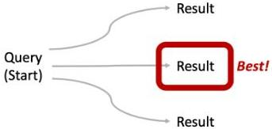
56: 
57: 
58: 
59: 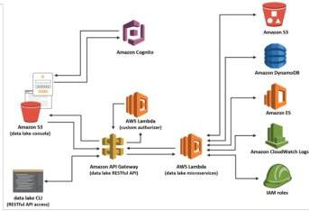
60: # Definition of Search
61: 
62: ## Finding a (best) sequence of actions to solve a problem
63: 
64: - We will consider the problem of designing goal-based agents in
65:   - Deterministic
66:   - Fully observable
67:   - Discret
68:   - Known environments.
69: # Today
70: 
71: ## Solving problems by searching
72: 
73: - Problem-solving agents
74: - Search Problems
75: - Uninformed Search Methods
76:   1. Depth-First Search
77:   2. Breadth-First Search
78:   3. Iterative Deepening Search
79:   4. Uniform-Cost Search
80: 
81: 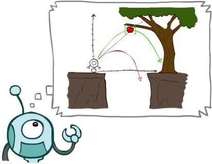
82: # Agents that Plan ahead
83: 
84: - An agent enjoying a touring vacation in United States.
85: - He is in the city of Boston and must find his friend in San Francisco.
86: - Which route to follow?
87: - We assume that our agent always have access to information about the world (the map).
88: 
89: 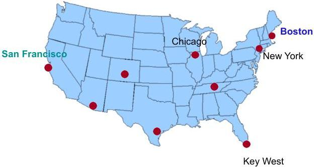
90: # Building a Problem-Solving Agent
91: 
92: - What goal / problem does the agent try to achieve / solve?
93: - What knowledge does the agent need?
94: - What actions does the agent need to do?
95: # Agents that Plan ahead
96: 
97: To find a way to reach the destination (goal), the agent can follow this four-phase problem-solving process:
98: 
99: ## 1. Goal formulation:
100: 
101: - How do you describe the goal?
102:   - as a problem to be solved
103:   - as a situation to be reached
104:   - as a set of properties to be acquired.
105: - **Our example:** The agent adopts the **goal** of reaching San Francisco.
106: - Goals organize behavior by limiting the objectives and hence the actions to be considered.
107: 
108: 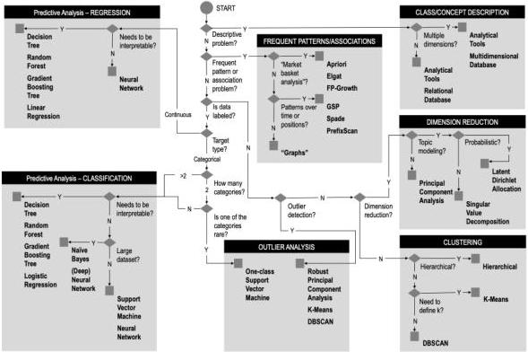
109: # Agents that Plan ahead
110: 
111: To find a way to reach the destination (goal), the agent can follow this four-phase problem-solving process:
112: 
113: ## 2. Problem formulation:
114: 
115: - The agent devises a description of the states and actions necessary to reach the goal
116: - Define an abstract model of the relevant part of the world.
117:   - Removing detail from a representation while retaining relevant information for solving the problem.
118: - **Example:**
119:   - consider the actions of traveling from one city to an adjacent city
120:   - the state of the world that will change due to an action is the current city.
121: 
122: 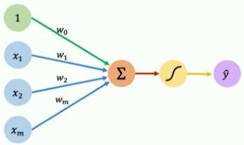
123: 
124: Key West
125: # Agents that Plan ahead
126: 
127: To find a way to reach the destination (goal), the agent can follow this four-phase problem-solving process:
128: 
129: ## 3. Search:
130: 
131: - Before taking any action in the real world, the agent simulates sequences of actions in its model, searching until it finds a sequence of actions that reaches the goal. Such a sequence is called a **solution**.
132: 
133: ## 4. Execution:
134: 
135: The agent can now execute the actions in the solution, one at a time.
136: 
137: 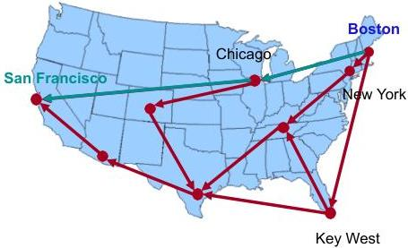
138: # Today
139: 
140: ## Solving problems by searching
141: 
142: - Problem-solving agents
143: - Search Problems
144: - Uninformed Search Methods
145:   1. Depth-First Search
146:   2. Breadth-First Search
147:   3. Iterative Deepening Search
148:   4. Uniform-Cost Search
149: 
150: 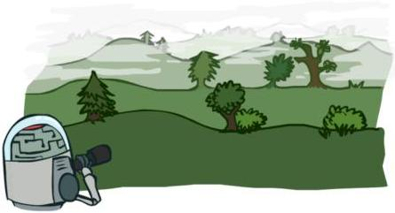
151: # Search problems
152: 
153: ## Search: sequence of actions to achieve goal.
154: 
155: - Search algorithm takes a problem as input and returns a solution in the form of a sequence of actions.
156: - Once solution is found, actions it recommends are executed.
157: 
158: Formulate -> Search -> Actions
159: 
160: - When executing, the agent is running open loop, i.e., it ignores percepts since it already knows in advance what they will be.
161: # Problem formulation
162: 
163: A search problem can be defined formally as follows:
164: 
165: a) **State space** — The set of all possible states in the environment.
166: 
167: b) **Initial state** — The starting state of the agent. Example: *Boston*.
168: 
169: c) **Goal States (Goal Test)** — Desired end states the agent aims to reach. **Example:** San Francisco.
170: 
171: d) **Actions Available to the Agent** — Possible moves or decisions the agent can make. Given a state $s$, $ACTIONS(s)$ returns a finite set of actions that can be executed in $s$. Each of these actions is considered applicable in $s$.
172: 
173: **Example:** $ACTIONS(Boston) = \{To\_KeyWest, To\_NewYork, To\_Chicago\}$
174: # Problem formulation
175: 
176: A search problem can be defined formally as follows:
177: 
178: e) A **transition model** — describes what each action does. $RESULT(s, a)$ returns the state that results from doing action $a$ in state $s$.
179: 
180: For example, $RESULT(Boston, To\_Chicago) = Chicago$.
181: 
182: f) **Action cost function** — denoted by $ACTION-COST(s, a, s')$, gives a numeric cost of applying action $a$ in state $s$ to reach state $s'$.
183: 
184: - A problem-solving agent should use a cost function that reflects its own performance measure;
185: - For example, for route-finding agents, the cost of an action might be the length in kilometers, or it might be the time it takes to complete the action, etc.
186: # Problem formulation
187: 
188: - The state space can be represented as a **graph** in which the vertices are states and the directed edges between them are actions.
189: 
190: - In a **state space graph**, each state occurs only once!
191: - In case of an undirected graph, each edge indicates two actions, one in each direction.
192: 
193: - A sequence of actions forms a **path**
194: 
195: - A **solution** is a path from the initial state to a goal state.
196: 
197: - We assume that action costs are additive; that is, the total cost of a path is the sum of the individual action costs.
198: 
199: - An **optimal solution** has the lowest path cost among all solutions.
200: 
201: - In this course, we assume that all action costs will be positive, to avoid certain complications.
202: 
203: 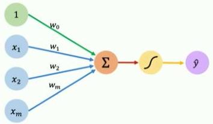
204: # Problem formulation
205: 
206: 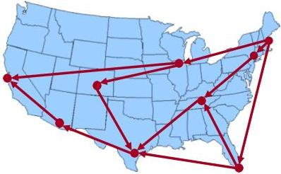
207: 
208: 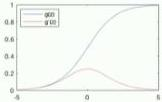
209: 
210: - State space: Cities
211: - Initial state: Boston
212: - Goal test: is state == San Francisco?
213: - Actions: Go to adjacent city
214: - Action cost: e.g., cost = distance
215: - Transition model: RESULT(Boston, To_Chicago) = Chicago
216:   RESULT(Boston, To_New York) = New York
217:   RESULT(Chicago, To_Danver) = Denver
218:   ...
219: - Example of path: {NewYork, Nashville, Austin}
220: - Solutions:
221:   - {Boston, NewYork, Nashville, Austin, Phoenix, SanFrancisco}
222:   - {Boston, Chicago, SanFrancisco}
223:   ...
224: - Optimal solution?? Depends on the objective
225: # Problem formulation
226: 
227: ## Other example
228: 
229: 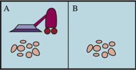
230: 
231: A vacuum-cleaner world with just two locations.
232: 
233: ## State space
234: 
235: 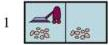
236: 
237: 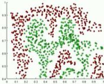
238: 
239: 
240: 
241: 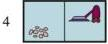
242: 
243: 
244: 
245: 
246: 
247: 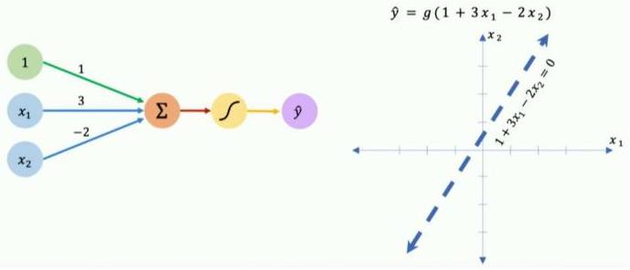
248: 
249: ## Goal State
250: 
251: 
252: 
253: 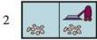
254: 
255: 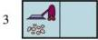
256: 
257: 
258: 
259: 
260: 
261: 
262: The eight possible states of the vacuum world
263: 
264: States 7 and 8 are goal states.
265: # Problem formulation
266: 
267: Example
268: 
269: 
270: A vacuum-cleaner world with just two locations.
271: 
272: Initial state
273: 
274: 
275: 
276: 
277: 
278: 
279: 
280: 
281: 
282: Actions
283: 
284: - Right (R)
285: - Left (L)
286: - Suck (S)
287: 
288: Any state can be designated as the initial state.
289: # Problem formulation
290: 
291: ## Example
292: 
293: 
294: A vacuum-cleaner world with just two locations.
295: 
296: ## Transition model
297: 
298: - **Suck** removes any dirt from the agent's cell;
299: - **Right** moves the agent one cell in the right direction, unless it hits a wall, in which case the action has no effect.
300: - **Left** moves the agent one cell in the left direction, unless it hits a wall, in which case the action has no effect.
301: 
302: ## Action cost
303: 
304: - Each action costs 1.
305: # Problem formulation
306: 
307: Example
308: 
309: 
310: A vacuum-cleaner world with just two locations.
311: 
312: State space graph
313: 
314: 
315: - Example of path:
316: {R, S, R, S, L}, From initial state 1
317: - Example of solution:
318: {S, L, S, R, S}, From initial state 1
319: - Example of optimal solution:
320: {S, R, S}, From initial state 1
321: # Problem Formulation involves Abstraction
322: 
323: ## Example: Missionaries and Cannibals
324: 
325: 
326: - 3 missionaries and 3 cannibals on left side
327: - Boat holds 1 or 2 people
328: - Never leave missionaries outnumbered by cannibals
329: - **States:**
330:   (# cannibals, # missionaries, # boats) on left side of river
331: - **Starting state / Goal state:**
332:   - (3,3,1) / (0,0,0)
333: - **Actions:**
334:   - Remove up to 2 people to other side and the resulting state is safe
335: - **Path cost:** number of crossing
336: # Problem formulation
337: 
338: - The process of removing detail from a representation is called *abstraction*.
339: - A good problem formulation has the right level of detail.
340: - The abstraction is *valid* if we can elaborate any abstract solution into a solution in the more detailed world;
341:   - a sufficient condition is that for every detailed state that is “in Boston,” there is a detailed path to some state that is “in Key west,” and so on.
342: - The abstraction is *useful* if carrying out each of the actions in the solution is easier than the original problem; in our case, the action “drive from Boston to Key West” can be carried out without further search or planning by a driver with average skill.
343: # How to Search
344: 
345: Given:
346: 
347: - Initial state
348: - Actions
349: - Transition model
350: - Goal state
351: - Path cost
352: 
353: 
354: How do we find a solution (best solution)?
355: # How to Search
356: 
357: ## Generating action sequences
358: 
359: 
360: 
361: The search strategy determines which state to expand next.
362: # Search Tree
363: 
364: - A sequences of actions and their outcomes
365: - The root node corresponds to the starting state
366: - The children of a node correspond to the successor states of that node's state
367: - A path through the tree corresponds to a sequence of actions
368:   - A solution is a path ending in the goal state
369: - **Nodes vs. states**
370:   - A state is a representation of the world, while a **node** is a data structure that is part of the search tree
371:     - Node keeps track of a **state description**, a **parent node** (the node that generated this node), an **action** (the action that was applied to the parent to generate this node), a **path cost** (the cost of the path from the start state to this state), **depth** (number of steps in the path from the start state), and possibly other info.
372: - For most problems, we can never actually build the whole tree
373: 
374: # State Space Graphs vs. Search Trees
375: 
376: 
377: State : e
378: 
379: Each NODE in the
380: search tree is an
381: entire PATH in the
382: state space graph.
383: 
384: 
385: Node: (e, [S,d,e], 2,...)
386: 
387: Node: (e, [S,e], 1,...)
388: 
389: Node: (Current state, path from initial state, cost, depth...)
390: # Search tree process
391: 
392: - Begin at the start state and **expand** it by making a list of all possible successor states
393: - Maintain a **frontier** or a list of unexpanded states
394: - At each step, pick a state from the frontier to expand
395: - Keep going until you reach a goal state
396: - **Objective:** *Try to expand as few states as possible*
397: 
398: # Tree Search example
399: 
400: 
401: |  expended node | Frontier  |
402: | --- | --- |
403: |   | {S}  |
404: |  S not goal | {d,e,p}  |
405: |  d not goal | {e,p,b,c,e}  |
406: |  e not goal | {e,p,b,c,h,r}  |
407: |  r not goal | {e,p,b,c,h,f}  |
408: |  f not goal | {e,p,b,c,h,c,G}  |
409: |  G is goal | {e,p,b,c,h,c}  |
410: 
411: # Quiz: State Space Graphs vs. Search Trees
412: 
413: Consider this 4-state graph:
414: 
415: 
416: How big is its search tree (from $s$)?
417: 
418: 
419: 
420: Important: Lots of repeated structure in the search tree!
421: # Tree search algorithm
422: 
423: ## Remark — Handle repeated states
424: 
425: - Every time you **expand a node**, add that state to the **explored set**; do not put explored states on the frontier again
426: - Every time you add a node to the frontier, check whether it already exists in the frontier with a higher path cost, and if yes, replace that node with the new one
427: - This approach is called **Graph search**
428: # General Graph Search
429: 
430: Consider this 4-state graph:
431: 
432: 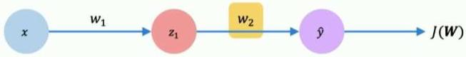
433: 
434: How big is its graph search (from s)?
435: 
436: 
437: # Tree search vs. Graph search
438: 
439: ## General Tree Search
440: 
441: **function TREE-SEARCH(problem) returns** a solution, or failure
442: 
443: initialize the **frontier** using the initial state of **problem**
444: 
445: **loop do**
446: 
447: if the **frontier** is empty **then return** failure
448: 
449: choose a leaf **node** and remove it from the **frontier**
450: 
451: if the **node** contains a goal state **then return** the corresponding solution
452: 
453: **expand** the chosen **node**, adding the resulting **nodes** to the **frontier**
454: 
455: **VS.**
456: 
457: ## General Graph Search
458: 
459: **function GRAPH-SEARCH(problem) returns** a solution, or failure
460: 
461: initialize the **frontier** using the initial state of **problem**
462: 
463: initialize the **explored set** to be empty
464: 
465: **loop do**
466: 
467: if the **frontier** is empty **then return** failure
468: 
469: choose a leaf **node** and remove it from the **frontier**
470: 
471: if the **node** contains a goal state **then return** the corresponding solution
472: 
473: add the **node** to the **explored set**
474: 
475: **expand** the chosen **node**, adding the resulting **nodes** to the **frontier**
476: 
477: but only if the **node** is not already in the **frontier** or **explored set**
478: # Search algorithm
479: 
480: **Main question:** which frontier nodes to explore? How to expand as few nodes as possible, while achieving the goal?
481: 
482: - **Search Strategy**
483:   - A search strategy determines the order in which nodes are expanded.
484: 
485: 
486: # Properties of Search Methods
487: 
488: Strategies are evaluated along the following criteria:
489: 
490: - ▶ **Completeness:** is the strategy guaranteed to find a solution when there is one?
491: - ▶ **Time Complexity:** how long does it take to find a solution?
492: - ▶ **Space Complexity:** how much memory does it require to perform the search?
493: - ▶ **Optimality:** Does the strategy find the best-quality solution when more than one solution exists?
494: 
495: • Time and space complexity are measured in terms of :
496: 
497: - • $b$ is the branching factor
498: - • $m$ is the maximum depth
499: - • solutions at various depths
500: 
501: • Number of nodes in entire tree?
502: 
503: • $1 + b + b^2 + \dots b^m = O(b^m)$
504: 
505: 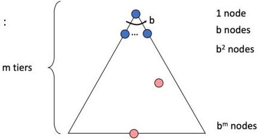
506: # Search Strategies
507: 
508: ???
509: 
510: 
511: What kinds of search algorithms are there?
512: # Search Algorithms
513: 
514: • Uninformed search algorithms
515: 
516: - Have no knowledge other the problem definition
517: - Has a start state
518: - Will recognize the goal state
519: 
520: • Informed search algorithms:
521: 
522: - Finds the solution efficiently
523: - Leverage information about the environment
524: - Use a heuristics - An under-estimate of cost to reach the goal
525: - Or path cost - Distance traveled to current state
526: 
527: 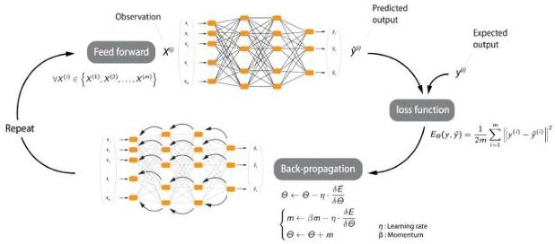
528: # Today
529: 
530: ## Solving problems by searching
531: 
532: - Problem-solving agents
533: - Search Problems
534: - **Uninformed Search Methods**
535:   1. Depth-First Search
536:   2. Breadth-First Search
537:   3. Iterative Deepening Search
538:   4. Uniform-Cost Search
539: 
540: # Uninformed search strategies
541: 
542: - **Uninformed search** also known as unguided search, blind search, or brute-force search is a search methodology that has no additional information about the domain of the problem apart from the representation of the problem which is usually a tree.
543:   - Can only traverse state space blindly in hope of somehow hitting a goal state at some point
544: - **Uninformed search algorithms:**
545:   - Depth-first Search
546:   - Breadth-first Search
547:   - Iterative deepening search
548:   - Uniform Cost Search
549: # Today
550: 
551: ## Solving problems by searching
552: 
553: - Problem-solving agents
554: - Search Problems
555: - Uninformed Search Methods
556: 1. Depth-First Search
557: 2. Breadth-First Search
558: 3. Iterative Deepening Search
559: 4. Uniform-Cost Search
560: 
561: # 1. Depth-First Search
562: 
563: Depth-First Search (DFS):
564: 
565: - Always expand node at the deepest level of the tree, e.g., one of the most recently generated nodes
566: - When hit a dead-end, backtrack to last choice
567: - Frontier can be maintained as a last-in first-out (LIFO) queue (aka. a stack).
568: - The elements are added to the stack one at a time.
569: - The one selected and taken off the frontier at any time is the last element that was added.
570: 
571: 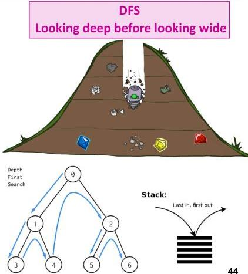
572: # 1. Depth-First Search Example
573: 
574: DFS Search(problem, stack )
575: 
576: # of nodes tested: 0, expanded: 0
577: 
578: |  Explored node | Frontier  |
579: | --- | --- |
580: |   | {(S, path:[S])}  |
581: 
582: **Strategy:** expand a deepest node first
583: 
584: **Implementation:** Frontier is a LIFO stack
585: 
586: State Space Graph
587: 
588: 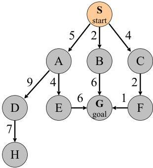
589: 
590: Graph Search
591: # 1. Depth-First Search Example
592: 
593: DFS Search(problem, stack )
594: 
595: # of nodes tested: 0, expanded: 0
596: 
597: |  Explored node | Frontier  |
598: | --- | --- |
599: |   | {(S, path:[S])}  |
600: |  S not goal |   |
601: 
602: State Space Graph
603: 
604: 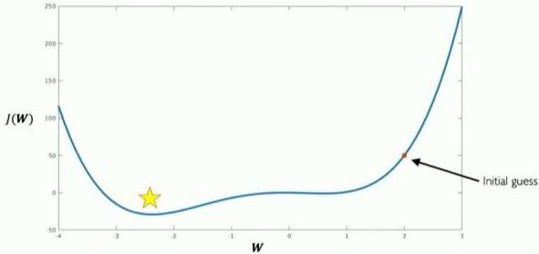
605: 
606: Graph Search
607: 
608: 
609: # 1. Depth-First Search Example
610: 
611: DFS Search(problem, stack )
612: 
613: # of nodes tested: 1, expanded: 1
614: 
615: |  Explored node | Frontier  |
616: | --- | --- |
617: |   | {(S, path:[S])}  |
618: |  S not goal | {(C, path: [S,C]), (B, path: [S,B]), (A, path: [S,A])}  |
619: 
620: State Space Graph
621: 
622: 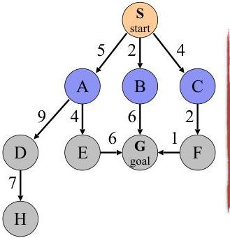
623: 
624: Graph Search
625: 
626: 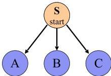
627: # 1. Depth-First Search Example
628: 
629: DFS Search(problem, stack )
630: 
631: # of nodes tested: 2, expanded: 2
632: 
633: |  Explored node | Frontier  |
634: | --- | --- |
635: |   | {(S, path:[S])}  |
636: |  S not goal | {(C, path: [S,C]), (B, path: [S,B]), (A, path: [S,A])}  |
637: |  A not goal | {(C, path: [S,C]), (B, path: [S,B]), (E, path: [S,A,E]), (D, path: [S,A,E])}  |
638: 
639: State Space Graph
640: 
641: 
642: 
643: Graph Search
644: 
645: 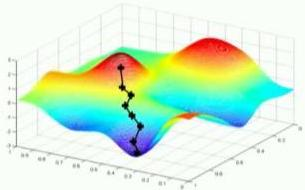
646: # 1. Depth-First Search Example
647: 
648: DFS Search(problem, stack )
649: 
650: # of nodes tested: 3, expanded: 3
651: 
652: |  Explored node | Frontier  |
653: | --- | --- |
654: |   | {(S, path:[S])}  |
655: |  S not goal | {(C, path: [S,C]), (B, path: [S,B]), (A, path: [S,A])}  |
656: |  A not goal | {(C, path: [S,C]), (B, path: [S,B]), (E, path: [S,A,E]), (D, path: [S,A,E])}  |
657: |  D not goal | {(C, path: [S,C]), (B, path: [S,B]), (E, path: [S,A,E]), (H, path: [S,A,D,H])}  |
658: 
659: State Space Graph
660: 
661: 
662: 
663: Graph Search
664: 
665: 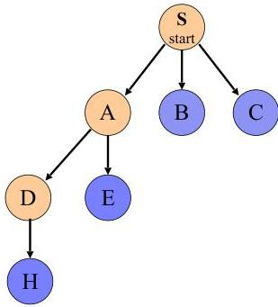
666: # 1. Depth-First Search Example
667: 
668: DFS Search(problem, stack )
669: 
670: # of nodes tested: 4, expanded: 3
671: 
672: |  Explored node | Frontier  |
673: | --- | --- |
674: |   | {S}  |
675: |  S not goal | {C, B, A}  |
676: |  A not goal | {C,B, E, D}  |
677: |  D not goal | {(C, path: [S,C]), (B, path: [S,B]), (E, path: [S,A,E]), (H, path: [S,A,D,H])}  |
678: |  H not goal | {(C, path: [S,C]), (B, path: [S,B]), (E, path: [S,A,E])} **no expand**  |
679: 
680: State Space Graph
681: 
682: 
683: 
684: Graph Search
685: 
686: 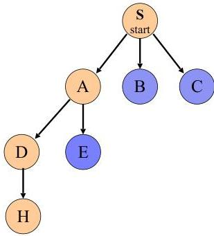
687: # 1. Depth-First Search Example
688: 
689: DFS Search(problem, stack )
690: 
691: # of nodes tested: 4, expanded: 3
692: 
693: |  Explored node | Frontier  |
694: | --- | --- |
695: |   | {S}  |
696: |  S not goal | {C, B, A}  |
697: |  A not goal | {C,B, E, D}  |
698: |  D not goal | {(C, path: [S,C]), (B, path: [S,B]), (E, path: [S,A,E]), (H, path: [S,A,D,H])}  |
699: |  H not goal | {(C, path: [S,C]), (B, path: [S,B]), (E, path: [S,A,E])}  |
700: 
701: State Space Graph
702: 
703: 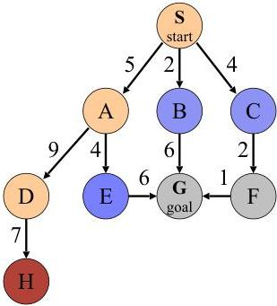
704: 
705: Graph Search
706: 
707: 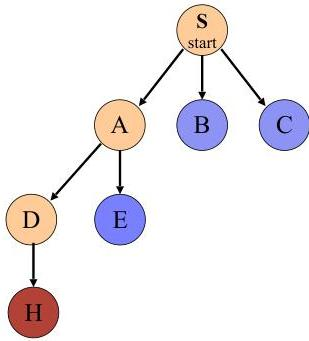
708: # 1. Depth-First Search Example
709: 
710: DFS Search(problem, stack )
711: 
712: # of nodes tested: 4, expanded: 3
713: 
714: |  Explored node | Frontier  |
715: | --- | --- |
716: |   | {S}  |
717: |  S not goal | {C, B, A}  |
718: |  A not goal | {C,B, E, D}  |
719: |  D not goal | {(C, path: [S,C]), (B, path: [S,B]), (E, path: [S,A,E]), (H, path: [S,A,D,H])}  |
720: |  H not goal | {(C, path: [S,C]), (B, path: [S,B]), (E, path: [S,A,E])}  |
721: 
722: State Space Graph
723: 
724: 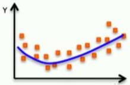
725: 
726: Graph Search
727: 
728: 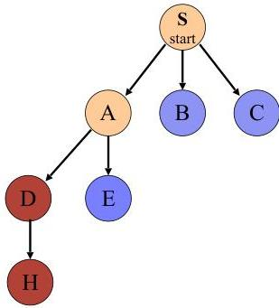
729: # 1. Depth-First Search Example
730: 
731: DFS Search(problem, stack )
732: 
733: # of nodes tested: 5, expanded: 4
734: 
735: |  Explored node | Frontier  |
736: | --- | --- |
737: |   | {S}  |
738: |  S not goal | {C, B, A}  |
739: |  A not goal | {C,B, E, D}  |
740: |  D not goal | {C, B, E, H}  |
741: |  H not goal | {C, B, E}  |
742: |  E not goal | {(C, path: [S,C]), (B, path: [S,B]), (G, path: [S,A,E, G])}  |
743: 
744: State Space Graph
745: 
746: 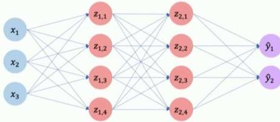
747: 
748: Graph Search
749: 
750: 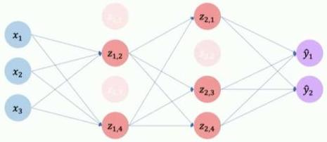
751: # 1. Depth-First Search Example
752: 
753: DFS Search(problem, stack )
754: 
755: # of nodes tested: 6, expanded: 4
756: 
757: |  Explored node | Frontier  |
758: | --- | --- |
759: |   | {S}  |
760: |  S not goal | {C, B, A}  |
761: |  A not goal | {C,B, E, D}  |
762: |  D not goal | {C, B, E, H}  |
763: |  H not goal | {C, B, E}  |
764: |  E not goal | {C, B, G}  |
765: |  **G is goal** | **Stop**  |
766: 
767: Expansion order: (S, A, D, H, E, G)
768: 
769: State Space Graph
770: 
771: 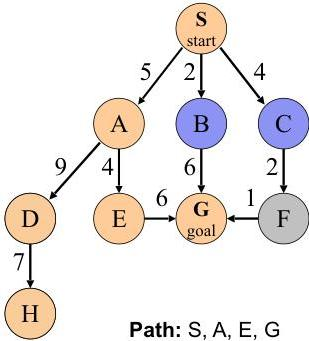
772: 
773: Path: S, A, E, G
774: Cost: 15
775: 
776: Graph Search
777: 
778: 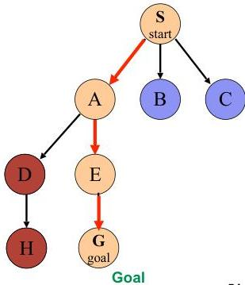
779: # 1. Depth-First Search
780: 
781: **Depth-first search:** In depth-first search, the frontier acts like a last-in first-out queue (a stack). The elements are added to the stack one at a time. The one selected and taken off the frontier at any time is the last element that was added.
782: 
783: 
784: 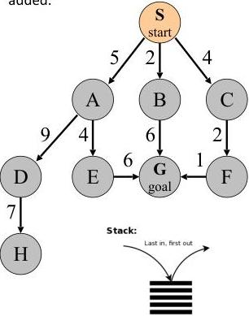
785: 
786: 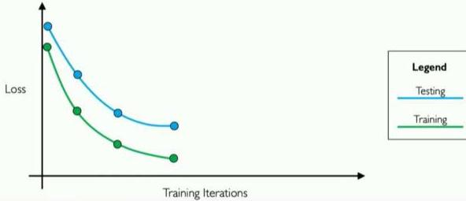
787: # 1. Depth-First Search Example
788: 
789: ## Depth-First Search algorithm
790: 
791: **function** DEPTH-FIRST-SEARCH( *problem* ) **returns** a solution, or failure
792: 
793: *node* ← a node with STATE = *problem*.INITIAL-STATE, PATH-COST = 0
794: 
795: **if** *problem*.GOAL-TEST( *node*.STATE) **then return** SOLUTION( *node* )
796: 
797: *frontier* ← a LIFO queue with *node* as the only element
798: 
799: *explored* ← an empty set
800: 
801: **loop do**
802: 
803: **if** EMPTY?( *frontier* ) **then return** failure
804: 
805: *node* ← POP( *frontier* ) /* chooses the deepest node in *frontier* */
806: 
807: add *node*.STATE to *explored*
808: 
809: **for each** *action* **in** *problem*.ACTIONS( *node*.STATE) **do**
810: 
811: *child* ← CHILD-NODE( *problem*, *node*, *action* )
812: 
813: **if** *child*.STATE is not in *explored* or *frontier* **then**
814: 
815: **if** *problem*.GOAL-TEST( *child*.STATE) **then return** SOLUTION( *child* )
816: 
817: *frontier* ← INSERT( *child*, *frontier* )
818: # 1. DFS Properties
819: 
820: - What nodes DFS expand?
821: 
822: - Some left prefix of the tree.
823: - Could process the whole tree!
824: - If $m$ is finite, takes time $O(b^m)$
825: 
826: - How much space does the fringe take?
827: 
828: - Only has siblings on path to root, so $O(bm)$, i.e., linear space!
829: 
830: - Is it complete?
831: 
832: - $m$ could be infinite, so only if we prevent cycles (more later)
833: - Complete in finite spaces
834: 
835: - Is it optimal?
836: 
837: - No, it finds the “leftmost” solution, regardless of depth or cost
838: 
839: 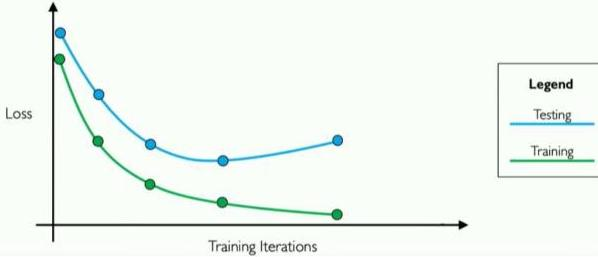
840: 
841: 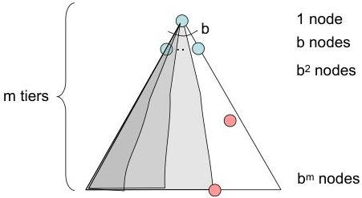
842: # Today
843: 
844: ## Solving problems by searching
845: 
846: - Problem-solving agents
847: - Search Problems
848: - Uninformed Search Methods
849:   1. Depth-First Search
850:   2. Breadth-First Search
851:   3. Iterative Deepening Search
852:   4. Uniform-Cost Search
853: 
854: ## 2. Breadth-First Search
855: 
856: Breadth-First Search (BFS):
857: 
858: - Nodes are expanded in the same order in which they are generated.
859: - Frontier can be maintained as a First-In, First-Out (FIFO) queue. Thus, the path that is selected from the frontier is the one that was added earliest.
860: - This approach implies that the paths from the start node are generated in order of the number of arcs in the path.
861: - One of the paths with the fewest arcs is selected at each stage.
862: 
863: BFS
864: Looking wide before looking deep
865: 
866: 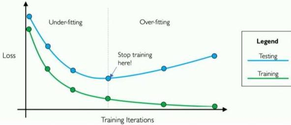
867: 
868: 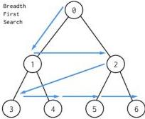
869: 
870: Queue:
871: 
872: 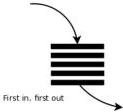
873: ## 2. Breadth-First Search Example
874: 
875: BFS_Search(problem, queue )
876: 
877: # of nodes tested: 0, expanded: 0
878: 
879: |  expnd. node | node list  |
880: | --- | --- |
881: |   | {(S, path:[S])}  |
882: 
883: Strategy: expand a shallowest node first
884: 
885: Implementation: Fringe/Frontier is a FIFO queue
886: 
887: State Space Graph
888: 
889: 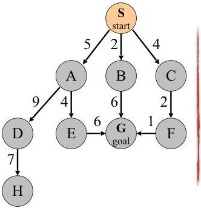
890: 
891: Graph Search
892: ## 2. Breadth-First Search Example
893: 
894: BFS_Search(problem, queue )
895: 
896: # of nodes tested: 1, expanded: 1
897: 
898: |  Explored node | node list  |
899: | --- | --- |
900: |   | {(S, path:[S])}  |
901: |  S not goal | {(A, path:[S,A]), (B, path:[S,B]), (C, path:[S,C])}  |
902: 
903: State Space Graph
904: 
905: 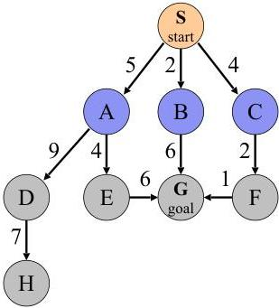
906: 
907: Graph Search
908: 
909: 
910: ## 2. Breadth-First Search Example
911: 
912: BFS_Search(problem, queue )
913: 
914: # of nodes tested: 2, expanded: 2
915: 
916: |  Explored node | node list  |
917: | --- | --- |
918: |   | {(S, path:[S])}  |
919: |  S not goal | {(A, path:[S,A]), (B, path:[S,B]), (C, path:[S,C])}  |
920: |  A not goal | {(B, path:[S,B]), (C, path:[S,C]), (D, path:[S,A,D]), (E, path:[S,A,E])}  |
921: 
922: State Space Graph
923: 
924: 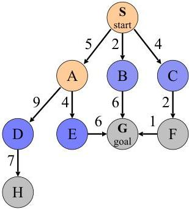
925: 
926: Graph Search
927: 
928: 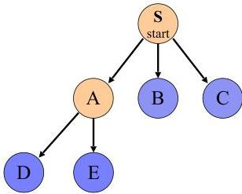
929: ## 2. Breadth-First Search Example
930: 
931: BFS_Search(problem, queue )
932: 
933: # of nodes tested: 3, expanded: 3
934: 
935: |  Explored node | node list  |
936: | --- | --- |
937: |   | {(S, path:[S])}  |
938: |  S not goal | {(A, path:[S,A]), (B, path:[S,B]), (C, path:[S,C])}  |
939: |  A not goal | {(B, path:[S,B]), (C, path:[S,C]), (D, path:[S,A,D]), (E, path:[S,A,E])}  |
940: |  B not goal | {(C, path:[S,C]), (D, path:[S,A,D]), (E, path:[S,A,E]), (G, path:[S,B,G])}  |
941: 
942: State Space Graph
943: 
944: 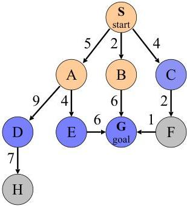
945: 
946: Graph Search
947: 
948: 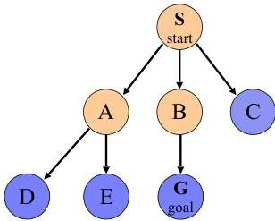
949: ## 2. Breadth-First Search Example
950: 
951: BFS_Search(problem, queue )
952: 
953: # of nodes tested: 4, expanded: 4
954: 
955: |  Explored node | node list  |
956: | --- | --- |
957: |   | {S}  |
958: |  S not goal | {A, B, C}  |
959: |  A not goal | {B, C, D, E}  |
960: |  B not goal | {C, D, E, G}  |
961: |  C not goal | {(D, path:[S,A,D]), (E, path:[S,A,E]), (G, path:[S,B,G]), **(F, path:[S,C,F])**}  |
962: 
963: State Space Graph
964: 
965: 
966: 
967: Graph Search
968: 
969: 
970: ## 2. Breadth-First Search Example
971: 
972: BFS_Search(problem, queue )
973: 
974: # of nodes tested: 5, expanded: 5
975: 
976: |  Explored node | node list  |
977: | --- | --- |
978: |   | {S}  |
979: |  S not goal | {A, B, C}  |
980: |  A not goal | {B, C, D, E}  |
981: |  B not goal | {C, D, E, G}  |
982: |  C not goal | {D, E, G, F}  |
983: |  D not goal | {(E, path:[S,A,E]), (G, path:[S,B,G]), (F, path:[S,C,F]), (H, path:[S,A,D,H])}  |
984: 
985: State Space Graph
986: 
987: 
988: 
989: Graph Search
990: 
991: 
992: ## 2. Breadth-First Search Example
993: 
994: BFS_Search(problem, queue )
995: 
996: # of nodes tested: 6, expanded: 6
997: 
998: |  Explored node | node list  |
999: | --- | --- |
1000: |   | {S}  |
1001: |  S not goal | {A, B, C}  |
1002: |  A not goal | {B, C, D, E}  |
1003: |  B not goal | {C, D, E, G}  |
1004: |  C not goal | {D, E, G, F}  |
1005: |  D not goal | {E, G, F, H}  |
1006: |  E not goal | {(G, path:[S,B,G]), (F, path:[S,C,F]), (H, path:[S,A,D,H])}  |
1007: 
1008: State Space Graph
1009: 
1010: 
1011: 
1012: Graph Search
1013: 
1014: 
1015: ## 2. Breadth-First Search Example
1016: 
1017: BFS_Search(problem, queue )
1018: 
1019: # of nodes tested: 7, expanded: 6
1020: 
1021: |  Explored node | node list  |
1022: | --- | --- |
1023: |   | {S}  |
1024: |  S not goal | {A, B, C}  |
1025: |  A not goal | {B, C, D, E}  |
1026: |  B not goal | {C, D, E, G}  |
1027: |  C not goal | {D, E, G, F}  |
1028: |  D not goal | {E, G, F, H}  |
1029: |  E not goal | {G, F, H, G}  |
1030: |  **G is goal** | **Stop**  |
1031: 
1032: State Space Graph
1033: 
1034: 
1035: 
1036: Path: S, B, G
1037: Cost: 8
1038: 
1039: Graph Search
1040: 
1041: 
1042: 
1043: Expansion order:
1044: (S, A, B, C, D, E, G)
1045: ## 2. Breadth-First Search
1046: 
1047: **Breadth-first search:** In breadth-first search, the frontier acts like a first-in first-out (FIFO) queue. The element selected and removed from the frontier at any given time is the one that was added earliest.
1048: 
1049: 
1050: 
1051: 
1052: ## 2. BFS pseudo-code
1053: 
1054: ### Breadth-First Search algorithm
1055: 
1056: **function** BREADTH-FIRST-SEARCH( *problem* ) **returns** a solution, or failure
1057: 
1058: *node* ← a node with STATE = *problem*.INITIAL-STATE, PATH-COST = 0
1059: 
1060: **if** *problem*.GOAL-TEST( *node*.STATE) **then return** SOLUTION( *node* )
1061: 
1062: *frontier* ← a FIFO queue with *node* as the only element
1063: 
1064: *explored* ← an empty set
1065: 
1066: **loop do**
1067: 
1068: **if** EMPTY?( *frontier* ) **then return** failure
1069: 
1070: *node* ← POP( *frontier* ) /* chooses the shallowest node in *frontier* */
1071: 
1072: add *node*.STATE to *explored*
1073: 
1074: **for each** *action* **in** *problem*.ACTIONS( *node*.STATE) **do**
1075: 
1076: *child* ← CHILD-NODE( *problem*, *node*, *action* )
1077: 
1078: **if** *child*.STATE is not in *explored* or *frontier* **then**
1079: 
1080: **if** *problem*.GOAL-TEST(*child*.STATE) **then return** SOLUTION(*child* )
1081: 
1082: *frontier* ← INSERT( *child*, *frontier* )
1083: ## 2. BFS Properties
1084: 
1085: ■ What nodes does BFS expand?
1086: 
1087: - ■ Processes all nodes above shallowest solution
1088: - ■ Let depth of shallowest solution be $d$
1089: - ■ Search takes time $O(b^d)$
1090: 
1091: ■ How much space does the frontier take?
1092: 
1093: - ■ Has roughly the last tier, so $O(b^d)$
1094: 
1095: ■ Is it complete?
1096: 
1097: - ■ $d$ must be finite if a solution exists, so yes!
1098: 
1099: ■ Is it optimal?
1100: 
1101: - ■ Only if costs are all 1 (1 per step)
1102: 
1103: 
1104: 
1105: 
1106: # Quiz: DFS vs BFS
1107: 
1108: 
1109: 
1110: - When will BFS outperform DFS?
1111: - When will DFS outperform BFS?
1112: 
1113: 
1114: 
1115: 
1116: 
1117: BFS, the closest elements to the starting location are searched first.
1118: 
1119: 
1120: 
1121: DFS, the search proceeds along a continuously deeper path until it hits a barrier and must backtracks to the last decision point.
1122: # DFS vs. BFS
1123: 
1124: - If you know a solution is not far from the root of the tree, *a breadth first search (BFS) might be better*
1125: - If the tree is very deep and solutions are rare, *depth first search (DFS) might take an extremely long time, but BFS could be faster*
1126: - If the tree is very wide, *a BFS might need to much memory, so it might be completely impractical*
1127: - If solutions are frequent but located deep in the tree, *BFS could be completely impractical*
1128: - If the search tree is very deep *you will need to restrict the search depth for depth first search (DFS)*
1129: 
1130: |  Scenario | Depth first | Breadth first  |
1131: | --- | --- | --- |
1132: |  Some paths are extremely long, or even infinite | Performs badly | Performs well  |
1133: |  All paths are of similar length | Performs well | Performs well  |
1134: |  All paths are of similar length, and all paths lead to a goal state | Performs well | Wasteful of time and memory  |
1135: |  High branching factor | Performance depends on other factors | Performs poorly  |
1136: # DFS Limites
1137: 
1138: - Depth first search is incomplete if there is an infinite branch in the search tree.
1139:   - Infinite branches can happen if:
1140:     - paths contain loops
1141:     - infinite number of states and/or operators.
1142: - For problems with infinite (or just very large) state spaces, several variants of depth-first search have been developed:
1143:   - Depth limited search
1144:   - Iterative deepening search
1145: # Outline
1146: 
1147: ## Solving problems by searching
1148: 
1149: - Problem-solving agents
1150: - Search Problems
1151: - Uninformed Search Methods
1152:   1. Depth-First Search
1153:   2. Breadth-First Search
1154:   3. Iterative Deepening Search
1155:   4. Uniform-Cost Search
1156: 
1157: ## 3.a. Depth Limited Search
1158: 
1159: - **Limited depth DFS:** just like DFS, except never go deeper than some depth $\ell$
1160: - The nodes at depth $\ell$ are treated as if they had no successors
1161: - If the search reaches a node at depth $\ell$ where the path is not a solution, we backtrack to the next choice point at depth $< \ell$
1162: - Depth-first search can be viewed as a special case of **Depth Limited Search** where $\ell = \infty$
1163: - The depth bound can sometimes be chosen based on knowledge of the problem
1164: # 3.a. Depth Limited Search
1165: 
1166: 
1167: 
1168: 
1169: 
1170: Example: route planning problem
1171: 
1172: ▶ Requires some knowledge of the solution:
1173: 
1174: - in the route planning problem, the longest route has length $s - 1$, where $s$ is the number of cities (states),
1175: - so we can set $\ell = s - 1$
1176: - 9 cities, depth limit of 8?
1177: 
1178: ▶ What if we choose a limit too small?
1179: 
1180: - Sacrifice completeness
1181: # 3. Iterative Deepening Search
1182: 
1183: For the most problems, $\ell$ is unknown.
1184: 
1185: Iterative Deepening Search (IDS) is a form of depth limited search which progressively increases the bound.
1186: 
1187: 
1188: ### 3. Iterative Deepening Search
1189: 
1190: - Idea: get DFS's space advantage with BFS's time / shallow-solution advantages
1191: 
1192: - Run a DFS with depth limit 1. If no solution...
1193: - Run a DFS with depth limit 2. If no solution...
1194: - Run a DFS with depth limit 3 ...
1195: - Until a solution is found
1196: 
1197: - Solution will be found when $\ell = d$
1198: 
1199: - Isn't that wastefully redundant?
1200: 
1201: - Generally most work happens in the lowest level searched, so not so bad!
1202: 
1203: 
1204: # 3. Iterative Deepening Search Example
1205: 
1206: IDS Search(problem, stack )
1207: 
1208: Depth : 1, # of nodes tested: 0, expanded: 0
1209: 
1210: |  expnd. node | node list  |
1211: | --- | --- |
1212: |  |   |
1213: 
1214: State Space Graph
1215: 
1216: 
1217: 
1218: Graph Search
1219: # 3. Iterative Deepening Search Example
1220: 
1221: IDS Search(problem, stack )
1222: 
1223: Depth : 1, # of nodes tested: 0, expanded: 0
1224: 
1225: |  expnd. node | node list  |
1226: | --- | --- |
1227: |  |   |
1228: 
1229: State Space Graph
1230: 
1231: 
1232: 
1233: Graph Search
1234: # 3. Iterative Deepening Search Example
1235: 
1236: IDS Search(problem, stack )
1237: 
1238: Depth : 1, # of nodes tested: 0, expanded: 0
1239: 
1240: |  expnd. node | node list  |
1241: | --- | --- |
1242: |   | {(S, path: [S])}  |
1243: 
1244: State Space Graph
1245: 
1246: 
1247: 
1248: Graph Search
1249: # 3. Iterative Deepening Search Example
1250: 
1251: IDS Search(problem, stack )
1252: 
1253: Depth : 1, # of nodes tested: 1, expanded: 1
1254: 
1255: |  Explored node | Frontier  |
1256: | --- | --- |
1257: |   | {(S, path: [S])}  |
1258: |  S not goal | {(C, path: [S, C]), (B, path: [S, B]), (A, path: [S, A])}  |
1259: 
1260: State Space Graph
1261: 
1262: 
1263: 
1264: Graph Search
1265: 
1266: 
1267: # 3. Iterative Deepening Search Example
1268: 
1269: IDS Search(problem, stack )
1270: 
1271: Depth : 1, # of nodes tested: 2, expanded: 1
1272: 
1273: |  Explored node | Frontier  |
1274: | --- | --- |
1275: |   | {(S, path: [S])}  |
1276: |  S not goal | {(C, path: [S, C]), (B, path: [S, B]), (A, path: [S, A])}  |
1277: |  A not goal | {(C, path: [S, C]), (B, path: [S, B])} **no expand**  |
1278: 
1279: State Space Graph
1280: 
1281: 
1282: 
1283: Graph Search
1284: 
1285: 
1286: # 3. Iterative Deepening Search Example
1287: 
1288: IDS Search(problem, stack )
1289: 
1290: Depth : 1, # of nodes tested: 3, expanded: 1
1291: 
1292: |  Explored node | Frontier  |
1293: | --- | --- |
1294: |   | {(S, path: [S])}  |
1295: |  S not goal | {(C, path: [S, C]), (B, path: [S, B]), (A, path: [S, A])}  |
1296: |  A not goal | {(C, path: [S, C]), (B, path: [S, B])} **no expand**  |
1297: |  B not goal | {(C, path: [S, C]) **no expand**  |
1298: 
1299: State Space Graph
1300: 
1301: 
1302: 
1303: Graph Search
1304: 
1305: 
1306: # 3. Iterative Deepening Search Example
1307: 
1308: IDS Search(problem, stack )
1309: 
1310: Depth : 1, # of nodes tested: 4, expanded: 1
1311: 
1312: |  Explored node | Frontier  |
1313: | --- | --- |
1314: |   | {(S, path: [S])}  |
1315: |  S not goal | {(C, path: [S, C]), (B, path: [S, B]), (A, path: [S, A])}  |
1316: |  A not goal | {(C, path: [S, C]), (B, path: [S, B])} **no expand**  |
1317: |  B not goal | {(C, path: [S, C])} **no expand**  |
1318: |  C not goal | {} **no expand**  |
1319: 
1320: State Space Graph
1321: 
1322: 
1323: 
1324: Graph Search
1325: 
1326: 
1327: # 3. Iterative Deepening Search Example
1328: 
1329: IDS Search(problem, stack )
1330: 
1331: Depth : 1, # of nodes tested: 4, expanded: 1
1332: 
1333: |  Explored node | Frontier  |
1334: | --- | --- |
1335: |   | {(S, path: [S])}  |
1336: |  S not goal | {(C, path: [S, C]), (B, path: [S, B]), (A, path: [S, A])}  |
1337: |  A not goal | {(C, path: [S, C]), (B, path: [S, B])} **no expand**  |
1338: |  B not goal | {(C, path: [S, C])} **no expand**  |
1339: |  C not goal | {} **no expand**  |
1340: 
1341: Frontier is empty. Increasing depth
1342: 
1343: State Space Graph
1344: 
1345: 
1346: 
1347: Graph Search
1348: 
1349: 
1350: # 3. Iterative Deepening Search Example
1351: 
1352: IDS Search(problem, stack )
1353: 
1354: **Depth : 2**, # of nodes tested: 4, expanded: 2
1355: 
1356: |  expnd. node | node list  |
1357: | --- | --- |
1358: |   | {S}  |
1359: |  S not goal | {C,B,A}  |
1360: |  A not goal | {C,B} no expand  |
1361: |  B not goal | {C} no expand  |
1362: |  C not goal | {} no expand  |
1363: 
1364: State Space Graph
1365: 
1366: 
1367: 
1368: Graph Search
1369: # 3. Iterative Deepening Search Example
1370: 
1371: IDS Search(problem, stack )
1372: 
1373: Depth : 2, # of nodes tested: 4, expanded: 2
1374: 
1375: |  expnd. node | node list  |
1376: | --- | --- |
1377: |   | {S}  |
1378: |  S not goal | {C,B,A}  |
1379: |  A not goal | {C,B} no expand  |
1380: |  B not goal | {C} no expand  |
1381: |  C not goal | {} no expand  |
1382: 
1383: State Space Graph
1384: 
1385: Graph Search
1386: 
1387: 
1388: 
1389: 
1390: # 3. Iterative Deepening Search Example
1391: 
1392: IDS Search(problem, stack )
1393: 
1394: Depth : 2, # of nodes tested: 4, expanded: 2
1395: 
1396: |  expnd. node | node list  |
1397: | --- | --- |
1398: |   | {S}  |
1399: |  S not goal | {C,B,A}  |
1400: |  A not goal | {C,B} no expand  |
1401: |  B not goal | {C} no expand  |
1402: |  C not goal | {} no expand  |
1403: |  S not goal | {C,B,A}  |
1404: 
1405: State Space Graph
1406: 
1407: 
1408: 
1409: Graph Search
1410: 
1411: 
1412: # 3. Iterative Deepening Search Example
1413: 
1414: IDS Search(problem, stack )
1415: 
1416: Depth : 2, # of nodes tested: 4, expanded: 3
1417: 
1418: |  expnd. node | node list  |
1419: | --- | --- |
1420: |   | {S}  |
1421: |  S not goal | {C,B,A}  |
1422: |  A not goal | {C,B} no expand  |
1423: |  B not goal | {C} no expand  |
1424: |  C not goal | {} no expand  |
1425: |  S not goal | {C,B,A}  |
1426: |  A not goal | {C,B,E, D}  |
1427: 
1428: State Space Graph
1429: 
1430: 
1431: 
1432: Graph Search
1433: 
1434: 
1435: # 3. Iterative Deepening Search Example
1436: 
1437: IDS Search(problem, stack )
1438: 
1439: Depth : 2, # of nodes tested: 5, expanded: 3
1440: 
1441: |  expnd. node | node list  |
1442: | --- | --- |
1443: |   | {S}  |
1444: |  S not goal | {C,B,A}  |
1445: |  A not goal | {C,B} no expand  |
1446: |  B not goal | {C} no expand  |
1447: |  C not goal | {} no expand  |
1448: |  S not goal | {C,B,A}  |
1449: |  A not goal | {C,B,E, D}  |
1450: |  D not goal | {C,B,E}  |
1451: 
1452: State Space Graph
1453: 
1454: 
1455: 
1456: Graph Search
1457: 
1458: 
1459: # 3. Iterative Deepening Search Example
1460: 
1461: IDS Search(problem, stack )
1462: 
1463: Depth : 2, # of nodes tested: 6, expanded: 3
1464: 
1465: |  expnd. node | node list  |
1466: | --- | --- |
1467: |   | {S}  |
1468: |  S not goal | {C,B,A}  |
1469: |  A not goal | {C,B} no expand  |
1470: |  B not goal | {C} no expand  |
1471: |  C not goal | {} no expand  |
1472: |  S not goal | {C, B, A}  |
1473: |  A not goal | {C, B, E, D}  |
1474: |  D not goal | {C, B, E}  |
1475: |  E not goal | {C, B}  |
1476: 
1477: State Space Graph
1478: 
1479: 
1480: 
1481: Graph Search
1482: 
1483: 
1484: # 3. Iterative Deepening Search Example
1485: 
1486: IDS Search(problem, stack )
1487: 
1488: Depth : 2, # of nodes tested: 6, expanded: 4
1489: 
1490: |  expnd. node | node list  |
1491: | --- | --- |
1492: |   | {S}  |
1493: |  S not goal | {C,B,A}  |
1494: |  A not goal | {C,B} no expand  |
1495: |  B not goal | {C} no expand  |
1496: |  C not goal | {} no expand  |
1497: |  S not goal | {C, B, A}  |
1498: |  A not goal | {C, B, E, D}  |
1499: |  D not goal | {C, B, E}  |
1500: |  E not goal | {C, B}  |
1501: |  B not goal | {C, G}  |
1502: 
1503: State Space Graph
1504: 
1505: 
1506: 
1507: Graph Search
1508: 
1509: 
1510: # 3. Iterative Deepening Search Example
1511: 
1512: IDS Search(problem, stack )
1513: 
1514: Depth : 2, # of nodes tested: 7, expanded: 4
1515: 
1516: |  expnd. node | node list  |
1517: | --- | --- |
1518: |   | {S}  |
1519: |  S not goal | {C,B,A}  |
1520: |  A not goal | {C,B} no expand  |
1521: |  B not goal | {C} no expand  |
1522: |  C not goal | {} no expand  |
1523: |  S not goal | {C, B, A}  |
1524: |  A not goal | {C, B, E, D}  |
1525: |  D not goal | {C, B, E}  |
1526: |  E not goal | {C, B}  |
1527: |  B not goal | {C, G}  |
1528: |  **G is goal** | **Stop**  |
1529: 
1530: State Space Graph
1531: 
1532: 
1533: 
1534: Graph Search
1535: 
1536: 
1537: # 3. Iterative Deepening Search Example
1538: 
1539: IDS Search(problem, stack )
1540: 
1541: Depth : 2, # of nodes tested: 7, expanded: 4
1542: 
1543: |  expnd. node | node list  |
1544: | --- | --- |
1545: |   | {S}  |
1546: |  S not goal | {C,B,A}  |
1547: |  A not goal | {C,B} no expand  |
1548: |  B not goal | {C} no expand  |
1549: |  C not goal | {} no expand  |
1550: |  S not goal | {C, B, A}  |
1551: |  A not goal | {C, B, E, D}  |
1552: |  D not goal | {C, B, E}  |
1553: |  E not goal | {C, B}  |
1554: |  B not goal | {C, G}  |
1555: |  **G is goal** | **Stop**  |
1556: 
1557: State Space Graph
1558: 
1559: 
1560: 
1561: Graph Search
1562: 
1563: 
1564: 
1565: Path: S, B, G
1566: Cost: 8
1567: # 3. Iterative deepening search Properties
1568: 
1569: # - ■ **Time?**
1570: 
1571: - ■ $O(b^d)$, where $b$ is the branching factor and $d$ is the depth of the shallowest solution.
1572: 
1573: # - ■ **Space?**
1574: 
1575: - ■ $O(bd)$
1576: 
1577: # - ■ **Is it complete?**
1578: 
1579: - ■ yes
1580: 
1581: # - ■ **Is it optimal?**
1582: 
1583: - ■ Yes, if step cost = 1
1584: 
1585: 
1586: ### 3. Iterative deepening search Properties
1587: 
1588: - Has the advantages of BFS
1589:   - Complete
1590:   - Optimal (if the edges have identical costs)
1591: - Has the advantages of DFS
1592:   - Linear space complexity: $O(bd)$
1593: - Wasteful?
1594:   - because nodes near the top of the search tree are generated multiple times
1595: - It turns out this is NOT very costly
1596:   - For a tree with (nearly) the same branching factor at each level, most of the nodes are in the bottom level
1597: - Worst case time complexity: $O(b^d)$
1598: # 3. Iterative Deepening Search algorithm
1599: 
1600: Iterative Deepening Search pseudocode
1601: 
1602: function ITERATIVE-DEEPENING-SEARCH(problem) returns a solution node or failure
1603: 
1604: for depth = 0 to ∞ do
1605: 
1606: result ← DEPTH-LIMITED-SEARCH(problem, depth)
1607: 
1608: if result ≠ cutoff then return result
1609: 
1610: function DEPTH-LIMITED-SEARCH(problem, ℓ) returns a node or failure or cutoff
1611: 
1612: frontier ← a LIFO queue (stack) with NODE(problem.INITIAL) as an element
1613: 
1614: result ← failure
1615: 
1616: while not IS-EMPTY(frontier) do
1617: 
1618: node ← POP(frontier)
1619: 
1620: if problem.IS-GOAL(node.STATE) then return node
1621: 
1622: if DEPTH(node) > ℓ then
1623: 
1624: result ← cutoff
1625: 
1626: else if not IS-CYCLE(node) do
1627: 
1628: for each child in EXPAND(problem, node) do
1629: 
1630: add child to frontier
1631: 
1632: return result
1633: # Outline
1634: 
1635: ## Solving problems by searching
1636: 
1637: - Problem-solving agents
1638: - Search Problems
1639: - Uninformed Search Methods
1640:   1. Depth-First Search
1641:   2. Breadth-First Search
1642:   3. Iterative Deepening Search
1643:   4. Uniform-Cost Search
1644: 
1645: # Search with varying step costs
1646: 
1647: 
1648: 
1649: - BFS finds the path with the fewest steps, but **does not always find the cheapest path**
1650: # Outline
1651: 
1652: ## Solving problems by searching
1653: 
1654: - Problem-solving agents
1655: - Search Problems
1656: - Uninformed Search Methods
1657:   1. Depth-First Search
1658:   2. Breadth-First Search
1659:   3. Iterative Deepening Search
1660:   4. Uniform-Cost Search
1661: 
1662: ## 4. Uniform Cost Search (UCS)
1663: 
1664: - For each frontier node, save the total cost of the path from the initial state to that node
1665: - Expand the frontier node with the **lowest path cost**
1666: - **Implementation:** *frontier* is a priority queue ordered by path cost
1667: - Equivalent to breadth-first if step costs all equal
1668: - Equivalent to Dijkstra's algorithm in general
1669: 
1670: 
1671: # 4. Uniform Cost Search Example
1672: 
1673: UCS Search(problem, priorityQueue )
1674: 
1675: # of nodes tested: 0, expanded: 0
1676: 
1677: |  expnd. node | node list  |
1678: | --- | --- |
1679: |   | {S}  |
1680: 
1681: **Strategy:** expand a cheapest node first
1682: 
1683: **Implementation:** Frontier is a priority queue (priority: cumulative cost)
1684: 
1685: State Space Graph
1686: 
1687: 
1688: 
1689: Graph Search
1690: # 4. Uniform Cost Search Example
1691: 
1692: UCS Search(problem, priorityQueue )
1693: 
1694: # of nodes tested:1, expanded: 1
1695: 
1696: |  Explored node | Frontier  |
1697: | --- | --- |
1698: |   | {(S, path: [S], cost: 0)}  |
1699: |  S not goal | {(B, [S,B], 2), (C, [S,C], 4), (A, [S,A], 5)}  |
1700: 
1701: State Space Graph
1702: 
1703: 
1704: 
1705: Graph Search
1706: 
1707: 
1708: # 4. Uniform Cost Search Example
1709: 
1710: UCS Search(problem, priorityQueue )
1711: 
1712: # of nodes tested: 2, expanded: 2
1713: 
1714: |  Explored node | Frontier  |
1715: | --- | --- |
1716: |   | {(S, path: [S], cost: 0}  |
1717: |  S not goal | {(B, [S,B], 2), (C, [S,C], 4), (A, [S,A], 5)}  |
1718: |  B not goal | {(C, [S,C], 4), (A, [S,A], 5), (G, [S, B, G], 8)}  |
1719: 
1720: State Space Graph
1721: 
1722: 
1723: 
1724: Graph Search
1725: 
1726: 
1727: # 4. Uniform Cost Search Example
1728: 
1729: UCS Search(problem, priorityQueue )
1730: 
1731: # of nodes tested: 3, expanded: 3
1732: 
1733: |  Explored node | Frontier  |
1734: | --- | --- |
1735: |   | {(S, path: [S], cost: 0)}  |
1736: |  S not goal | {(B, [S,B], 2), (C, [S,C], 4), (A, [S,A], 5)}  |
1737: |  B not goal | {(C, [S,C], 4), (A, [S,A], 5), (G, [S, B, G], 8)}  |
1738: |  C not goal | {(A, [S,A], 5), (G, [S, B, G], 8), (F, [S, C, F], 6)}  |
1739: 
1740: State Space Graph
1741: 
1742: 
1743: 
1744: Graph Search
1745: 
1746: 
1747: # 4. Uniform Cost Search Example
1748: 
1749: UCS Search(problem, priorityQueue )
1750: 
1751: # of nodes tested: 4, expanded: 4
1752: 
1753: |  Explored node | Frontier  |
1754: | --- | --- |
1755: |   | {(S, path: [S], cost: 0)}  |
1756: |  S not goal | {(B, [S,B], 2), (C, [S,C], 4), (A, [S,A], 5)}  |
1757: |  B not goal | {(C, [S,C], 4), (A, [S,A], 5), (G, [S, B, G], 8)}  |
1758: |  C not goal | {(A, [S,A], 5), (G, [S, B, G], 8), (F, [S, C, F], 6)}  |
1759: |  A not goal | {(G, [S, B, G], 8), (F, [S, C, F], 6), (D, [S, A, D], 14), (E, [S, A, E], 9)}  |
1760: 
1761: State Space Graph
1762: 
1763: 
1764: 
1765: Graph Search
1766: 
1767: 
1768: # 4. Uniform Cost Search Example
1769: 
1770: UCS Search(problem, priorityQueue )
1771: 
1772: # of nodes tested: 5, expanded: 5
1773: 
1774: |  Explored node | Frontier  |
1775: | --- | --- |
1776: |   | {(S, path: [S], cost: 0}  |
1777: |  S not goal | {(B, [S,B], 2),(C, [S,C], 4),(A, [S,A], 5)}  |
1778: |  B not goal | {(C, [S,C], 4), (A, [S,A], 5), (G, [S, B, G], 8)}  |
1779: |  C not goal | {(A, [S,A], 5), (G, [S, B, G], 8), (F, [S, C, F], 6)}  |
1780: |  A not goal | {(G, [S, B, G], 8), (F, [S, C, F], 6), (D, [S, A, D], 14), (E, [S, A, E], 9)}  |
1781: |  F not goal | {(G, [S, B, G], 8), (D, [S, A, D], 14), (E, [S, A, E], 9), (G, [S, C, F, G], 7)}  |
1782: 
1783: State Space Graph
1784: 
1785: 
1786: 
1787: Graph Search
1788: 
1789: 
1790: 
1791: Remove the higher-cost of identical nodes on the queue and save memory. However, UCS is optimal even if this is not done, since lower-cost nodes sort to the front.
1792: ## 4. Uniform Cost Search Example
1793: 
1794: UCS Search(problem, priorityQueue)
1795: 
1796: # of nodes tested: 6, expanded: 5
1797: 
1798: |  Explored node | Frontier  |
1799: | --- | --- |
1800: |   | {(S, path: [S], cost: 0}  |
1801: |  S not goal | {(B, [S,B], 2),(C, [S,C], 4),(A, [S,A], 5)}  |
1802: |  B not goal | {(C, [S,C], 4), (A, [S,A], 5), (G, [S, B, G], 8)}  |
1803: |  C not goal | {(A, [S,A], 5), (G, [S, B, G], 8), (F, [S, C, F], 6)}  |
1804: |  A not goal | {(G, [S, B, G], 8), (F, [S, C, F], 6), (D, [S, A, D], 14), (E, [S, A, E], 9)}  |
1805: |  F not goal | {(G, [S, B, G], 8), (D, [S, A, D], 14), (E, [S, A, E], 9), (G, [S, C, F, G], 7)}  |
1806: |  G is goal | Stop  |
1807: 
1808: State Space Graph
1809: 
1810: 
1811: 
1812: Graph Search
1813: 
1814: 
1815: # 4. UCS algorithm
1816: 
1817: # Best first search
1818: 
1819: function BEST-FIRST-SEARCH(problem, f) returns a solution node or failure
1820:     node ← NODE(STATE=problem.INITIAL)
1821:     frontier ← a priority queue ordered by f, with node as an element
1822:     reached ← a lookup table, with one entry with key problem.INITIAL and value node
1823:     while not IS-EMPTY(frontier) do
1824:         node ← POP(frontier)
1825:         if problem.IS-GOAL(node.STATE) then return node
1826:         for each child in EXPAND(problem, node) do
1827:             s ← child.STATE
1828:             if s is not in reached or child.PATH-COST < reached[s].PATH-COST then
1829:                 reached[s] ← child
1830:                 add child to frontier
1831:     return failure
1832: 
1833: function EXPAND(problem, node) yields nodes
1834:     s ← node.STATE
1835: 
1836:     for each action in problem.ACTIONS(s) do
1837:         s' ← problem.RESULT(s, action)
1838:         cost ← node.PATH-COST + problem.ACTION-COST(s, action, s')
1839:     yield NODE(STATE=s', PARENT=node, ACTION=action, PATH-COST=cost)
1840: 
1841: # Uniform Cost Search
1842: 
1843: function UNIFORM-COST-SEARCH(problem) returns a solution node, or failure
1844: return BEST-FIRST-SEARCH(problem, PATH-COST)
1845: # 4. UCS Properties
1846: 
1847: What nodes does UCS expand?
1848: 
1849: - Processes all nodes with cost less than cheapest solution!
1850: - If that solution costs $C^*$ and arcs cost at least $\varepsilon$, then the “effective depth” is roughly $C^*/\varepsilon$
1851: - Takes time $O(b^{C*/\varepsilon})$ (exponential in effective depth)
1852: - This can be greater than $O(b^d)$: the search can explore long paths consisting of small steps before exploring shorter paths consisting of larger steps
1853: 
1854: How much space does the frontier take?
1855: 
1856: - Has roughly the last tier, so $O(b^{C*/\varepsilon})$
1857: 
1858: Is it complete?
1859: 
1860: - Assuming best solution has a finite cost and minimum arc cost is positive, yes!
1861: 
1862: Is it optimal?
1863: 
1864: - Yes! (Proof next lecture via A*)
1865: 
1866: 
1867: # 4. Uniform Cost Issues
1868: 
1869: - **Strategy:** expand lowest path cost
1870: - **The good:** UCS is complete and optimal!
1871: - **The bad:**
1872:   - Explores options in every “direction”
1873:   - No information about goal location
1874: 
1875: 
1876: 
1877: 
1878: # Review: Uninformed search strategies
1879: 
1880: - A **search strategy** is defined by picking the order of node expansion
1881: - **Uninformed** search strategies use only the information available in the problem definition
1882:   - Breadth-first search
1883:   - Depth-first search
1884:   - Iterative deepening search
1885:   - Uniform-cost search
1886:   - Bidirectional Search
1887: # BFS/DFS/IDS/UCS
1888: 
1889: • Breadth-first search
1890: 
1891: - • **Good**: optimal, works well when many options, but not many actions required
1892: - • **Bad**: assumes all actions have equal cost
1893: 
1894: • Depth-first search
1895: 
1896: - • **Good**: memory-efficient, works well when few options, but lots of actions required
1897: - • **Bad**: not optimal, can run infinitely, assumes all actions have equal cost
1898: 
1899: • Iterative deepening search
1900: 
1901: - • **Good**: optimal, memory-efficient, and adaptable to different situations
1902: - • **Bad**: redundant work, assume all actions have equal cost,
1903: 
1904: • Uniform-cost search
1905: 
1906: - • **Good**: optimal, handles variable-cost actions
1907: - • **Bad**: explores all options, no information about goal location
1908: 
1909: **Basically Dijkstra's Algorithm!**
1910: # Evaluation of search algorithms
1911: 
1912: |  Criterion | Breadth-First | Uniform-Cost | Depth-First | Depth-Limited | Iterative Deepening  |
1913: | --- | --- | --- | --- | --- | --- |
1914: |  Complete? | Yes^{1} | Yes^{1,2} | No | No | Yes^{1}  |
1915: |  Optimal cost? | Yes^{3} | Yes | No | No | Yes^{3}  |
1916: |  Time | $$O(b^d)$$ | $$O(b^{1+\lfloor C^*/\epsilon \rfloor})$$ | $$O(b^m)$$ | $$O(b^\ell)$$ | $$O(b^d)$$  |
1917: |  Space | $$O(b^d)$$ | $$O(b^{1+\lfloor C^*/\epsilon \rfloor})$$ | $$O(bm)$$ | $$O(b\ell)$$ | $$O(bd)$$  |
1918: 
1919: - b is the branching factor; m is the maximum depth of the search tree; d is the depth of the shallowest solution, or is m when there is no solution; ℓ is the depth limit.
1920: - Superscript caveats are as follows: ¹ complete if b is finite, and the state space either has a solution or is finite. ² complete if all action costs are ≥ ε > 0; ³ cost-optimal if action costs are all identical.
1921: # Search Gone Wrong?
1922: 
1923: Still not as smart as it could be...
1924: 
1925: Can we do better?
1926: 
1927: # Incorporating goal information
1928: 
1929: **How to efficiently solve search problems with variable-cost actions, using information about the goal state?**
1930: 
1931: This is the motivation behind **informed search**, which uses problem-specific knowledge to try and find solutions more efficiently
