1: # Artificial Intelligence Algorithms
2: 
3: ## Basic Search
4: 
5: 
6: 
7: Instructor: Farah AIT SALAHT
8: 
9: ESILV- Leonard de Vinci Graduated School of Engineering
10: # Previous session
11: 
12: ## What did we learn:
13: 
14: - Introduction to Artificial Intelligence for problem solving and decision-making and intelligent agents
15: - What makes an Agents?
16: 
17: 
18: # What makes an Agents?
19: 
20: - Example: Vacuum-cleaner world – Roomba!
21: 
22: 
23: 
24: (dirt)
25: 
26: - Percepts: location and contents, e.g., [A,Dirty]
27: - Actions: Left, Right, Suck
28: 
29: - Example of an agent function:
30: 
31: |  Percept sequence | Action  |
32: | --- | --- |
33: |  [A, Clean] | Right  |
34: |  [A, Dirty] | Suck  |
35: |  [B, Clean] | Left  |
36: |  [B, Dirty] | Suck  |
37: |  [A, Clean], [A, Clean] | Right  |
38: |  [A, Clean], [A, Dirty] | Suck  |
39: |  ⋮ | ⋮  |
40: # What makes one rational?
41: 
42: A rational agent always acts to **maximize the utility function**, given current state/percept
43: 
44: 
45: # What makes one rational?
46: 
47: How do we choose the best sequence of actions?
48: 
49: This involves defining the
50: « search problems »
51: # Search process?
52: 
53: 
54: # Information Retrieval vs. Search
55: 
56: 
57: 
58: 
59: 
60: 
61: 
62: 
63: # Definition of Search
64: 
65: ## Finding a (best) sequence of actions to solve a problem
66: 
67: - We will consider the problem of designing goal-based agents in
68:   - Deterministic
69:   - Fully observable
70:   - Discret
71:   - Known environments.
72: # Today
73: 
74: ## Solving problems by searching
75: 
76: - Problem-solving agents
77: - Search Problems
78: - Uninformed Search Methods
79:   1. Depth-First Search
80:   2. Breadth-First Search
81:   3. Iterative Deepening Search
82:   4. Uniform-Cost Search
83: 
84: 
85: # Agents that Plan ahead
86: 
87: - An agent enjoying a touring vacation in United States.
88: - He is in the city of Boston and must find his friend in San Francisco.
89: - Which route to follow?
90: - We assume that our agent always have access to information about the world (the map).
91: 
92: 
93: # Building a Problem-Solving Agent
94: 
95: - What goal / problem does the agent try to achieve / solve?
96: - What knowledge does the agent need?
97: - What actions does the agent need to do?
98: # Agents that Plan ahead
99: 
100: To find a way to reach the destination (goal), the agent can follow this four-phase problem-solving process:
101: 
102: ## 1. Goal formulation:
103: 
104: - How do you describe the goal?
105:   - as a problem to be solved
106:   - as a situation to be reached
107:   - as a set of properties to be acquired.
108: - **Our example:** The agent adopts the **goal** of reaching San Francisco.
109: - Goals organize behavior by limiting the objectives and hence the actions to be considered.
110: 
111: 
112: # Agents that Plan ahead
113: 
114: To find a way to reach the destination (goal), the agent can follow this four-phase problem-solving process:
115: 
116: ## 2. Problem formulation:
117: 
118: - The agent devises a description of the states and actions necessary to reach the goal
119: - Define an abstract model of the relevant part of the world.
120:   - Removing detail from a representation while retaining relevant information for solving the problem.
121: - **Example:**
122:   - consider the actions of traveling from one city to an adjacent city
123:   - the state of the world that will change due to an action is the current city.
124: 
125: 
126: 
127: Key West
128: # Agents that Plan ahead
129: 
130: To find a way to reach the destination (goal), the agent can follow this four-phase problem-solving process:
131: 
132: ## 3. Search:
133: 
134: - Before taking any action in the real world, the agent simulates sequences of actions in its model, searching until it finds a sequence of actions that reaches the goal. Such a sequence is called a **solution**.
135: 
136: ## 4. Execution:
137: 
138: The agent can now execute the actions in the solution, one at a time.
139: 
140: 
141: # Today
142: 
143: ## Solving problems by searching
144: 
145: - Problem-solving agents
146: - Search Problems
147: - Uninformed Search Methods
148:   1. Depth-First Search
149:   2. Breadth-First Search
150:   3. Iterative Deepening Search
151:   4. Uniform-Cost Search
152: 
153: 
154: # Search problems
155: 
156: ## Search: sequence of actions to achieve goal.
157: 
158: - Search algorithm takes a problem as input and returns a solution in the form of a sequence of actions.
159: - Once solution is found, actions it recommends are executed.
160: 
161: Formulate -> Search -> Actions
162: 
163: - When executing, the agent is running open loop, i.e., it ignores percepts since it already knows in advance what they will be.
164: # Problem formulation
165: 
166: A search problem can be defined formally as follows:
167: 
168: a) **State space** — The set of all possible states in the environment.
169: 
170: b) **Initial state** — The starting state of the agent. Example: *Boston*.
171: 
172: c) **Goal States (Goal Test)** — Desired end states the agent aims to reach. **Example:** San Francisco.
173: 
174: d) **Actions Available to the Agent** — Possible moves or decisions the agent can make. Given a state $s$, $ACTIONS(s)$ returns a finite set of actions that can be executed in $s$. Each of these actions is considered applicable in $s$.
175: 
176: **Example:** $ACTIONS(Boston) = \{To\_KeyWest, To\_NewYork, To\_Chicago\}$
177: # Problem formulation
178: 
179: A search problem can be defined formally as follows:
180: 
181: e) A **transition model** — describes what each action does. $RESULT(s, a)$ returns the state that results from doing action $a$ in state $s$.
182: 
183: For example, $RESULT(Boston, To\_Chicago) = Chicago$.
184: 
185: f) **Action cost function** — denoted by $ACTION-COST(s, a, s')$, gives a numeric cost of applying action $a$ in state $s$ to reach state $s'$.
186: 
187: - A problem-solving agent should use a cost function that reflects its own performance measure;
188: - For example, for route-finding agents, the cost of an action might be the length in kilometers, or it might be the time it takes to complete the action, etc.
189: # Problem formulation
190: 
191: - The state space can be represented as a **graph** in which the vertices are states and the directed edges between them are actions.
192: 
193: - In a **state space graph**, each state occurs only once!
194: - In case of an undirected graph, each edge indicates two actions, one in each direction.
195: 
196: - A sequence of actions forms a **path**
197: - A **solution** is a path from the initial state to a goal state.
198: - We assume that action costs are additive; that is, the total cost of a path is the sum of the individual action costs.
199: - An **optimal solution** has the lowest path cost among all solutions.
200: - In this course, we assume that all action costs will be positive, to avoid certain complications.
201: 
202: 
203: # Problem formulation
204: 
205: 
206: 
207: 
208: 
209: - State space: Cities
210: - Initial state: Boston
211: - Goal test: is state == San Francisco?
212: - Actions: Go to adjacent city
213: - Action cost: e.g., cost = distance
214: - Transition model: RESULT(Boston, To_Chicago) = Chicago
215:   RESULT(Boston, To_New York) = New York
216:   RESULT(Chicago, To_Danver) = Denver
217:   ...
218: - Example of path: {NewYork, Nashville, Austin}
219: - Solutions:
220:   - {Boston, NewYork, Nashville, Austin, Phoenix, SanFrancisco}
221:   - {Boston, Chicago, SanFrancisco}
222:   - ...
223: - Optimal solution?? Depends on the objective
224: # Problem formulation
225: 
226: ## Other example
227: 
228: 
229: 
230: A vacuum-cleaner world with just two locations.
231: 
232: 
233: 
234: 
235: 
236: ## State space
237: 
238: 
239: 
240: 
241: 
242: 
243: 
244: 
245: 
246: 
247: 
248: 
249: 
250: ## Goal State
251: 
252: 
253: 
254: 
255: 
256: 
257: 
258: 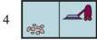
259: 
260: 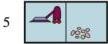
261: 
262: 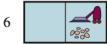
263: 
264: 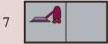
265: 
266: 
267: 
268: The eight possible states of the vacuum world
269: 
270: States 7 and 8 are goal states.
271: # Problem formulation
272: 
273: Example
274: 
275: 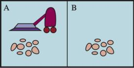
276: 
277: A vacuum-cleaner world with just two locations.
278: 
279: Initial state
280: 
281: 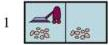
282: 
283: 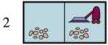
284: 
285: 
286: 
287: 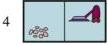
288: 
289: 
290: 
291: 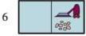
292: 
293: 
294: 
295: 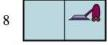
296: 
297: Actions
298: 
299: - Right (R)
300: - Left (L)
301: - Suck (S)
302: 
303: Any state can be designated as the initial state.
304: # Problem formulation
305: 
306: ## Example
307: 
308: 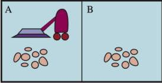
309: 
310: A vacuum-cleaner world with just two locations.
311: 
312: ## Transition model
313: 
314: - **Suck** removes any dirt from the agent's cell;
315: - **Right** moves the agent one cell in the right direction, unless it hits a wall, in which case the action has no effect.
316: - **Left** moves the agent one cell in the left direction, unless it hits a wall, in which case the action has no effect.
317: 
318: ## Action cost
319: 
320: - Each action costs 1.
321: # Problem formulation
322: 
323: Example
324: 
325: 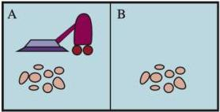
326: 
327: A vacuum-cleaner world with just two locations.
328: 
329: State space graph
330: 
331: 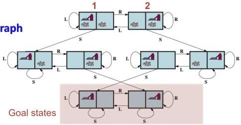
332: 
333: - Example of path:
334: {R, S, R, S, L}, From initial state 1
335: - Example of solution:
336: {S, L, S, R, S}, From initial state 1
337: - Example of optimal solution:
338: {S, R, S}, From initial state 1
339: # Problem Formulation involves Abstraction
340: 
341: ## Example: Missionaries and Cannibals
342: 
343: 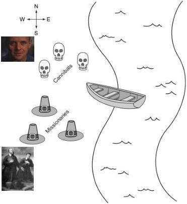
344: 
345: - 3 missionaries and 3 cannibals on left side
346: - Boat holds 1 or 2 people
347: - Never leave missionaries outnumbered by cannibals
348: - **States:**
349:   (# cannibals, # missionaries, # boats) on left side of river
350: - **Starting state / Goal state:**
351:   - (3,3,1) / (0,0,0)
352: - **Actions:**
353:   - Remove up to 2 people to other side and the resulting state is safe
354: - **Path cost:** number of crossing
355: # Problem formulation
356: 
357: - The process of removing detail from a representation is called *abstraction*.
358: - A good problem formulation has the right level of detail.
359: - The abstraction is *valid* if we can elaborate any abstract solution into a solution in the more detailed world;
360:   - a sufficient condition is that for every detailed state that is “in Boston,” there is a detailed path to some state that is “in Key west,” and so on.
361: - The abstraction is *useful* if carrying out each of the actions in the solution is easier than the original problem; in our case, the action “drive from Boston to Key West” can be carried out without further search or planning by a driver with average skill.
362: # How to Search
363: 
364: Given:
365: 
366: - Initial state
367: - Actions
368: - Transition model
369: - Goal state
370: - Path cost
371: 
372: 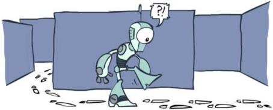
373: 
374: How do we find a solution (best solution)?
375: # How to Search
376: 
377: ## Generating action sequences
378: 
379: 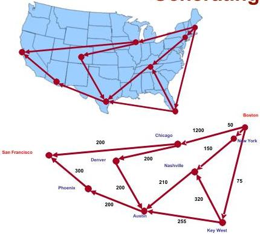
380: 
381: 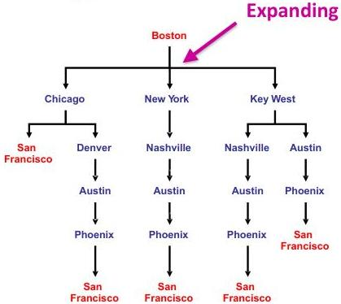
382: 
383: The search strategy determines which state to expand next.
384: # Search Tree
385: 
386: - A sequences of actions and their outcomes
387: - The root node corresponds to the starting state
388: - The children of a node correspond to the successor states of that node's state
389: - A path through the tree corresponds to a sequence of actions
390:   - A solution is a path ending in the goal state
391: - **Nodes vs. states**
392:   - A state is a representation of the world, while a **node** is a data structure that is part of the search tree
393:     - Node keeps track of a **state description**, a **parent node** (the node that generated this node), an **action** (the action that was applied to the parent to generate this node), a **path cost** (the cost of the path from the start state to this state), **depth** (number of steps in the path from the start state), and possibly other info.
394: - For most problems, we can never actually build the whole tree
395: 
396: 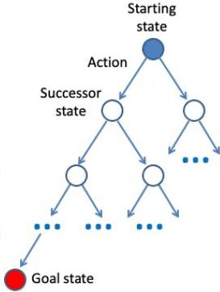
397: # State Space Graphs vs. Search Trees
398: 
399: ## State Space Graph
400: 
401: 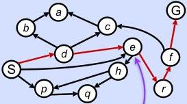
402: 
403: State : e
404: 
405: Each NODE in the
406: search tree is an
407: entire PATH in the
408: state space graph.
409: 
410: ## Search Tree
411: 
412: 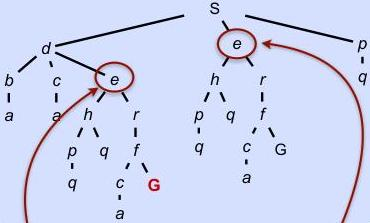
413: 
414: Node: (e, [S,d,e], 2,...)
415: 
416: Node: (e, [S,e], 1,...)
417: 
418: Node: (Current state, path from initial state, cost, depth...)
419: # Search tree process
420: 
421: - Begin at the start state and **expand** it by making a list of all possible successor states
422: - Maintain a **frontier** or a list of unexpanded states
423: - At each step, pick a state from the frontier to expand
424: - Keep going until you reach a goal state
425: - **Objective:** *Try to expand as few states as possible*
426: 
427: 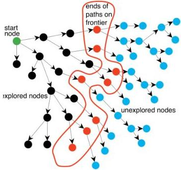
428: # Tree Search example
429: 
430: 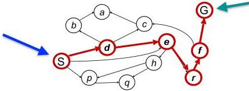
431: 
432: |  expended node | Frontier  |
433: | --- | --- |
434: |   | {S}  |
435: |  S not goal | {d,e,p}  |
436: |  d not goal | {e,p,b,c,e}  |
437: |  e not goal | {e,p,b,c,h,r}  |
438: |  r not goal | {e,p,b,c,h,f}  |
439: |  f not goal | {e,p,b,c,h,c,G}  |
440: |  G is goal | {e,p,b,c,h,c}  |
441: 
442: 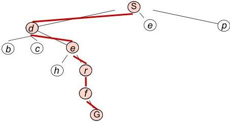
443: # Quiz: State Space Graphs vs. Search Trees
444: 
445: Consider this 4-state graph:
446: 
447: 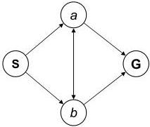
448: 
449: How big is its search tree (from $s$)?
450: 
451: 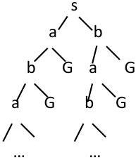
452: 
453: 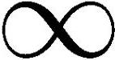
454: 
455: Important: Lots of repeated structure in the search tree!
456: # Tree search algorithm
457: 
458: ## Remark — Handle repeated states
459: 
460: - Every time you **expand a node**, add that state to the **explored set**; do not put explored states on the frontier again
461: - Every time you add a node to the frontier, check whether it already exists in the frontier with a higher path cost, and if yes, replace that node with the new one
462: - This approach is called **Graph search**
463: # General Graph Search
464: 
465: Consider this 4-state graph:
466: 
467: 
468: 
469: How big is its graph search (from s)?
470: 
471: 
472: # Tree search vs. Graph search
473: 
474: ## General Tree Search
475: 
476: **function TREE-SEARCH(problem) returns** a solution, or failure
477: 
478: initialize the **frontier** using the initial state of **problem**
479: 
480: **loop do**
481: 
482: if the **frontier** is empty **then return** failure
483: 
484: choose a leaf **node** and remove it from the **frontier**
485: 
486: if the **node** contains a goal state **then return** the corresponding solution
487: 
488: **expand** the chosen **node**, adding the resulting **nodes** to the **frontier**
489: 
490: **VS.**
491: 
492: ## General Graph Search
493: 
494: **function GRAPH-SEARCH(problem) returns** a solution, or failure
495: 
496: initialize the **frontier** using the initial state of **problem**
497: 
498: initialize the **explored set** to be empty
499: 
500: **loop do**
501: 
502: if the **frontier** is empty **then return** failure
503: 
504: choose a leaf **node** and remove it from the **frontier**
505: 
506: if the **node** contains a goal state **then return** the corresponding solution
507: 
508: add the **node** to the **explored set**
509: 
510: **expand** the chosen **node**, adding the resulting **nodes** to the **frontier**
511: 
512: but only if the **node** is not already in the **frontier** or **explored set**
513: # Search algorithm
514: 
515: **Main question:** which frontier nodes to explore? How to expand as few nodes as possible, while achieving the goal?
516: 
517: - **Search Strategy**
518:   - A search strategy determines the order in which nodes are expanded.
519: 
520: 
521: # Properties of Search Methods
522: 
523: Strategies are evaluated along the following criteria:
524: 
525: - ▶ **Completeness:** is the strategy guaranteed to find a solution when there is one?
526: - ▶ **Time Complexity:** how long does it take to find a solution?
527: - ▶ **Space Complexity:** how much memory does it require to perform the search?
528: - ▶ **Optimality:** Does the strategy find the best-quality solution when more than one solution exists?
529: 
530: • Time and space complexity are measured in terms of :
531: 
532: - • $b$ is the branching factor
533: - • $m$ is the maximum depth
534: - • solutions at various depths
535: 
536: • Number of nodes in entire tree?
537: 
538: • $1 + b + b^2 + \dots b^m = O(b^m)$
539: 
540: 
541: # Search Strategies
542: 
543: ???
544: 
545: 
546: 
547: What kinds of search algorithms are there?
548: # Search Algorithms
549: 
550: • Uninformed search algorithms
551: 
552: - Have no knowledge other the problem definition
553: - Has a start state
554: - Will recognize the goal state
555: 
556: • Informed search algorithms:
557: 
558: - Finds the solution efficiently
559: - Leverage information about the environment
560: - Use a heuristics - An under-estimate of cost to reach the goal
561: - Or path cost - Distance traveled to current state
562: 
563: 
564: # Today
565: 
566: ## Solving problems by searching
567: 
568: - Problem-solving agents
569: - Search Problems
570: - **Uninformed Search Methods**
571:   1. Depth-First Search
572:   2. Breadth-First Search
573:   3. Iterative Deepening Search
574:   4. Uniform-Cost Search
575: 
576: 
577: # Uninformed search strategies
578: 
579: - **Uninformed search** also known as unguided search, blind search, or brute-force search is a search methodology that has no additional information about the domain of the problem apart from the representation of the problem which is usually a tree.
580:   - Can only traverse state space blindly in hope of somehow hitting a goal state at some point
581: - **Uninformed search algorithms:**
582:   - Depth-first Search
583:   - Breadth-first Search
584:   - Iterative deepening search
585:   - Uniform Cost Search
586: # Today
587: 
588: ## Solving problems by searching
589: 
590: - Problem-solving agents
591: - Search Problems
592: - Uninformed Search Methods
593:   1. Depth-First Search
594:   2. Breadth-First Search
595:   3. Iterative Deepening Search
596:   4. Uniform-Cost Search
597: 
598: 
599: # 1. Depth-First Search
600: 
601: Depth-First Search (DFS):
602: 
603: - Always expand node at the deepest level of the tree, e.g., one of the most recently generated nodes
604: - When hit a dead-end, backtrack to last choice
605: - Frontier can be maintained as a last-in first-out (LIFO) queue (aka. a stack).
606: - The elements are added to the stack one at a time.
607: - The one selected and taken off the frontier at any time is the last element that was added.
608: 
609: 
610: # 1. Depth-First Search Example
611: 
612: DFS Search(problem, stack )
613: 
614: # of nodes tested: 0, expanded: 0
615: 
616: |  Explored node | Frontier  |
617: | --- | --- |
618: |   | {(S, path:[S])}  |
619: 
620: **Strategy:** expand a deepest node first
621: 
622: **Implementation:** Frontier is a LIFO stack
623: 
624: State Space Graph
625: 
626: 
627: 
628: Graph Search
629: # 1. Depth-First Search Example
630: 
631: DFS Search(problem, stack )
632: 
633: # of nodes tested: 0, expanded: 0
634: 
635: |  Explored node | Frontier  |
636: | --- | --- |
637: |   | {(S, path:[S])}  |
638: |  S not goal |   |
639: 
640: State Space Graph
641: 
642: 
643: 
644: Graph Search
645: 
646: 
647: # 1. Depth-First Search Example
648: 
649: DFS Search(problem, stack )
650: 
651: # of nodes tested: 1, expanded: 1
652: 
653: |  Explored node | Frontier  |
654: | --- | --- |
655: |   | {(S, path:[S])}  |
656: |  S not goal | {(C, path: [S,C]), (B, path: [S,B]), (A, path: [S,A])}  |
657: 
658: State Space Graph
659: 
660: 
661: 
662: Graph Search
663: 
664: 
665: # 1. Depth-First Search Example
666: 
667: DFS Search(problem, stack )
668: 
669: # of nodes tested: 2, expanded: 2
670: 
671: |  Explored node | Frontier  |
672: | --- | --- |
673: |   | {(S, path:[S])}  |
674: |  S not goal | {(C, path: [S,C]), (B, path: [S,B]), (A, path: [S,A])}  |
675: |  A not goal | {(C, path: [S,C]), (B, path: [S,B]), (E, path: [S,A,E]), (D, path: [S,A,E])}  |
676: 
677: State Space Graph
678: 
679: 
680: 
681: Graph Search
682: 
683: 
684: # 1. Depth-First Search Example
685: 
686: DFS Search(problem, stack )
687: 
688: # of nodes tested: 3, expanded: 3
689: 
690: |  Explored node | Frontier  |
691: | --- | --- |
692: |   | {(S, path:[S])}  |
693: |  S not goal | {(C, path: [S,C]), (B, path: [S,B]), (A, path: [S,A])}  |
694: |  A not goal | {(C, path: [S,C]), (B, path: [S,B]), (E, path: [S,A,E]), (D, path: [S,A,E])}  |
695: |  D not goal | {(C, path: [S,C]), (B, path: [S,B]), (E, path: [S,A,E]), (H, path: [S,A,D,H])}  |
696: 
697: State Space Graph
698: 
699: 
700: 
701: Graph Search
702: 
703: 
704: # 1. Depth-First Search Example
705: 
706: DFS Search(problem, stack )
707: 
708: # of nodes tested: 4, expanded: 3
709: 
710: |  Explored node | Frontier  |
711: | --- | --- |
712: |   | {S}  |
713: |  S not goal | {C, B, A}  |
714: |  A not goal | {C,B, E, D}  |
715: |  D not goal | {(C, path: [S,C]), (B, path: [S,B]), (E, path: [S,A,E]), (H, path: [S,A,D,H])}  |
716: |  H not goal | {(C, path: [S,C]), (B, path: [S,B]), (E, path: [S,A,E])} **no expand**  |
717: 
718: State Space Graph
719: 
720: 
721: 
722: Graph Search
723: 
724: 
725: # 1. Depth-First Search Example
726: 
727: DFS Search(problem, stack )
728: 
729: # of nodes tested: 4, expanded: 3
730: 
731: |  Explored node | Frontier  |
732: | --- | --- |
733: |   | {S}  |
734: |  S not goal | {C, B, A}  |
735: |  A not goal | {C,B, E, D}  |
736: |  D not goal | {(C, path: [S,C]), (B, path: [S,B]), (E, path: [S,A,E]), (H, path: [S,A,D,H])}  |
737: |  H not goal | {(C, path: [S,C]), (B, path: [S,B]), (E, path: [S,A,E])}  |
738: 
739: State Space Graph
740: 
741: 
742: 
743: Graph Search
744: 
745: 
746: # 1. Depth-First Search Example
747: 
748: DFS Search(problem, stack )
749: 
750: # of nodes tested: 4, expanded: 3
751: 
752: |  Explored node | Frontier  |
753: | --- | --- |
754: |   | {S}  |
755: |  S not goal | {C, B, A}  |
756: |  A not goal | {C,B, E, D}  |
757: |  D not goal | {(C, path: [S,C]), (B, path: [S,B]), (E, path: [S,A,E]), (H, path: [S,A,D,H])}  |
758: |  H not goal | {(C, path: [S,C]), (B, path: [S,B]), (E, path: [S,A,E])}  |
759: 
760: State Space Graph
761: 
762: 
763: 
764: Graph Search
765: 
766: 
767: # 1. Depth-First Search Example
768: 
769: DFS Search(problem, stack )
770: 
771: # of nodes tested: 5, expanded: 4
772: 
773: |  Explored node | Frontier  |
774: | --- | --- |
775: |   | {S}  |
776: |  S not goal | {C, B, A}  |
777: |  A not goal | {C,B, E, D}  |
778: |  D not goal | {C, B, E, H}  |
779: |  H not goal | {C, B, E}  |
780: |  E not goal | {(C, path: [S,C]), (B, path: [S,B]), (G, path: [S,A,E, G])}  |
781: 
782: State Space Graph
783: 
784: 
785: 
786: Graph Search
787: 
788: 
789: # 1. Depth-First Search Example
790: 
791: DFS Search(problem, stack )
792: 
793: # of nodes tested: 6, expanded: 4
794: 
795: |  Explored node | Frontier  |
796: | --- | --- |
797: |   | {S}  |
798: |  S not goal | {C, B, A}  |
799: |  A not goal | {C,B, E, D}  |
800: |  D not goal | {C, B, E, H}  |
801: |  H not goal | {C, B, E}  |
802: |  E not goal | {C, B, G}  |
803: |  **G is goal** | **Stop**  |
804: 
805: Expansion order: (S, A, D, H, E, G)
806: 
807: State Space Graph
808: 
809: 
810: 
811: Path: S, A, E, G
812: Cost: 15
813: 
814: Graph Search
815: 
816: 
817: # 1. Depth-First Search
818: 
819: **Depth-first search:** In depth-first search, the frontier acts like a last-in first-out queue (a stack). The elements are added to the stack one at a time. The one selected and taken off the frontier at any time is the last element that was added.
820: 
821: 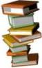
822: 
823: 
824: 
825: 
826: # 1. Depth-First Search Example
827: 
828: ## Depth-First Search algorithm
829: 
830: **function** DEPTH-FIRST-SEARCH( *problem* ) **returns** a solution, or failure
831: 
832: *node* ← a node with STATE = *problem*.INITIAL-STATE, PATH-COST = 0
833: 
834: **if** *problem*.GOAL-TEST( *node*.STATE) **then return** SOLUTION( *node* )
835: 
836: *frontier* ← a LIFO queue with *node* as the only element
837: 
838: *explored* ← an empty set
839: 
840: **loop do**
841: 
842: **if** EMPTY?( *frontier* ) **then return** failure
843: 
844: *node* ← POP( *frontier* ) /* chooses the deepest node in *frontier* */
845: 
846: add *node*.STATE to *explored*
847: 
848: **for each** *action* **in** *problem*.ACTIONS( *node*.STATE) **do**
849: 
850: *child* ← CHILD-NODE( *problem*, *node*, *action* )
851: 
852: **if** *child*.STATE is not in *explored* or *frontier* **then**
853: 
854: **if** *problem*.GOAL-TEST( *child*.STATE) **then return** SOLUTION( *child* )
855: 
856: *frontier* ← INSERT( *child*, *frontier* )
857: # 1. DFS Properties
858: 
859: - What nodes DFS expand?
860: 
861: - Some left prefix of the tree.
862: - Could process the whole tree!
863: - If $m$ is finite, takes time $O(b^m)$
864: 
865: - How much space does the fringe take?
866: 
867: - Only has siblings on path to root, so $O(bm)$, i.e., linear space!
868: 
869: - Is it complete?
870: 
871: - $m$ could be infinite, so only if we prevent cycles (more later)
872: - Complete in finite spaces
873: 
874: - Is it optimal?
875: 
876: - No, it finds the “leftmost” solution, regardless of depth or cost
877: 
878: 
879: 
880: 
881: # Today
882: 
883: ## Solving problems by searching
884: 
885: - Problem-solving agents
886: - Search Problems
887: - Uninformed Search Methods
888:   1. Depth-First Search
889:   2. Breadth-First Search
890:   3. Iterative Deepening Search
891:   4. Uniform-Cost Search
892: 
893: 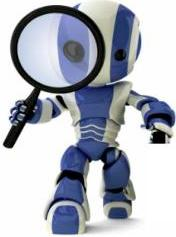
894: ## 2. Breadth-First Search
895: 
896: Breadth-First Search (BFS):
897: 
898: - Nodes are expanded in the same order in which they are generated.
899: - Frontier can be maintained as a First-In, First-Out (FIFO) queue. Thus, the path that is selected from the frontier is the one that was added earliest.
900: - This approach implies that the paths from the start node are generated in order of the number of arcs in the path.
901: - One of the paths with the fewest arcs is selected at each stage.
902: 
903: BFS
904: Looking wide before looking deep
905: 
906: 
907: 
908: 
909: 
910: Queue:
911: 
912: 
913: ## 2. Breadth-First Search Example
914: 
915: BFS_Search(problem, queue )
916: 
917: # of nodes tested: 0, expanded: 0
918: 
919: |  expnd. node | node list  |
920: | --- | --- |
921: |   | {(S, path:[S])}  |
922: 
923: Strategy: expand a shallowest node first
924: 
925: Implementation: Fringe/Frontier is a FIFO queue
926: 
927: State Space Graph
928: 
929: 
930: 
931: Graph Search
932: ## 2. Breadth-First Search Example
933: 
934: BFS_Search(problem, queue )
935: 
936: # of nodes tested: 1, expanded: 1
937: 
938: |  Explored node | node list  |
939: | --- | --- |
940: |   | {(S, path:[S])}  |
941: |  S not goal | {(A, path:[S,A]), (B, path:[S,B]), (C, path:[S,C])}  |
942: 
943: State Space Graph
944: 
945: 
946: 
947: Graph Search
948: 
949: 
950: ## 2. Breadth-First Search Example
951: 
952: BFS_Search(problem, queue )
953: 
954: # of nodes tested: 2, expanded: 2
955: 
956: |  Explored node | node list  |
957: | --- | --- |
958: |   | {(S, path:[S])}  |
959: |  S not goal | {(A, path:[S,A]), (B, path:[S,B]), (C, path:[S,C])}  |
960: |  A not goal | {(B, path:[S,B]), (C, path:[S,C]), (D, path:[S,A,D]), (E, path:[S,A,E])}  |
961: 
962: State Space Graph
963: 
964: 
965: 
966: Graph Search
967: 
968: 
969: ## 2. Breadth-First Search Example
970: 
971: BFS_Search(problem, queue )
972: 
973: # of nodes tested: 3, expanded: 3
974: 
975: |  Explored node | node list  |
976: | --- | --- |
977: |   | {(S, path:[S])}  |
978: |  S not goal | {(A, path:[S,A]), (B, path:[S,B]), (C, path:[S,C])}  |
979: |  A not goal | {(B, path:[S,B]), (C, path:[S,C]), (D, path:[S,A,D]), (E, path:[S,A,E])}  |
980: |  B not goal | {(C, path:[S,C]), (D, path:[S,A,D]), (E, path:[S,A,E]), (G, path:[S,B,G])}  |
981: 
982: State Space Graph
983: 
984: 
985: 
986: Graph Search
987: 
988: 
989: ## 2. Breadth-First Search Example
990: 
991: BFS_Search(problem, queue )
992: 
993: # of nodes tested: 4, expanded: 4
994: 
995: |  Explored node | node list  |
996: | --- | --- |
997: |   | {S}  |
998: |  S not goal | {A, B, C}  |
999: |  A not goal | {B, C, D, E}  |
1000: |  B not goal | {C, D, E, G}  |
1001: |  C not goal | {(D, path:[S,A,D]), (E, path:[S,A,E]), (G, path:[S,B,G]), **(F, path:[S,C,F])**}  |
1002: 
1003: State Space Graph
1004: 
1005: 
1006: 
1007: Graph Search
1008: 
1009: 
1010: ## 2. Breadth-First Search Example
1011: 
1012: BFS_Search(problem, queue )
1013: 
1014: # of nodes tested: 5, expanded: 5
1015: 
1016: |  Explored node | node list  |
1017: | --- | --- |
1018: |   | {S}  |
1019: |  S not goal | {A, B, C}  |
1020: |  A not goal | {B, C, D, E}  |
1021: |  B not goal | {C, D, E, G}  |
1022: |  C not goal | {D, E, G, F}  |
1023: |  D not goal | {(E, path:[S,A,E]), (G, path:[S,B,G]), (F, path:[S,C,F]), (H, path:[S,A,D,H])}  |
1024: 
1025: State Space Graph
1026: 
1027: 
1028: 
1029: Graph Search
1030: 
1031: 
1032: ## 2. Breadth-First Search Example
1033: 
1034: BFS_Search(problem, queue )
1035: 
1036: # of nodes tested: 6, expanded: 6
1037: 
1038: |  Explored node | node list  |
1039: | --- | --- |
1040: |   | {S}  |
1041: |  S not goal | {A, B, C}  |
1042: |  A not goal | {B, C, D, E}  |
1043: |  B not goal | {C, D, E, G}  |
1044: |  C not goal | {D, E, G, F}  |
1045: |  D not goal | {E, G, F, H}  |
1046: |  E not goal | {(G, path:[S,B,G]), (F, path:[S,C,F]), (H, path:[S,A,D,H])}  |
1047: 
1048: State Space Graph
1049: 
1050: 
1051: 
1052: Graph Search
1053: 
1054: 
1055: ## 2. Breadth-First Search Example
1056: 
1057: BFS_Search(problem, queue )
1058: 
1059: # of nodes tested: 7, expanded: 6
1060: 
1061: |  Explored node | node list  |
1062: | --- | --- |
1063: |   | {S}  |
1064: |  S not goal | {A, B, C}  |
1065: |  A not goal | {B, C, D, E}  |
1066: |  B not goal | {C, D, E, G}  |
1067: |  C not goal | {D, E, G, F}  |
1068: |  D not goal | {E, G, F, H}  |
1069: |  E not goal | {G, F, H, G}  |
1070: |  **G is goal** | **Stop**  |
1071: 
1072: State Space Graph
1073: 
1074: 
1075: 
1076: Path: S, B, G
1077: Cost: 8
1078: 
1079: Graph Search
1080: 
1081: 
1082: 
1083: Expansion order:
1084: (S, A, B, C, D, E, G)
1085: ## 2. Breadth-First Search
1086: 
1087: **Breadth-first search:** In breadth-first search, the frontier acts like a first-in first-out (FIFO) queue. The element selected and removed from the frontier at any given time is the one that was added earliest.
1088: 
1089: 
1090: 
1091: 
1092: ## 2. BFS pseudo-code
1093: 
1094: ### Breadth-First Search algorithm
1095: 
1096: **function** BREADTH-FIRST-SEARCH( *problem* ) **returns** a solution, or failure
1097: 
1098: *node* ← a node with STATE = *problem*.INITIAL-STATE, PATH-COST = 0
1099: 
1100: **if** *problem*.GOAL-TEST( *node*.STATE) **then return** SOLUTION( *node* )
1101: 
1102: *frontier* ← a FIFO queue with *node* as the only element
1103: 
1104: *explored* ← an empty set
1105: 
1106: **loop do**
1107: 
1108: **if** EMPTY?( *frontier* ) **then return** failure
1109: 
1110: *node* ← POP( *frontier* ) /* chooses the shallowest node in *frontier* */
1111: 
1112: add *node*.STATE to *explored*
1113: 
1114: **for each** *action* **in** *problem*.ACTIONS( *node*.STATE) **do**
1115: 
1116: *child* ← CHILD-NODE( *problem*, *node*, *action* )
1117: 
1118: **if** *child*.STATE is not in *explored* or *frontier* **then**
1119: 
1120: **if** *problem*.GOAL-TEST(*child*.STATE) **then return** SOLUTION(*child* )
1121: 
1122: *frontier* ← INSERT( *child*, *frontier* )
1123: ## 2. BFS Properties
1124: 
1125: ■ What nodes does BFS expand?
1126: 
1127: - ■ Processes all nodes above shallowest solution
1128: - ■ Let depth of shallowest solution be $d$
1129: - ■ Search takes time $O(b^d)$
1130: 
1131: ■ How much space does the frontier take?
1132: 
1133: - ■ Has roughly the last tier, so $O(b^d)$
1134: 
1135: ■ Is it complete?
1136: 
1137: - ■ $d$ must be finite if a solution exists, so yes!
1138: 
1139: ■ Is it optimal?
1140: 
1141: - ■ Only if costs are all 1 (1 per step)
1142: 
1143: 
1144: 
1145: 
1146: # Quiz: DFS vs BFS
1147: 
1148: 
1149: 
1150: - When will BFS outperform DFS?
1151: - When will DFS outperform BFS?
1152: 
1153: 
1154: 
1155: 
1156: 
1157: BFS, the closest elements to the starting location are searched first.
1158: 
1159: 
1160: 
1161: DFS, the search proceeds along a continuously deeper path until it hits a barrier and must backtracks to the last decision point.
1162: # DFS vs. BFS
1163: 
1164: - If you know a solution is not far from the root of the tree, *a breadth first search (BFS) might be better*
1165: - If the tree is very deep and solutions are rare, *depth first search (DFS) might take an extremely long time, but BFS could be faster*
1166: - If the tree is very wide, *a BFS might need to much memory, so it might be completely impractical*
1167: - If solutions are frequent but located deep in the tree, *BFS could be completely impractical*
1168: - If the search tree is very deep *you will need to restrict the search depth for depth first search (DFS)*
1169: 
1170: |  Scenario | Depth first | Breadth first  |
1171: | --- | --- | --- |
1172: |  Some paths are extremely long, or even infinite | Performs badly | Performs well  |
1173: |  All paths are of similar length | Performs well | Performs well  |
1174: |  All paths are of similar length, and all paths lead to a goal state | Performs well | Wasteful of time and memory  |
1175: |  High branching factor | Performance depends on other factors | Performs poorly  |
1176: # DFS Limites
1177: 
1178: - Depth first search is incomplete if there is an infinite branch in the search tree.
1179:   - Infinite branches can happen if:
1180:     - paths contain loops
1181:     - infinite number of states and/or operators.
1182: - For problems with infinite (or just very large) state spaces, several variants of depth-first search have been developed:
1183:   - Depth limited search
1184:   - Iterative deepening search
1185: # Outline
1186: 
1187: ## Solving problems by searching
1188: 
1189: - Problem-solving agents
1190: - Search Problems
1191: - Uninformed Search Methods
1192:   1. Depth-First Search
1193:   2. Breadth-First Search
1194:   3. Iterative Deepening Search
1195:   4. Uniform-Cost Search
1196: 
1197: 
1198: ## 3.a. Depth Limited Search
1199: 
1200: - **Limited depth DFS:** just like DFS, except never go deeper than some depth $\ell$
1201: - The nodes at depth $\ell$ are treated as if they had no successors
1202: - If the search reaches a node at depth $\ell$ where the path is not a solution, we backtrack to the next choice point at depth $< \ell$
1203: - Depth-first search can be viewed as a special case of **Depth Limited Search** where $\ell = \infty$
1204: - The depth bound can sometimes be chosen based on knowledge of the problem
1205: # 3.a. Depth Limited Search
1206: 
1207: 
1208: 
1209: 
1210: 
1211: Example: route planning problem
1212: 
1213: ▶ Requires some knowledge of the solution:
1214: 
1215: - in the route planning problem, the longest route has length $s - 1$, where $s$ is the number of cities (states),
1216: - so we can set $\ell = s - 1$
1217: - 9 cities, depth limit of 8?
1218: 
1219: ▶ What if we choose a limit too small?
1220: 
1221: - Sacrifice completeness
1222: # 3. Iterative Deepening Search
1223: 
1224: For the most problems, $\ell$ is unknown.
1225: 
1226: Iterative Deepening Search (IDS) is a form of depth limited search which progressively increases the bound.
1227: 
1228: 
1229: ### 3. Iterative Deepening Search
1230: 
1231: - Idea: get DFS's space advantage with BFS's time / shallow-solution advantages
1232: 
1233: - Run a DFS with depth limit 1. If no solution...
1234: - Run a DFS with depth limit 2. If no solution...
1235: - Run a DFS with depth limit 3 ...
1236: - Until a solution is found
1237: 
1238: - Solution will be found when $\ell = d$
1239: 
1240: - Isn't that wastefully redundant?
1241: 
1242: - Generally most work happens in the lowest level searched, so not so bad!
1243: 
1244: 
1245: # 3. Iterative Deepening Search Example
1246: 
1247: IDS Search(problem, stack )
1248: 
1249: Depth : 1, # of nodes tested: 0, expanded: 0
1250: 
1251: |  expnd. node | node list  |
1252: | --- | --- |
1253: |  |   |
1254: 
1255: State Space Graph
1256: 
1257: 
1258: 
1259: Graph Search
1260: # 3. Iterative Deepening Search Example
1261: 
1262: IDS Search(problem, stack )
1263: 
1264: Depth : 1, # of nodes tested: 0, expanded: 0
1265: 
1266: |  expnd. node | node list  |
1267: | --- | --- |
1268: |  |   |
1269: 
1270: State Space Graph
1271: 
1272: 
1273: 
1274: Graph Search
1275: # 3. Iterative Deepening Search Example
1276: 
1277: IDS Search(problem, stack )
1278: 
1279: Depth : 1, # of nodes tested: 0, expanded: 0
1280: 
1281: |  expnd. node | node list  |
1282: | --- | --- |
1283: |   | {(S, path: [S])}  |
1284: 
1285: State Space Graph
1286: 
1287: 
1288: 
1289: Graph Search
1290: # 3. Iterative Deepening Search Example
1291: 
1292: IDS Search(problem, stack )
1293: 
1294: Depth : 1, # of nodes tested: 1, expanded: 1
1295: 
1296: |  Explored node | Frontier  |
1297: | --- | --- |
1298: |   | {(S, path: [S])}  |
1299: |  S not goal | {(C, path: [S, C]), (B, path: [S, B]), (A, path: [S, A])}  |
1300: 
1301: State Space Graph
1302: 
1303: 
1304: 
1305: Graph Search
1306: 
1307: 
1308: # 3. Iterative Deepening Search Example
1309: 
1310: IDS Search(problem, stack )
1311: 
1312: Depth : 1, # of nodes tested: 2, expanded: 1
1313: 
1314: |  Explored node | Frontier  |
1315: | --- | --- |
1316: |   | {(S, path: [S])}  |
1317: |  S not goal | {(C, path: [S, C]), (B, path: [S, B]), (A, path: [S, A])}  |
1318: |  A not goal | {(C, path: [S, C]), (B, path: [S, B])} **no expand**  |
1319: 
1320: State Space Graph
1321: 
1322: 
1323: 
1324: Graph Search
1325: 
1326: 
1327: # 3. Iterative Deepening Search Example
1328: 
1329: IDS Search(problem, stack )
1330: 
1331: Depth : 1, # of nodes tested: 3, expanded: 1
1332: 
1333: |  Explored node | Frontier  |
1334: | --- | --- |
1335: |   | {(S, path: [S])}  |
1336: |  S not goal | {(C, path: [S, C]), (B, path: [S, B]), (A, path: [S, A])}  |
1337: |  A not goal | {(C, path: [S, C]), (B, path: [S, B])} **no expand**  |
1338: |  B not goal | {(C, path: [S, C]) **no expand**  |
1339: 
1340: State Space Graph
1341: 
1342: 
1343: 
1344: Graph Search
1345: 
1346: 
1347: # 3. Iterative Deepening Search Example
1348: 
1349: IDS Search(problem, stack )
1350: 
1351: Depth : 1, # of nodes tested: 4, expanded: 1
1352: 
1353: |  Explored node | Frontier  |
1354: | --- | --- |
1355: |   | {(S, path: [S])}  |
1356: |  S not goal | {(C, path: [S, C]), (B, path: [S, B]), (A, path: [S, A])}  |
1357: |  A not goal | {(C, path: [S, C]), (B, path: [S, B])} **no expand**  |
1358: |  B not goal | {(C, path: [S, C])} **no expand**  |
1359: |  C not goal | {} **no expand**  |
1360: 
1361: State Space Graph
1362: 
1363: 
1364: 
1365: Graph Search
1366: 
1367: 
1368: # 3. Iterative Deepening Search Example
1369: 
1370: IDS Search(problem, stack )
1371: 
1372: Depth : 1, # of nodes tested: 4, expanded: 1
1373: 
1374: |  Explored node | Frontier  |
1375: | --- | --- |
1376: |   | {(S, path: [S])}  |
1377: |  S not goal | {(C, path: [S, C]), (B, path: [S, B]), (A, path: [S, A])}  |
1378: |  A not goal | {(C, path: [S, C]), (B, path: [S, B])} **no expand**  |
1379: |  B not goal | {(C, path: [S, C])} **no expand**  |
1380: |  C not goal | {} **no expand**  |
1381: 
1382: Frontier is empty. Increasing depth
1383: 
1384: State Space Graph
1385: 
1386: 
1387: 
1388: Graph Search
1389: 
1390: 
1391: # 3. Iterative Deepening Search Example
1392: 
1393: IDS Search(problem, stack )
1394: 
1395: **Depth : 2**, # of nodes tested: 4, expanded: 2
1396: 
1397: |  expnd. node | node list  |
1398: | --- | --- |
1399: |   | {S}  |
1400: |  S not goal | {C,B,A}  |
1401: |  A not goal | {C,B} no expand  |
1402: |  B not goal | {C} no expand  |
1403: |  C not goal | {} no expand  |
1404: 
1405: State Space Graph
1406: 
1407: 
1408: 
1409: Graph Search
1410: # 3. Iterative Deepening Search Example
1411: 
1412: IDS Search(problem, stack )
1413: 
1414: Depth : 2, # of nodes tested: 4, expanded: 2
1415: 
1416: |  expnd. node | node list  |
1417: | --- | --- |
1418: |   | {S}  |
1419: |  S not goal | {C,B,A}  |
1420: |  A not goal | {C,B} no expand  |
1421: |  B not goal | {C} no expand  |
1422: |  C not goal | {} no expand  |
1423: 
1424: 
1425: 
1426: State Space Graph
1427: 
1428: 
1429: 
1430: Graph Search
1431: # 3. Iterative Deepening Search Example
1432: 
1433: IDS Search(problem, stack )
1434: 
1435: Depth : 2, # of nodes tested: 4, expanded: 2
1436: 
1437: |  expnd. node | node list  |
1438: | --- | --- |
1439: |   | {S}  |
1440: |  S not goal | {C,B,A}  |
1441: |  A not goal | {C,B} no expand  |
1442: |  B not goal | {C} no expand  |
1443: |  C not goal | {} no expand  |
1444: |  S not goal | {C,B,A}  |
1445: 
1446: State Space Graph
1447: 
1448: 
1449: 
1450: Graph Search
1451: 
1452: 
1453: # 3. Iterative Deepening Search Example
1454: 
1455: IDS Search(problem, stack )
1456: 
1457: Depth : 2, # of nodes tested: 4, expanded: 3
1458: 
1459: |  expnd. node | node list  |
1460: | --- | --- |
1461: |   | {S}  |
1462: |  S not goal | {C,B,A}  |
1463: |  A not goal | {C,B} no expand  |
1464: |  B not goal | {C} no expand  |
1465: |  C not goal | {} no expand  |
1466: |  S not goal | {C,B,A}  |
1467: |  A not goal | {C,B,E, D}  |
1468: 
1469: State Space Graph
1470: 
1471: 
1472: 
1473: Graph Search
1474: 
1475: 
1476: # 3. Iterative Deepening Search Example
1477: 
1478: IDS Search(problem, stack )
1479: 
1480: Depth : 2, # of nodes tested: 5, expanded: 3
1481: 
1482: |  expnd. node | node list  |
1483: | --- | --- |
1484: |   | {S}  |
1485: |  S not goal | {C,B,A}  |
1486: |  A not goal | {C,B} no expand  |
1487: |  B not goal | {C} no expand  |
1488: |  C not goal | {} no expand  |
1489: |  S not goal | {C,B,A}  |
1490: |  A not goal | {C,B,E, D}  |
1491: |  D not goal | {C,B,E}  |
1492: 
1493: State Space Graph
1494: 
1495: 
1496: 
1497: Graph Search
1498: 
1499: 
1500: # 3. Iterative Deepening Search Example
1501: 
1502: IDS Search(problem, stack )
1503: 
1504: Depth : 2, # of nodes tested: 6, expanded: 3
1505: 
1506: |  expnd. node | node list  |
1507: | --- | --- |
1508: |   | {S}  |
1509: |  S not goal | {C,B,A}  |
1510: |  A not goal | {C,B} no expand  |
1511: |  B not goal | {C} no expand  |
1512: |  C not goal | {} no expand  |
1513: |  S not goal | {C, B, A}  |
1514: |  A not goal | {C, B, E, D}  |
1515: |  D not goal | {C, B, E}  |
1516: |  E not goal | {C, B}  |
1517: 
1518: State Space Graph
1519: 
1520: 
1521: 
1522: Graph Search
1523: 
1524: 
1525: # 3. Iterative Deepening Search Example
1526: 
1527: IDS Search(problem, stack )
1528: 
1529: Depth : 2, # of nodes tested: 6, expanded: 4
1530: 
1531: |  expnd. node | node list  |
1532: | --- | --- |
1533: |   | {S}  |
1534: |  S not goal | {C,B,A}  |
1535: |  A not goal | {C,B} no expand  |
1536: |  B not goal | {C} no expand  |
1537: |  C not goal | {} no expand  |
1538: |  S not goal | {C, B, A}  |
1539: |  A not goal | {C, B, E, D}  |
1540: |  D not goal | {C, B, E}  |
1541: |  E not goal | {C, B}  |
1542: |  B not goal | {C, G}  |
1543: 
1544: State Space Graph
1545: 
1546: 
1547: 
1548: Graph Search
1549: 
1550: 
1551: # 3. Iterative Deepening Search Example
1552: 
1553: IDS Search(problem, stack )
1554: 
1555: Depth : 2, # of nodes tested: 7, expanded: 4
1556: 
1557: |  expnd. node | node list  |
1558: | --- | --- |
1559: |   | {S}  |
1560: |  S not goal | {C,B,A}  |
1561: |  A not goal | {C,B} no expand  |
1562: |  B not goal | {C} no expand  |
1563: |  C not goal | {} no expand  |
1564: |  S not goal | {C, B, A}  |
1565: |  A not goal | {C, B, E, D}  |
1566: |  D not goal | {C, B, E}  |
1567: |  E not goal | {C, B}  |
1568: |  B not goal | {C, G}  |
1569: |  **G is goal** | **Stop**  |
1570: 
1571: State Space Graph
1572: 
1573: 
1574: 
1575: Graph Search
1576: 
1577: 
1578: # 3. Iterative Deepening Search Example
1579: 
1580: IDS Search(problem, stack )
1581: 
1582: Depth : 2, # of nodes tested: 7, expanded: 4
1583: 
1584: |  expnd. node | node list  |
1585: | --- | --- |
1586: |   | {S}  |
1587: |  S not goal | {C,B,A}  |
1588: |  A not goal | {C,B} no expand  |
1589: |  B not goal | {C} no expand  |
1590: |  C not goal | {} no expand  |
1591: |  S not goal | {C, B, A}  |
1592: |  A not goal | {C, B, E, D}  |
1593: |  D not goal | {C, B, E}  |
1594: |  E not goal | {C, B}  |
1595: |  B not goal | {C, G}  |
1596: |  **G is goal** | **Stop**  |
1597: 
1598: State Space Graph
1599: 
1600: 
1601: 
1602: Graph Search
1603: 
1604: 
1605: 
1606: Path: S, B, G
1607: Cost: 8
1608: # 3. Iterative deepening search Properties
1609: 
1610: # - ■ **Time?**
1611: 
1612: - ■ $O(b^d)$, where $b$ is the branching factor and $d$ is the depth of the shallowest solution.
1613: 
1614: # - ■ **Space?**
1615: 
1616: - ■ $O(bd)$
1617: 
1618: # - ■ **Is it complete?**
1619: 
1620: - ■ yes
1621: 
1622: # - ■ **Is it optimal?**
1623: 
1624: - ■ Yes, if step cost = 1
1625: 
1626: 
1627: ### 3. Iterative deepening search Properties
1628: 
1629: - Has the advantages of BFS
1630:   - Complete
1631:   - Optimal (if the edges have identical costs)
1632: - Has the advantages of DFS
1633:   - Linear space complexity: $O(bd)$
1634: - Wasteful?
1635:   - because nodes near the top of the search tree are generated multiple times
1636: - It turns out this is NOT very costly
1637:   - For a tree with (nearly) the same branching factor at each level, most of the nodes are in the bottom level
1638: - Worst case time complexity: $O(b^d)$
1639: # 3. Iterative Deepening Search algorithm
1640: 
1641: # Iterative Deepening Search pseudocode
1642: 
1643: function ITERATIVE-DEEPENING-SEARCH(problem) returns a solution node or failure
1644: 
1645: for depth = 0 to ∞ do
1646: 
1647: result ← DEPTH-LIMITED-SEARCH(problem, depth)
1648: 
1649: if result ≠ cutoff then return result
1650: 
1651: function DEPTH-LIMITED-SEARCH(problem, ℓ) returns a node or failure or cutoff
1652: 
1653: frontier ← a LIFO queue (stack) with NODE(problem.INITIAL) as an element
1654: 
1655: result ← failure
1656: 
1657: while not IS-EMPTY(frontier) do
1658: 
1659: node ← POP(frontier)
1660: 
1661: if problem.IS-GOAL(node.STATE) then return node
1662: 
1663: if DEPTH(node) > ℓ then
1664: 
1665: result ← cutoff
1666: 
1667: else if not IS-CYCLE(node) do
1668: 
1669: for each child in EXPAND(problem, node) do
1670: 
1671: add child to frontier
1672: 
1673: return result
1674: # Outline
1675: 
1676: ## Solving problems by searching
1677: 
1678: - Problem-solving agents
1679: - Search Problems
1680: - Uninformed Search Methods
1681:   1. Depth-First Search
1682:   2. Breadth-First Search
1683:   3. Iterative Deepening Search
1684:   4. Uniform-Cost Search
1685: 
1686: 
1687: # Search with varying step costs
1688: 
1689: 
1690: 
1691: - BFS finds the path with the fewest steps, but **does not always find the cheapest path**
1692: # Outline
1693: 
1694: ## Solving problems by searching
1695: 
1696: - Problem-solving agents
1697: - Search Problems
1698: - Uninformed Search Methods
1699:   1. Depth-First Search
1700:   2. Breadth-First Search
1701:   3. Iterative Deepening Search
1702:   4. Uniform-Cost Search
1703: 
1704: 
1705: ## 4. Uniform Cost Search (UCS)
1706: 
1707: - For each frontier node, save the total cost of the path from the initial state to that node
1708: - Expand the frontier node with the lowest path cost
1709: - **Implementation:** *frontier* is a priority queue ordered by path cost
1710: - Equivalent to breadth-first if step costs all equal
1711: - Equivalent to Dijkstra's algorithm in general
1712: 
1713: 
1714: # 4. Uniform Cost Search Example
1715: 
1716: UCS Search(problem, priorityQueue )
1717: 
1718: # of nodes tested: 0, expanded: 0
1719: 
1720: |  expnd. node | node list  |
1721: | --- | --- |
1722: |   | {S}  |
1723: 
1724: **Strategy:** expand a cheapest node first
1725: 
1726: **Implementation:** Frontier is a priority queue (priority: cumulative cost)
1727: 
1728: State Space Graph
1729: 
1730: 
1731: 
1732: Graph Search
1733: # 4. Uniform Cost Search Example
1734: 
1735: UCS Search(problem, priorityQueue )
1736: 
1737: # of nodes tested:1, expanded: 1
1738: 
1739: |  Explored node | Frontier  |
1740: | --- | --- |
1741: |   | {(S, path: [S], cost: 0}  |
1742: |  S not goal | {(B, [S,B], 2), (C, [S,C], 4), (A, [S,A], 5)}  |
1743: 
1744: State Space Graph
1745: 
1746: 
1747: 
1748: Graph Search
1749: 
1750: 
1751: # 4. Uniform Cost Search Example
1752: 
1753: UCS Search(problem, priorityQueue )
1754: 
1755: # of nodes tested: 2, expanded: 2
1756: 
1757: |  Explored node | Frontier  |
1758: | --- | --- |
1759: |   | {(S, path: [S], cost: 0}  |
1760: |  S not goal | {(B, [S,B], 2), (C, [S,C], 4), (A, [S,A], 5)}  |
1761: |  B not goal | {(C, [S,C], 4), (A, [S,A], 5), (G, [S, B, G], 8)}  |
1762: 
1763: State Space Graph
1764: 
1765: 
1766: 
1767: Graph Search
1768: 
1769: 
1770: # 4. Uniform Cost Search Example
1771: 
1772: UCS Search(problem, priorityQueue )
1773: 
1774: # of nodes tested: 3, expanded: 3
1775: 
1776: |  Explored node | Frontier  |
1777: | --- | --- |
1778: |   | {(S, path: [S], cost: 0)}  |
1779: |  S not goal | {(B, [S,B], 2), (C, [S,C], 4), (A, [S,A], 5)}  |
1780: |  B not goal | {(C, [S,C], 4), (A, [S,A], 5), (G, [S, B, G], 8)}  |
1781: |  C not goal | {(A, [S,A], 5), (G, [S, B, G], 8), (F, [S, C, F], 6)}  |
1782: 
1783: State Space Graph
1784: 
1785: 
1786: 
1787: Graph Search
1788: 
1789: 
1790: # 4. Uniform Cost Search Example
1791: 
1792: UCS Search(problem, priorityQueue )
1793: 
1794: # of nodes tested: 4, expanded: 4
1795: 
1796: |  Explored node | Frontier  |
1797: | --- | --- |
1798: |   | {(S, path: [S], cost: 0)}  |
1799: |  S not goal | {(B, [S,B], 2), (C, [S,C], 4), (A, [S,A], 5)}  |
1800: |  B not goal | {(C, [S,C], 4), (A, [S,A], 5), (G, [S, B, G], 8)}  |
1801: |  C not goal | {(A, [S,A], 5), (G, [S, B, G], 8), (F, [S, C, F], 6)}  |
1802: |  A not goal | {(G, [S, B, G], 8), (F, [S, C, F], 6), (D, [S, A, D], 14), (E, [S, A, E], 9)}  |
1803: 
1804: State Space Graph
1805: 
1806: 
1807: 
1808: Graph Search
1809: 
1810: 
1811: # 4. Uniform Cost Search Example
1812: 
1813: UCS Search(problem, priorityQueue )
1814: 
1815: # of nodes tested: 5, expanded: 5
1816: 
1817: |  Explored node | Frontier  |
1818: | --- | --- |
1819: |   | {(S, path: [S], cost: 0}  |
1820: |  S not goal | {(B, [S,B], 2),(C, [S,C], 4),(A, [S,A], 5)}  |
1821: |  B not goal | {(C, [S,C], 4), (A, [S,A], 5), (G, [S, B, G], 8)}  |
1822: |  C not goal | {(A, [S,A], 5), (G, [S, B, G], 8), (F, [S, C, F], 6)}  |
1823: |  A not goal | {(G, [S, B, G], 8), (F, [S, C, F], 6), (D, [S, A, D], 14), (E, [S, A, E], 9)}  |
1824: |  F not goal | {(G, [S, B, G], 8), (D, [S, A, D], 14), (E, [S, A, E], 9), (G, [S, C, F, G], 7)}  |
1825: 
1826: State Space Graph
1827: 
1828: 
1829: 
1830: Graph Search
1831: 
1832: 
1833: 
1834: Remove the higher-cost of identical nodes on the queue and save memory. However, UCS is optimal even if this is not done, since lower-cost nodes sort to the front.
1835: ## 4. Uniform Cost Search Example
1836: 
1837: UCS Search(problem, priorityQueue)
1838: 
1839: # of nodes tested: 6, expanded: 5
1840: 
1841: |  Explored node | Frontier  |
1842: | --- | --- |
1843: |   | {(S, path: [S], cost: 0}  |
1844: |  S not goal | {(B, [S,B], 2),(C, [S,C], 4),(A, [S,A], 5)}  |
1845: |  B not goal | {(C, [S,C], 4), (A, [S,A], 5), (G, [S, B, G], 8)}  |
1846: |  C not goal | {(A, [S,A], 5), (G, [S, B, G], 8), (F, [S, C, F], 6)}  |
1847: |  A not goal | {(G, [S, B, G], 8), (F, [S, C, F], 6), (D, [S, A, D], 14), (E, [S, A, E], 9)}  |
1848: |  F not goal | {(G, [S, B, G], 8), (D, [S, A, D], 14), (E, [S, A, E], 9), (G, [S, C, F, G], 7)}  |
1849: |  G is goal | Stop  |
1850: 
1851: State Space Graph
1852: 
1853: 
1854: 
1855: Graph Search
1856: 
1857: 
1858: # 4. UCS algorithm
1859: 
1860: # Best first search
1861: 
1862: function BEST-FIRST-SEARCH(problem, f) returns a solution node or failure
1863:     node ← NODE(STATE=problem.INITIAL)
1864:     frontier ← a priority queue ordered by f, with node as an element
1865:     reached ← a lookup table, with one entry with key problem.INITIAL and value node
1866:     while not IS-EMPTY(frontier) do
1867:         node ← POP(frontier)
1868:         if problem.IS-GOAL(node.STATE) then return node
1869:         for each child in EXPAND(problem, node) do
1870:             s ← child.STATE
1871:             if s is not in reached or child.PATH-COST < reached[s].PATH-COST then
1872:                 reached[s] ← child
1873:                 add child to frontier
1874:     return failure
1875: 
1876: function EXPAND(problem, node) yields nodes
1877:     s ← node.STATE
1878: 
1879:     for each action in problem.ACTIONS(s) do
1880:         s' ← problem.RESULT(s, action)
1881:         cost ← node.PATH-COST + problem.ACTION-COST(s, action, s')
1882:     yield NODE(STATE=s', PARENT=node, ACTION=action, PATH-COST=cost)
1883: 
1884: # Uniform Cost Search
1885: 
1886: function UNIFORM-COST-SEARCH(problem) returns a solution node, or failure
1887: return BEST-FIRST-SEARCH(problem, PATH-COST)
1888: # 4. UCS Properties
1889: 
1890: What nodes does UCS expand?
1891: 
1892: - Processes all nodes with cost less than cheapest solution!
1893: - If that solution costs $C^*$ and arcs cost at least $\varepsilon$, then the “effective depth” is roughly $C^*/\varepsilon$
1894: - Takes time $O(b^{C*/\varepsilon})$ (exponential in effective depth)
1895: - This can be greater than $O(b^d)$: the search can explore long paths consisting of small steps before exploring shorter paths consisting of larger steps
1896: 
1897: How much space does the frontier take?
1898: 
1899: - Has roughly the last tier, so $O(b^{C*/\varepsilon})$
1900: 
1901: Is it complete?
1902: 
1903: - Assuming best solution has a finite cost and minimum arc cost is positive, yes!
1904: 
1905: Is it optimal?
1906: 
1907: - Yes! (Proof next lecture via A*)
1908: 
1909: 
1910: # 4. Uniform Cost Issues
1911: 
1912: - ■ **Strategy:** expand lowest path cost
1913: - ■ **The good:** UCS is complete and optimal!
1914: - ■ **The bad:**
1915:   - ■ Explores options in every “direction”
1916:   - ■ No information about goal location
1917: 
1918: 
1919: 
1920: 
1921: # Review: Uninformed search strategies
1922: 
1923: - A **search strategy** is defined by picking the order of node expansion
1924: - **Uninformed** search strategies use only the information available in the problem definition
1925:   - Breadth-first search
1926:   - Depth-first search
1927:   - Iterative deepening search
1928:   - Uniform-cost search
1929:   - Bidirectional Search
1930: # BFS/DFS/IDS/UCS
1931: 
1932: • Breadth-first search
1933: 
1934: - • **Good**: optimal, works well when many options, but not many actions required
1935: - • **Bad**: assumes all actions have equal cost
1936: 
1937: • Depth-first search
1938: 
1939: - • **Good**: memory-efficient, works well when few options, but lots of actions required
1940: - • **Bad**: not optimal, can run infinitely, assumes all actions have equal cost
1941: 
1942: • Iterative deepening search
1943: 
1944: - • **Good**: optimal, memory-efficient, and adaptable to different situations
1945: - • **Bad**: redundant work, assume all actions have equal cost,
1946: 
1947: • Uniform-cost search
1948: 
1949: - • **Good**: optimal, handles variable-cost actions
1950: - • **Bad**: explores all options, no information about goal location
1951: 
1952: **Basically Dijkstra's Algorithm!**
1953: # Evaluation of search algorithms
1954: 
1955: |  Criterion | Breadth-First | Uniform-Cost | Depth-First | Depth-Limited | Iterative Deepening  |
1956: | --- | --- | --- | --- | --- | --- |
1957: |  Complete? | Yes^{1} | Yes^{1,2} | No | No | Yes^{1}  |
1958: |  Optimal cost? | Yes^{3} | Yes | No | No | Yes^{3}  |
1959: |  Time | $$O(b^d)$$ | $$O(b^{1+\lfloor C^*/\epsilon \rfloor})$$ | $$O(b^m)$$ | $$O(b^\ell)$$ | $$O(b^d)$$  |
1960: |  Space | $$O(b^d)$$ | $$O(b^{1+\lfloor C^*/\epsilon \rfloor})$$ | $$O(bm)$$ | $$O(b\ell)$$ | $$O(bd)$$  |
1961: 
1962: - b is the branching factor; m is the maximum depth of the search tree; d is the depth of the shallowest solution, or is m when there is no solution; ℓ is the depth limit.
1963: - Superscript caveats are as follows: ¹ complete if b is finite, and the state space either has a solution or is finite. ² complete if all action costs are ≥ ε > 0; ³ cost-optimal if action costs are all identical.
1964: # Search Gone Wrong?
1965: 
1966: Still not as smart as it could be...
1967: 
1968: Can we do better?
1969: 
1970: 
1971: # Incorporating goal information
1972: 
1973: **How to efficiently solve search problems with variable-cost actions, using information about the goal state?**
1974: 
1975: This is the motivation behind **informed search**, which uses problem-specific knowledge to try and find solutions more efficiently
