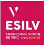
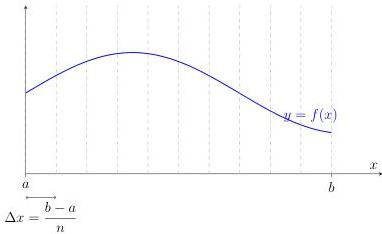
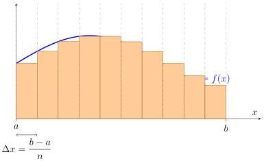

1: 
2: 
3: Raafat Talhouk
4: 
5: 2025-2026
6: 
7: ## Chapitre 2 : Lebesgue Integral
8: 
9: ### Contents
10: 
11: |  **1** | **Introduction** | **4**  |
12: | --- | --- | --- |
13: |  **2** | **Motivations and limitations of the Riemann integral** | **4**  |
14: |  2.1 | Recall of the Riemann integral . . . . . . . . . . . . . . . . . . . . . . . . . . . . . . . . . . . . . . . . . . . . . . . . . . . . . . . . . . . . . . . . . . . . . . . . . . . . . . . . . . . . . . . . . . . . . . . . . . . . | 4  |
15: |  2.2 | A famous limitation: the indicator function of rationals . . . . . . . . . . . . . . . . . . . . . . . . . . . . . . . . . . . . . . . . . . . . . . . . . . . . . . . . . . . . . . . . . . . . . . . . . . . . . . . . . . . . . . . . . . . . . . . . . . . | 5  |
16: |  2.3 | Another limitation: passing to the limit in a sequence of functions . . . . . . . . . . . . . . . . . . . . . . . . . . . . . . . . . . . . . . . . . . . . . . . . . . . . . . . . . . . . . . . . . . . . . . . . . . . . . . . . . . . . . . . . . . . . . . . . . . . | 5  |
17: |  2.4 | Towards a new approach . . . . . . . . . . . . . . . . . . . . . . . . . . . . . . . . . . . . . . . . . . . . . . . . . . . . . . . . . . . . . . . . . . . . . . . . . . . . . . . . . . . . . . . . . . . . . . . . . . . | 6  |
18: |  **3** | **Measure and σ-Algebras** | **6**  |
19: |  3.1 | σ-Algebras . . . . . . . . . . . . . . . . . . . . . . . . . . . . . . . . . . . . . . . . . . . . . . . . . . . . . . . . . . . . . . . . . . . . . . . . . . . . . . . . . . . . . . . . . . . . . . . . . . . | 6  |
20: |  3.2 | Measures . . . . . . . . . . . . . . . . . . . . . . . . . . . . . . . . . . . . . . . . . . . . . . . . . . . . . . . . . . . . . . . . . . . . . . . . . . . . . . . . . . . . . . . . . . . . . . . . . . . | 7  |
21: |  3.3 | Measured Spaces . . . . . . . . . . . . . . . . . . . . . . . . . . . . . . . . . . . . . . . . . . . . . . . . . . . . . . . . . . . . . . . . . . . . . . . . . . . . . . . . . . . . . . . . . . . . . . . . . . . | 9  |
22: |  3.4 | Key ideas to remember . . . . . . . . . . . . . . . . . . . . . . . . . . . . . . . . . . . . . . . . . . . . . . . . . . . . . . . . . . . . . . . . . . . . . . . . . . . . . . . . . . . . . . . . . . . . . . . . . . . | 9  |
23: |  **4** | **Measurable Functions** | **9**  |
24: |  4.1 | Definition . . . . . . . . . . . . . . . . . . . . . . . . . . . . . . . . . . . . . . . . . . . . . . . . . . . . . . . . . . . . . . . . . . . . . . . . . . . . . . . . . . . . . . . . . . . . . . . . . . . | 9  |
25: |  4.2 | Examples of measurable functions . . . . . . . . . . . . . . . . . . . . . . . . . . . . . . . . . . . . . . . . . . . . . . . . . . . . . . . . . . . . . . . . . . . . . . . . . . . . . . . . . . . . . . . . . . . . . . . . . . . | 10  |
26: |  4.3 | Stability of measurable functions . . . . . . . . . . . . . . . . . . . . . . . . . . . . . . . . . . . . . . . . . . . . . . . . . . . . . . . . . . . . . . . . . . . . . . . . . . . . . . . . . . . . . . . . . . . . . . . . . . . | 10  |
27: |  4.4 | Negligible sets and "almost everywhere" property . . . . . . . . . . . . . . . . . . . . . . . . . . . . . . . . . . . . . . . . . . . . . . . . . . . . . . . . . . . . . . . . . . . . . . . . . . . . . . . . . . . . . . . . . . . . . . . . . . . | 13  |
28: |  4.5 | Why is measurability important? . . . . . . . . . . . . . . . . . . . . . . . . . . . . . . . . . . . . . . . . . . . . . . . . . . . . . . . . . . . . . . . . . . . . . . . . . . . . . . . . . . . . . . . . . . . . . . . . . . . | 14  |
29: |  **5** | **Integral for the Dirac and counting measures** | **14**  |
30: |  **6** | **Integral of simple functions** | **15**  |
31: |  6.1 | Definition . . . . . . . . . . . . . . . . . . . . . . . . . . . . . . . . . . . . . . . . . . . . . . . . . . . . . . . . . . . . . . . . . . . . . . . . . . . . . . . . . . . . . . . . . . . . . . . . . . . | 15  |
32: |  6.2 | Definition of the integral of a simple function . . . . . . . . . . . . . . . . . . . . . . . . . . . . . . . . . . . . . . . . . . . . . . . . . . . . . . . . . . . . . . . . . . . . . . . . . . . . . . . . . . . . . . . . . . . . . . . . . . . | 16  |
33: |  6.3 | Simple example . . . . . . . . . . . . . . . . . . . . . . . . . . . . . . . . . . . . . . . . . . . . . . . . . . . . . . . . . . . . . . . . . . . . . . . . . . . . . . . . . . . . . . . . . . . . . . . . . . . | 16  |
34: |  6.4 | Properties of the integral of simple functions . . . . . . . . . . . . . . . . . . . . . . . . . . . . . . . . . . . . . . . . . . . . . . . . . . . . . . . . . . . . . . . . . . . . . . . . . . . . . . . . . . . . . . . . . . . . . . . . . . . | 16  |
35: |  6.5 | Why start with simple functions? . . . . . . . . . . . . . . . . . . . . . . . . . . . . . . . . . . . . . . . . . . . . . . . . . . . . . . . . . . . . . . . . . . . . . . . . . . . . . . . . . . . . . . . . . . . . . . . . . . . | 18  |
36: |  **7** | **Definition of the Lebesgue integral for a non-negative measurable function** | **18**  |
37: | --- | --- | --- |
38: |  7.1 | Non-negative measurable functions | 18  |
39: |  7.2 | Approximation by simple functions | 18  |
40: |  7.3 | Definition of the integral | 20  |
41: |  7.4 | Example | 20  |
42: |  7.5 | Fundamental properties | 21  |
43: |  7.6 | Summary | 22  |
44: |  **8** | **Integral of General Functions** | **22**  |
45: |  8.1 | Positive Part and Negative Part | 22  |
46: |  8.2 | Definition of the Integral | 23  |
47: |  8.3 | Examples | 23  |
48: |  8.4 | Summary to Remember | 23  |
49: |  **9** | **Fundamental Properties of the Lebesgue Integral** | **23**  |
50: |  9.1 | Linearity | 24  |
51: |  9.2 | Monotonicity | 24  |
52: |  9.3 | Fatou's Lemma | 25  |
53: |  9.4 | Lebesgue's Dominated Convergence Theorem | 26  |
54: |  **10** | **Examples and Counter examples** | **28**  |
55: |  10.1 | Continuous function: $f(x)\; =\; x$ | 28  |
56: |  10.2 | Indicator function of the rationals | 28  |
57: |  10.3 | Unbounded function: $f(x)\; =\; \backslash frac\{1\}\{\backslash sqrt\{x\}\}$ | 28  |
58: |  10.4 | Non-integrable function: $f(x)\; =\; \backslash frac\{1\}\{x\}$ on $(0,1]$ | 28  |
59: |  10.5 | Sequence of functions: $f_n(x)\; =\; n\cdot\; \backslash left\{1\}\{0,\backslash frac\{1\}\{n\}\}$ | 29  |
60: |  **11** | **$L^p(\Omega)$ Space** | **29**  |
61: |  11.1 | Definition and First Properties | 29  |
62: |  11.2 | Fundamental Inequalities | 30  |
63: |  11.3 | Density Results | 32  |
64: |  11.4 | $L^p$ on a Measured Space $(X,\mathscr{A},\mu)$ | 32  |
65: |  11.5 | Summary to Remember | 32  |
66: |  **12** | **Applications of the Lebesgue Integral** | **33**  |
67: |  12.1 | Probability and Random Variables | 33  |
68: |  12.2 | Other Application Areas | 33  |
69: |  12.3 | Summary | 33  |
70: |  **13** | **Product Measures and Tonelli and Fubini Theorems** | **34**  |
71: |  13.1 | Product Measures | 34  |
72: |  13.2 | Tonelli's Theorem (case of positive functions) | 35  |
73: |  13.3 | Fubini's Theorem (case of integrable functions) | 36  |
74: |  13.4 | Counterexample to Fubini: non-integrable function | 36  |
75: |  13.5 | Summary to remember | 37  |
76: # 14 Change of Variables Theorem 37
77: 
78: 14.1 Statement of the theorem in \(\mathbb{R}^n\) 37
79: 14.2 Example 1: Polar coordinates in \(\mathbb{R}^2\) 37
80: 14.3 Example 2: Cylindrical coordinates in \(\mathbb{R}^3\) 38
81: 14.4 Example 3: Spherical coordinates in \(\mathbb{R}^3\) 38
82: 14.5 Example 4: Affine change in \(\mathbb{R}^n\) 39
83: 14.6 Summary to remember 39
84: 
85: # A Appendix: Comparison between the Riemann and Lebesgue Integrals 40
86: 
87: A.1 Philosophy of the two approaches 40
88: A.2 Compatibility case 41
89: A.3 Functions integrable in the Lebesgue sense but not Riemann . 41
90: 
91: # B Appendix: Support of a measurable function 41
92: 
93: # C Appendix: Pushforward measure 42
94: 
95: # D Appendix: Duality in the spaces \(L^p (\Omega)\) 42
96: # 1 Introduction
97: 
98: The Lebesgue integral is a generalization of the Riemann integral, which students usually encounter in high school and during the first years of undergraduate studies. While the Riemann integral gives a meaning to the area under a curve, it quickly shows its limitations when we want to integrate more general functions, such as those with too many discontinuities.
99: 
100: At the beginning of the 20th century, Henri Lebesgue developed a new way of approaching integration, based not on subdivisions of the x-axis (as in Riemann's method), but on the measure of the sets of values taken by a function. This new approach allows the integration of a much larger class of functions and possesses powerful convergence properties.
101: 
102: The goal of this chapter is to introduce this new integral step-by-step, relying on intuition, simple examples, and the main ideas that form the foundation of modern analysis.
103: 
104: # 2 Motivations and limitations of the Riemann integral
105: 
106: ## 2.1 Recall of the Riemann integral
107: 
108: The Riemann integral is based on the following idea: to compute the area under a curve f defined on an interval [a, b], we divide this interval into small subintervals, then sum the areas of rectangles approximating the curve. If this sum converges as the subdivisions get finer, we say that f is Riemann integrable.
109: 
110: 
111: 
112: Figure 1: Example of a function to integrate over [a, b].
113: 
114: 
115: Figure 2: Left Riemann sums $$\sum_{k=0}^{n-1} f(a + k\Delta x)\Delta x$$: as the subdivision is refined ($$\Delta x \to 0$$), the sum of the rectangle areas converges to $$\int_{a}^{b} f(x) \, dx$$, if $$f$$ is Riemann integrable.
116: 
117: However, this method relies heavily on the continuity of the function or, at least, on the “smallness” of its discontinuities.
118: 
119: ## 2.2 A famous limitation: the indicator function of rationals
120: 
121: Consider the function defined on $$[0, 1]$$:
122: 
123: $$f(x) = \mathbf{1}_{\mathbb{Q} \cap [0, 1]}(x) = \begin{cases} 1 & \text{if } x \in \mathbb{Q} \cap [0, 1], \\ 0 & \text{otherwise}. \end{cases}$$
124: 
125: It is the indicator function of the rational numbers in $$[0, 1]$$. It takes the value 1 on rationals, and 0 on irrationals.
126: 
127: - It is discontinuous everywhere.
128: - Every interval contains infinitely many rationals and irrationals.
129: 
130: This function is not Riemann integrable, because its lower and upper integrals are:
131: 
132: $$\int_{0}^{1} f(x) \, dx = 0 \quad \text{and} \quad \overline{\int_{0}^{1}} f(x) \, dx = 1.$$
133: 
134: Thus, the Riemann integral cannot exist in this case.
135: 
136: ## 2.3 Another limitation: passing to the limit in a sequence of functions
137: 
138: Consider the sequence $$(f_n)$$ defined by:
139: 
140: $$f_n(x) = \begin{cases} n & \text{if } 0 \le x \le \frac{1}{n}, \\ 0 & \text{otherwise}. \end{cases}$$
141: Each $f_n$ is Riemann integrable on $[0, 1]$, and we have:
142: 
143: $$\int_0^1 f_n(x) \, dx = 1 \quad \text{for all } n.$$
144: 
145: But when $n \to \infty$, $f_n(x) \to 0$ for all $x > 0$, and $f_n(0) = n \to \infty$, so:
146: 
147: $$f_n(x) \longrightarrow 0 \quad \text{for all } x \in (0, 1].$$
148: 
149: We might expect that the limit of the integral equals the integral of the limit, i.e., 0. But here, this is not the case: the interchange of limit and integral fails.
150: 
151: The Lebesgue integral allows, under simple conditions, to justify this type of interchange.
152: 
153: ## 2.4 Towards a new approach
154: 
155: These examples show that the Riemann integral, while very intuitive, has limitations. It is not suited for highly discontinuous functions, nor for certain limit operations (like sequences of functions).
156: 
157: The Lebesgue integral will allow us:
158: 
159: to integrate very "irregular" functions;
160: to easily interchange limits and integrals (under certain conditions);
161: to handle cases impossible for Riemann's method.
162: 
163: We will therefore start with some fundamental tools: measure theory and measurable functions.
164: 
165: ## 3 Measure and $\sigma$-Algebras
166: 
167: Before defining the Lebesgue integral, we need to understand how to “measure” sets in a rigorous way. This is the purpose of measure theory.
168: 
169: ### 3.1 $\sigma$-Algebras
170: 
171: Definition 3.1. Let $X$ be a non-empty set. A $\sigma$-algebra $\mathscr{A}$ on $X$ is a collection of subsets of $X$ such that:
172: 
173: 1. \(X\in \mathcal{A}\)
174: 2. If \(A \in \mathcal{A}\), then \(A^c = X \setminus A \in \mathcal{A}\);
175: 3. If \((A_{n})_{n\in \mathbb{N}}\subset \mathcal{A}\), then \(\bigcup_{n = 0}^{\infty}A_n\in \mathcal{A}\)
176: 
177: In other words, a $\sigma$-algebra is closed under complements and countable unions. It is therefore also closed under countable intersections.
178: Example 3.2. On \( X = \{1,2\} \), the following collection is a \( \sigma \)-algebra:
179: 
180: \[
181: \mathscr {A} = \{\emptyset , \{1 \}, \{2 \}, \{1, 2 \} \}.
182: \]
183: 
184: On \(\mathbb{R}\), the most important example is the Borel \(\sigma\)-algebra, generated by open intervals \((a,b)\). It contains all standard intervals, countable sets, etc.
185: 
186: Definition 3.3 (Borel \(\sigma\)-algebra on \(\mathbb{R}^n\)). The Borel \(\sigma\)-algebra on \(\mathbb{R}^n\), denoted \(\mathcal{B}(\mathbb{R}^n)\), is the \(\sigma\)-algebra generated by the open sets of \(\mathbb{R}^n\) (for the usual topology). It contains all open and closed sets, intervals, and is stable under countable unions, countable intersections, and complements.
187: 
188: Definition 3.4 (Borel \(\sigma\)-algebra on an open set \(\Omega \subset \mathbb{R}^n\)). Let \(\Omega\) be an open set in \(\mathbb{R}^n\). The Borel \(\sigma\)-algebra of \(\Omega\), denoted \(\mathcal{B}(\Omega)\), is the \(\sigma\)-algebra induced by \(\mathcal{B}(\mathbb{R}^n)\) on \(\Omega\), that is:
189: 
190: \[
191: \mathscr {B} (\Omega) = \{A \cap \Omega \mid A \in \mathscr {B} (\mathbb {R} ^ {n}) \}.
192: \]
193: 
194: In other words, it contains intersections of Borel sets of \(\mathbb{R}^n\) with \(\Omega\).
195: 
196: ### 3.2 Measures
197: 
198: Definition 3.5. Let \(\mathcal{A}\) be a \(\sigma\)-algebra on a set \(X\). A mapping \(\mu : \mathcal{A} \to [0, +\infty]\) is called a measure if:
199: 
200: 1.  \( \mu(\emptyset)=0; \)
201: 
202: 2. \(\mu\) is \(\sigma\)-additive: for every sequence \((A_n)_{n \in \mathbb{N}}\) of disjoint sets in \(\mathcal{A}\), we have:
203: 
204: \[
205: \mu \left(\bigcup_ {n = 0} ^ {\infty} A _ {n}\right) = \sum_ {n = 0} ^ {\infty} \mu (A _ {n}).
206: \]
207: 
208: Example 3.6 (Dirac Measure). Let \( X \) be a set and \( x_0 \in X \) a fixed point. The Dirac measure at \( x_0 \), denoted \( \delta_{x_0} \), on \( (X, \mathcal{P}(X)) \) is defined by:
209: 
210: \[
211: \delta_ {x _ {0}} (A) = \left\{ \begin{array}{l l} 1 & \text {   if   } x _ {0} \in A, \\ 0 & \text {   if   } x _ {0} \notin A, \end{array} \right. \quad \text {   for   all   } A \subset X \text {(i.e.,   for   all   } A \in \mathcal {P} (X)).
212: \]
213: 
214: Why \(\delta_{x_0}\) is a positive measure.
215: 
216: - \(\delta_{x_0}(\emptyset) = 0\) since \(x_0 \notin \emptyset\).
217: - Let \((A_{n})_{n\in \mathbb{N}}\) be a sequence of pairwise disjoint sets. Then:
218: 
219: \[
220: \delta_ {x _ {0}} \left(\bigcup_ {n = 0} ^ {\infty} A _ {n}\right) = \left\{ \begin{array}{l l} 1 & \text { if } x _ {0} \in \bigcup_ {n = 0} ^ {\infty} A _ {n}, \\ 0 & \text { otherwise }. \end{array} \right.
221: \]
222: 
223: But \( x_0 \in \bigcup_{n=0}^{\infty} A_n \) if and only if there exists a unique \( n_0 \) such that \( x_0 \in A_{n_0} \) (since the \( A_n \) are disjoint). Therefore:
224: 
225: \[
226: \sum_ {n = 0} ^ {\infty} \delta_ {x _ {0}} (A _ {n}) = \left\{ \begin{array}{l l} 1 & \text { if } x _ {0} \in A _ {n _ {0}} \text { for   a   unique } n _ {0}, \\ 0 & \text { otherwise }. \end{array} \right.
227: \]
228: 
229: Hence:
230: 
231: \[
232: \delta_ {x _ {0}} \left(\bigcup_ {n = 0} ^ {\infty} A _ {n}\right) = \sum_ {n = 0} ^ {\infty} \delta_ {x _ {0}} (A _ {n}).
233: \]
234: Thus, $\delta_{x_0}$ is a positive measure.
235: 
236: Example 3.7 (Counting Measure). Let $X$ be any set. The counting measure $\mu$ on $(X, \mathscr{P}(X))$ is defined by:
237: 
238: $$\mu(A) = \begin{cases} \text{the number of elements of } A & \text{if } A \text{ is finite,} \\ +\infty & \text{if } A \text{ is infinite,} \end{cases} \quad \text{for all } A \in \mathscr{P}(X).$$
239: 
240: Why $\mu$ is a positive measure.
241: 
242: - $\mu(\emptyset) = 0$.
243: - Let $(A_n)_{n \in \mathbb{N}}$ be a family of pairwise disjoint sets. Then:
244: 
245: $$\mu \left( \bigcup_{n=0}^{\infty} A_n \right) = \sum_{n=0}^{\infty} \mu(A_n),$$
246: 
247: because the elements of $\bigcup A_n$ are all distinct and each belongs to exactly one $A_n$. Thus, we simply count the elements in each $A_n$ and sum them.
248: 
249: Therefore, $\mu$ is indeed a positive measure on $(X, \mathscr{P}(X))$.
250: 
251: Example 3.8 (Intuitive approach to length: Lebesgue measure on $\mathbb{R}$). The Lebesgue measure on $\mathbb{R}$, denoted $\lambda$, is the unique measure such that:
252: 
253: - It assigns to each interval $[a, b] \subset \mathbb{R}$ its length:
254: 
255: $$\lambda([a, b]) = b - a.$$
256: 
257: - It is translation-invariant: for all $x \in \mathbb{R}$, $\lambda(A + x) = \lambda(A)$.
258: 
259: It extends to a well-defined measure on the Borel $\sigma$-algebra of $\mathbb{R}$ (and then to a larger $\sigma$-algebra called the Lebesgue $\sigma$-algebra).
260: 
261: More generally: Lebesgue measure on $\mathbb{R}^N$.
262: 
263: Example 3.9 (Lebesgue measure on $\mathbb{R}^N$ – intuitive approach). The Lebesgue measure on $\mathbb{R}^N$ generalizes the notions of length (in 1D, see Example 3.8), area (in 2D), or volume (in 3D and higher) to much more general sets than just boxes or regular domains.
264: 
265: Intuitively, the Lebesgue measure $\lambda^N$ of a set $A \subset \mathbb{R}^N$ represents its geometric “size,” even if $A$ is highly irregular.
266: 
267: It is constructed so that:
268: 
269: - The measure of a box $I = \prod_{i=1}^N [a_i, b_i]$ is the product of its side lengths: $\lambda^N(I) = \prod_{i=1}^N (b_i - a_i)$.
270: - It is additive on disjoint sets: the measure of a disjoint union is the sum of the measures.
271: - It is translation-invariant: for all $x \in \mathbb{R}^N$, $\lambda^N(A + x) = \lambda^N(A)$.
272: 
273: Definition 3.10. A measurable space is a pair $(X, \mathscr{A})$ where:
274: 
275: - $X$ is a set,
276: - $\mathscr{A}$ is a $\sigma$-algebra on $X$.
277: ### 3.3 Measured Spaces
278: 
279: Definition 3.11. A measured space is a triple $(X, \mathcal{A}, \mu)$ where:
280: 
281: - $X$ is a set,
282: - $\mathcal{A}$ is a $\sigma$-algebra on $X$,
283: - $\mu$ is a measure on $\mathcal{A}$.
284: 
285: This is the framework in which we can define measurable functions and then integrate them.
286: 
287: Remark 3.12. The set of functions we can integrate depends on the chosen measure. The Lebesgue integral is therefore defined with respect to a measure.
288: 
289: ### 3.4 Key ideas to remember
290: 
291: - A $\sigma$-algebra specifies the “measurable” sets (compatible with the measure).
292: - A measure gives meaning to the “size” or “volume” of these sets.
293: - Lebesgue measure is the most common in real analysis.
294: 
295: We will now define what a measurable function is: in other words, a function well adapted to the measure, which we can integrate.
296: 
297: ## 4 Measurable Functions
298: 
299: The Lebesgue integral does not apply to all functions, but only to those that are well adapted to the measure defined on the domain. These functions are called measurable functions.
300: 
301: ### 4.1 Definition
302: 
303: Definition 4.1. Let $(X, \mathcal{A})$ be a measurable space (i.e., $X$ equipped with a $\sigma$-algebra $\mathcal{A}$), and let $f: X \to \mathbb{R} \cup \{+\infty, -\infty\} = \overline{\mathbb{R}}$ be a function.
304: 
305: We say that $f$ is measurable (with respect to $\mathcal{A}$) if for every real number $a \in \mathbb{R}$, the set
306: 
307: $$\{x \in X \mid f(x) > a\}$$
308: 
309: belongs to $\mathcal{A}$.
310: 
311: Remark 4.2. We could replace the condition "$f(x) > a$" by "$f(x) \geq a$", "$f(x) < a$", or "$f(x) \leq a$": these are equivalent for defining measurability.
312: ### 4.2 Examples of measurable functions
313: 
314: Example 4.3. Any continuous function \( f: \mathbb{R} \to \mathbb{R} \) is measurable (with respect to the Borel \( \sigma \)-algebra).
315: 
316: Solution. For a continuous \( f \), the set \( f^{-1}(]a, +\infty[) = \{x \in \mathbb{R} \mid f(x) > a\} \) is open for all \( a \in \mathbb{R} \) and hence Borel measurable.
317: 
318: Example 4.4. The indicator function \(\mathbf{1}_A\) of a measurable set \(A\in \mathcal{A}\), defined by:
319: 
320: \[
321: \mathbf {1} _ {A} (x) = \left\{ \begin{array}{l l} 1 & \text { if } x \in A, \\ 0 & \text { otherwise }, \end{array} \right.
322: \]
323: 
324: is measurable.
325: 
326: Solution. If \(a < 0\), then \(\{x \mid \mathbf{1}_A(x) > a\} = \mathbb{R}\), which is measurable.
327: 
328: - If \(0 \leq a < 1\), then \(\{x \mid \mathbf{1}_A(x) > a\} = A\), which is measurable by assumption.
329: - If \(a \geq 1\), then \(\{x \mid \mathbf{1}_A(x) > a\} = \emptyset\), which is measurable.
330: 
331: In all cases, the preimage set \(\{x\mid \mathbf{1}_A(x) > a\}\) is measurable. Therefore, \(\mathbf{1}_A\) is measurable.
332: 
333: □
334: 
335: Example 4.5. Any step (simple) function (piecewise constant on measurable sets) is measurable. Recall that \( f \) is a step function on \( [x_0, x_n] \) if
336: 
337: \[
338: f (x) = \sum_ {k = 1} ^ {n} a _ {k} \mathbf {1} _ {(x _ {k - 1}, x _ {k} ]} (x)
339: \]
340: 
341: Solution. This follows from the previous example and item 1 of Property 4.7.
342: 
343: ### 4.3 Stability of measurable functions
344: 
345: Measurable functions are stable under many usual operations:
346: 
347: Theorem 4.6 (Stability under Composition). Let \((X, \mathcal{A})\), \((Y, \mathcal{B})\), and \((Z, \mathcal{C})\) be three measurable spaces. If \(f: X \to Y\) is \(\mathcal{A} / \mathcal{B}\)-measurable and \(g: Y \to Z\) is \(\mathcal{B} / \mathcal{C}\)-measurable, then the composition \(g \circ f: X \to Z\) is \(\mathcal{A} / \mathcal{C}\)-measurable.
348: 
349: Proof. Let \( C \in \mathcal{C} \). Since \( g \) is \( \mathcal{B} / \mathcal{C} \)-measurable, we have \( g^{-1}(C) \in \mathcal{B} \). Because \( f \) is \( \mathcal{A} / \mathcal{B} \)-measurable, the preimage of any set in \( \mathcal{B} \) under \( f \) belongs to \( \mathcal{A} \), hence \( f^{-1}(g^{-1}(C)) \in \mathcal{A} \). By the elementary property of preimages,
350: 
351: \[
352: (g \circ f) ^ {- 1} (C) = f ^ {- 1} \bigl (g ^ {- 1} (C) \bigr).
353: \]
354: 
355: Thus, \((g\circ f)^{-1}(C)\in \mathcal{A}\) for every \(C\in \mathcal{C}\), which proves that \(g\circ f\) is \(\mathcal{A} / \mathcal{C}\)-measurable.
356: 
357: Property 4.7 (Stability under elementary operations). Let \( f \) and \( g \) be two measurable functions from \( X \) to \( \mathbb{R} \). Then:
358: 
359: 1. \(f + g\) is measurable.
360: 2. \(f \cdot g\) is measurable.
361: 3. \(|f|\) is measurable.
362: 4. \(\min (f,g)\) and \(\max (f,g)\) are measurable.
363: 
364: Proof. The key fact in all these proofs is: if $f$ is measurable, then for all $a \in \mathbb{R}$, the set $\{x \in X \mid f(x) > a\}$ is measurable and conversely.
365: 
366: 1. Measurability of $f + g$:
367: 
368: Let $a \in \mathbb{R}$. We want to show:
369: 
370: $$\{x \mid f(x) + g(x) > a\} \in \mathscr{A}.$$
371: 
372: We can write:
373: 
374: $$\{x \mid f(x) + g(x) > a\} = \bigcup_{q \in \mathbb{Q}} (\{x \mid f(x) > q\} \cap \{x \mid g(x) > a - q\}).$$
375: 
376: This union is countable since $\mathbb{Q}$ is countable. As $f$ and $g$ are measurable, the sets $\{x \mid f(x) > q\}$ and $\{x \mid g(x) > a - q\}$ are measurable. Intersections of measurable sets are measurable, and countable unions of measurable sets are measurable. Therefore, $f + g$ is measurable.
377: 
378: 2. Measurability of $f \cdot g$:
379: 
380: Since continuous functions are measurable, and $f \cdot g$ can be expressed as the limit of combinations of $f$ and $g$, this suffices. Alternatively, one can use:
381: 
382: $$fg = \frac{1}{4} \left[ (f + g)^2 - (f - g)^2 \right],$$
383: 
384: and note composition sums, differences, and the square function (continuous) preserve measurability.
385: 
386: 3. Measurability of $|f|$: We use the following criterion: a function $h$ is measurable if, for every $a \in \mathbb{R}$,
387: 
388: $$\{x \in X : h(x) < a\} \in \mathcal{A}.$$
389: 
390: - If $a \le 0$, then
391: 
392: $$\{x \in X : |f(x)| < a\} = \varnothing \in \mathcal{A}.$$
393: 
394: - If $a > 0$, then
395: 
396: $$\{x \in X : |f(x)| < a\} = f^{-1}((-a, a)).$$
397: 
398: Now $(-a, a)$ is an open interval of $\mathbb{R}$, hence a Borel set. Since $f$ is measurable, $f^{-1}((-a, a)) \in \mathcal{A}$.
399: 
400: Thus, for every $a \in \mathbb{R}$, the set $\{x \in X : |f(x)| < a\}$ belongs to $\mathcal{A}$. We conclude that $|f|$ is measurable.
401: 
402: 4. Measurability of $\min(f, g)$ and $\max(f, g)$:
403: 
404: We use the formulas:
405: 
406: $$\min(f, g) = \frac{1}{2}(f + g - |f - g|), \quad \max(f, g) = \frac{1}{2}(f + g + |f - g|).$$
407: 
408: Since $+$, $-$, and $|\cdot|$ preserve measurability, $\min(f, g)$ and $\max(f, g)$ are measurable.
409: Theorem 4.8 (Stability of limit operations; complete space). Let \((X, \mathcal{A}, \mu)\) be a measure space. Let \((f_n)_{n \geq 1}\) be a sequence of \(\mathcal{A}\)-measurable functions taking values in \(\overline{\mathbb{R}}\). Then the functions
410: 
411: \[
412: \sup _ {n \geq 1} f _ {n}, \quad \inf _ {n \geq 1} f _ {n}, \quad \operatorname * {l i m s u p} _ {n \to \infty} f _ {n}, \quad \operatorname * {l i m i n f} _ {n \to \infty} f _ {n}
413: \]
414: 
415: are \(\mathcal{A}\)-measurable. In particular, if \(f_n \to f\) \(\mu\)-almost everywhere, then \(f\) is measurable (here it is necessary to assume that \((X, \mathcal{A}, \mu)\) is complete, i.e. such that if \(N \in \mathcal{A}\) and \(\mu(N) = 0\), then every subset \(B \subset N\) also belongs to \(\mathcal{A}\). Otherwise, the limit function \(f\), after modification on a null set, is measurable).
416: 
417: Proof. We use the classical criterion: a function \( g: X \to \overline{\mathbb{R}} \) is measurable if and only if \( \{g < a\} \in \mathcal{A} \) for every \( a \in \mathbb{R} \).
418: 
419: (1) Supremum. For \(a \in \mathbb{R}\),
420: 
421: \[
422: \left\{\sup _ {n \geq 1} f _ {n} <   a \right\} = \bigcap_ {n = 1} ^ {\infty} \left\{f _ {n} <   a \right\}.
423: \]
424: 
425: Since each \(\{f_n < a\} \in \mathcal{A}\) and \(\mathcal{A}\) is stable under countable intersections, we obtain the measurability of \(\sup_n f_n\).
426: 
427: (2) Infimum. Similarly,
428: 
429: \[
430: \left\{\inf _ {n \geq 1} f _ {n} > a \right\} = \bigcap_ {n = 1} ^ {\infty} \left\{f _ {n} > a \right\},
431: \]
432: 
433: hence \(\inf_n f_n\) is measurable (or equivalently via \(-\inf f_n = \sup(-f_n)\)).
434: 
435: (3) Limsup. For \(a \in \mathbb{R}\),
436: 
437: \[
438: \left\{\limsup _ {n \to \infty} f _ {n} <   a \right\} = \bigcup_ {k = 1} ^ {\infty} \bigcap_ {n \geq k} \{f _ {n} <   a \}.
439: \]
440: 
441: The stability of \(\mathcal{A}\) under countable unions and intersections implies the measurability of \(\limsup f_n\).
442: 
443: (4) Liminf. Similarly,
444: 
445: \[
446: \left\{\liminf _ {n \to \infty} f _ {n} > a \right\} = \bigcup_ {k = 1} ^ {\infty} \bigcap_ {n \geq k} \{f _ {n} > a \},
447: \]
448: 
449: which shows that \(\liminf f_n\) is measurable.
450: 
451: (5) Almost everywhere limit. Assume that \( f_{n} \to f \) \( \mu \)-almost everywhere. Then on \( E := \{x \in X : \lim f_{n}(x) \text{ exists}\} \) (with \( \mu(X \setminus E) = 0 \)), we have \( f = \limsup f_{n} = \liminf f_{n} \). Let \( g := \limsup f_{n} \), which is measurable by (3). We have \( f = g \) on \( E \), hence for every \( a \in \mathbb{R} \),
452: 
453: \[
454: \{f <   a \} \Delta \{g <   a \} \subset X \setminus E,
455: \]
456: 
457: where  \( \Delta \)  denotes the symmetric difference. Since  \( X \setminus E \)  is measurable with measure zero and the space is complete, every subset of  \( X \setminus E \)  is measurable; thus  \( \{f < a\} \in A \)  for all a, and f is measurable. ☐
458: ### 4.4 Negligible sets and "almost everywhere" property
459: 
460: Definition 4.9 (Negligible set). Let \((X, \mathcal{A}, \mu)\) be a measure space. A set \(N \subset X\) is said to be negligible (or null set) for the measure \(\mu\) if:
461: 
462: \[
463: \mu (N) = 0.
464: \]
465: 
466: In other words, \(N\) belongs to \(\mathcal{A}\) and has measure zero.
467: 
468: Examples 4.10 (Examples for the Lebesgue measure \(\lambda\) on \(\mathbb{R}\)).
469: 
470: - Example 1: a singleton is negligible.
471: 
472: Let \(x_0 \in \mathbb{R}\). Then:
473: 
474: \[
475: \lambda (\{x _ {0} \}) = 0.
476: \]
477: 
478: Proof. For any \(\varepsilon > 0\), we can cover \(\{x_0\}\) with an interval \(I_{\varepsilon} = (x_0 - \varepsilon, x_0 + \varepsilon)\) whose measure is \(2\varepsilon\). By definition of Lebesgue measure as the infimum of lengths of open coverings:
479: 
480: \[
481: \lambda (\{x _ {0} \}) \leq 2 \varepsilon , \quad \forall \varepsilon > 0.
482: \]
483: 
484: Hence \(\lambda (\{x_0\}) = 0\)
485: 
486: - Example 2: a finite set is negligible.
487: 
488: Let \( A = \{x_{1},\ldots ,x_{n}\} \subset \mathbb{R} \). By finite additivity of Lebesgue measure:
489: 
490: \[
491: \lambda (A) = \sum_ {i = 1} ^ {n} \lambda (\{x _ {i} \}) = 0.
492: \]
493: 
494: - Example 3: the set of rationals \(\mathbb{Q}\) is negligible.
495: 
496: Proof. The rationals are countable: \(\mathbb{Q} = \{q_1, q_2, q_3, \ldots\}\). Then:
497: 
498: \[
499: \lambda (\mathbb {Q}) = \lambda \left(\bigcup_ {n = 1} ^ {\infty} \{q _ {n} \}\right) \leq \sum_ {n = 1} ^ {\infty} \lambda (\{q _ {n} \}) = 0.
500: \]
501: 
502: By \(\sigma\)-additivity, \(\lambda(\mathbb{Q}) = 0\).
503: 
504: - Example 4: the Cantor set is negligible.
505: 
506: It is known that the Cantor set \(\mathcal{C} \subset [0,1]\) is uncountable, closed, and has no intervals, but:
507: 
508: \[
509: \lambda (\mathcal {C}) = 0.
510: \]
511: 
512: (The proof relies on the construction of the Cantor set by successive removal of intervals, whose total removed length equals 1.)
513: 
514: Definition 4.11 (Property holding almost everywhere). Let \((X, \mathcal{A}, \mu)\) be a measure space. We say that a property \(P(x)\) holds almost everywhere on \(X\) (or \(\mu\)-almost everywhere) if the set of points in \(X\) where \(P(x)\) fails is negligible, i.e.:
515: 
516: \[
517: \mu \left(\{x \in X \mid P (x) i s f a l s e \}\right) = 0.
518: \]
519: 
520: We also write: \( P(x) \) is true for \( \mu \)-almost every \( x \in X \), or simply \( P(x) \) is true a.e.
521: Example 4.12. Let $f, g : X \to \mathbb{R}$ be two measurable functions. We say that $f = g$ almost everywhere on $X$ if:
522: 
523: $$\mu(\{x \in X \mid f(x) \neq g(x)\}) = 0.$$
524: 
525: That is, $f(x) = g(x)$ for $\mu$-almost every $x \in X$.
526: 
527: Back to measurability.
528: 
529: Proposition 4.13. Let $f : \mathbb{R} \to \mathbb{R}$ and let $N \subset \mathbb{R}$ be a negligible set (i.e. $\lambda(N) = 0$) such that $f$ is continuous on $\mathbb{R} \setminus N$. Then $f$ is (Lebesgue-)measurable.
530: 
531: Proof. Fix $a \in \mathbb{R}$. We decompose:
532: 
533: $$E_a = (\mathbb{R} \setminus N) \cap \{x : f(x) > a\} \cup N \cap \{x : f(x) > a\}.$$
534: 
535: On $\mathbb{R} \setminus N$, the function $f$ is continuous. Therefore:
536: 
537: $$\{x \in \mathbb{R} \setminus N : f(x) > a\} = (f|_{\mathbb{R} \setminus N})^{-1}((a, \infty))$$
538: 
539: is open in $\mathbb{R} \setminus N$, hence Borel measurable in $\mathbb{R}$ and thus Lebesgue-measurable. Moreover:
540: 
541: $$N \cap \{x : f(x) > a\} \subset N,$$
542: 
543: so it is negligible (any subset of a negligible set is measurable).
544: 
545: Thus, $E_a$ is the union of two measurable sets, hence measurable. As this holds for all $a \in \mathbb{R}$, $f$ is (Lebesgue-)measurable.
546: 
547: ### 4.5 Why is measurability important?
548: 
549: The measurability condition is what ensures that the sets on which the function “takes certain values” are measurable, and therefore integrable in the sense of Lebesgue.
550: 
551: ## 5 Integral for the Dirac and counting measures
552: 
553: Integration with respect to the Dirac measure Let $(X, \mathcal{A})$ be a measurable space, $x_0 \in X$ and $f : X \to \mathbb{R}$ a measurable function. We consider the Dirac measure $\delta_{x_0}$. We then define the integral of $f$ with respect to $\delta_{x_0}$ as:
554: 
555: $$\int_X f(x) \, d\delta_{x_0}(x) = f(x_0).$$
556: Integration with respect to the counting measure Let $X$ be a set, endowed with the $\sigma$-algebra $\mathscr{P}(X)$, and let $\mu$ be the counting measure. Let $f: X \to \mathbb{R}$ be a measurable function.
557: 
558: We define the integral of $f$ with respect to $\mu$ by the following sum:
559: 
560: $$\int_X f(x) \, d\mu(x) = \sum_{x \in X} f(x),$$
561: 
562: provided the series converges absolutely (i.e., $\sum_{x \in X} |f(x)| < \infty$). In this case, we say that $f \in L^1(X, \mu)$.
563: 
564: Example 5.1. Let $f: \mathbb{N} \to \mathbb{R}$ be defined by $f(n) = \frac{1}{n^2}$. Then:
565: 
566: $$\int_{\mathbb{N}} f(n) \, d\mu(n) = \sum_{n=1}^{\infty} \frac{1}{n^2} = \frac{\pi^2}{6}.$$
567: 
568: ## 6 Integral of simple functions
569: 
570: To build the Lebesgue integral, we start by integrating the simplest possible functions: simple functions, i.e., those taking only finitely many values.
571: 
572: ### 6.1 Definition
573: 
574: Definition 6.1. Let $(X, \mathscr{A}, \mu)$ be a measure space. A simple (or step) function is any function $f: X \to \mathbb{R}$ that is measurable and takes only finitely many real values.
575: 
576: In other words, there exists an integer $n \in \mathbb{N}^*$, real numbers $a_1, \ldots, a_n \in \mathbb{R}$, and measurable sets $A_1, \ldots, A_n \in \mathscr{A}$ forming a partition of $X$ (with $f$ constant on each $A_i$), such that:
577: 
578: $$f(x) = \sum_{i=1}^n a_i \, \mathbf{1}_{A_i}(x), \quad \forall x \in X.$$
579: 
580: Each $A_i$ is called the level set associated with the value $a_i$. We denote by $\mathscr{E}$ the set of all simple functions.
581: 
582: Reminder. Let $A \subset X$. A finite family of sets $(A_1, \ldots, A_n) \subset \mathscr{A}$ is called a partition of $A$ if:
583: 
584: (i) $\bigcup_{i=1}^n A_i = A,$
585: 
586: (ii) $A_i \cap A_j = \emptyset$ for all $i \neq j$.
587: 
588: That is, the $A_i$ are pairwise disjoint and cover the whole set $A$.
589: ### 6.2 Definition of the integral of a simple function
590: 
591: Definition 6.2. Let \( f = \sum_{i=1}^{n} a_i \mathbf{1}_{A_i} \) be a non-negative simple function, with \( a_i \in \mathbb{R}^+ \), i.e. \( f \in \mathcal{E}^+ \), \( A_i \in \mathcal{A} \). We define the integral of \( f \) over \( X \) (or over a measurable subset \( E \subset X \)) by:
592: 
593: \[
594: \int_ {E} f d \mu = \sum_ {i = 1} ^ {n} a _ {i} \mu (A _ {i} \cap E).
595: \]
596: 
597: Remark 6.3. This formula can be seen as a generalization of rectangle areas: for each value \( a_i \), we measure "how much" of \( E \) takes this value via \( \mu(A_i \cap E) \), then take a weighted sum.
598: 
599: ### 6.3 Simple example
600: 
601: Example 6.4. Let \( X = [0,2] \), equipped with the Lebesgue measure \( \lambda \), and consider the function:
602: 
603: \[
604: f (x) = \left\{ \begin{array}{l l} 1 & \text { if } x \in [ 0, 1), \\ 2 & \text { if } x \in [ 1, 2 ]. \end{array} \right.
605: \]
606: 
607: We can write:
608: 
609: \[
610: f (x) = \mathbf {1} _ {[ 0, 1)} (x) + 2 \mathbf {1} _ {[ 1, 2 ]} (x),
611: \]
612: 
613: and hence:
614: 
615: \[
616: \int_ {[ 0, 2 ]} f (x) d \lambda (x) = 1 \lambda ([ 0, 1)) + 2 \lambda ([ 1, 2 ]) = 1 \times 1 + 2 \times 1 = 3.
617: \]
618: 
619: ### 6.4 Properties of the integral of simple functions
620: 
621: Property 6.5 (Linearity). Let \( f \) and \( g \) be two simple functions in \( \mathcal{E}^+ \), and \( \alpha, \beta \in \mathbb{R} \). Then:
622: 
623: \[
624: \int_ {E} (\alpha f + \beta g) d \mu = \alpha \int_ {E} f d \mu + \beta \int_ {E} g d \mu .
625: \]
626: 
627: Proof. Since \( f \) and \( g \) are simple functions, there exist measurable partitions of \( E \) such that:
628: 
629: \[
630: f = \sum_ {i = 1} ^ {n} a _ {i} \mathbf {1} _ {A _ {i}}, \quad g = \sum_ {j = 1} ^ {m} b _ {j} \mathbf {1} _ {B _ {j}},
631: \]
632: 
633: with \(A_{i}, B_{j}\) measurable and \(a_{i}, b_{j} \geq 0\).
634: 
635: We consider the common partition formed by the sets \( C_{i,j} = A_i \cap B_j \), on which:
636: 
637: \[
638: \alpha f + \beta g = \sum_ {i, j} \left(\alpha a _ {i} + \beta b _ {j}\right) \mathbf {1} _ {C _ {i, j}}.
639: \]
640: 
641: The integral becomes:
642: 
643: \[
644: \int_ {E} (\alpha f + \beta g) d \mu = \sum_ {i, j} (\alpha a _ {i} + \beta b _ {j}) \mu (C _ {i, j}) = \alpha \sum_ {i, j} a _ {i} \mu (C _ {i, j}) + \beta \sum_ {i, j} b _ {j} \mu (C _ {i, j}).
645: \]
646: 
647: But:
648: 
649: \[
650: \sum_ {i, j} a _ {i} \mu (C _ {i, j}) = \sum_ {i} a _ {i} \mu (A _ {i}), \quad \sum_ {i, j} b _ {j} \mu (C _ {i, j}) = \sum_ {j} b _ {j} \mu (B _ {j}).
651: \]
652: Hence:
653: 
654: $$\int_{E} (\alpha f + \beta g) \, d\mu = \alpha \int_{E} f \, d\mu + \beta \int_{E} g \, d\mu. \quad \square$$
655: 
656: Property 6.6 (Monotonicity). Let $f$ and $g \in \mathcal{E}^+$ functions on a measurable set $E$ such that $f \leq g$ on $E$. Then:
657: 
658: $$\int_{E} f \, d\mu \leq \int_{E} g \, d\mu.$$
659: 
660: Proof. Since $f \leq g$, we have $g - f \geq 0$. Moreover, $g - f$ is still a simple function (being the sum and difference of simple functions).
661: 
662: By positivity of the integral for (non-negative) simple functions:
663: 
664: $$\int_{E} (g - f) \, d\mu \geq 0.$$
665: 
666: Therefore:
667: 
668: $$\int_{E} g \, d\mu - \int_{E} f \, d\mu \geq 0 \quad \Rightarrow \quad \int_{E} f \, d\mu \leq \int_{E} g \, d\mu. \quad \square$$
669: 
670: Proposition 6.7. Let $f \in \mathcal{E}^+$ function on $X$ and $A \in \mathcal{A}$ a negligible set. Then:
671: 
672: $$\int_{A} f(x) \, dx = 0.$$
673: 
674: Proof. By definition, a simple function $f$ is a linear combination of indicator functions of measurable sets of finite measure:
675: 
676: $$f = \sum_{k=1}^{n} a_k \mathbf{1}_{E_k},$$
677: 
678: where $a_k \in \mathbb{R}$ and each $E_k$ is measurable with finite measure.
679: 
680: We consider the integral of $f$ over the negligible set $A$:
681: 
682: $$\int_{A} f(x) \, dx = \sum_{k=1}^{n} a_k \int_{A} \mathbf{1}_{E_k}(x) \, dx.$$
683: 
684: But $\mathbf{1}_{E_k}(x)$ is measurable, and since $A$ is negligible, we have:
685: 
686: $$\int_{A} \mathbf{1}_{E_k}(x) \, dx = \operatorname{mes}(A \cap E_k) = 0.$$
687: 
688: Thus each term of the sum is zero, giving:
689: 
690: $$\int_{A} f(x) \, dx = 0.$$
691: 
692: Proposition 6.8. Let $(X, \mathcal{A}, \mu)$ be a measure space, and let $f : X \to \mathbb{R}^+$ be a simple function, If
693: 
694: $$\int_{X} f \, d\mu = 0,$$
695: 
696: then $f = 0$ $\mu$-almost everywhere on $X$.
697: Proof. A simple function $f$ can be written as $f = \sum_{i=1}^{n} \lambda_i \mathbf{1}_{A_i}$ with $\lambda_i \geq 0$ and $A_i \in \mathcal{A}$. We have:
698: 
699: $$\int_X f \, d\mu = \sum_{i=1}^{n} \lambda_i \, \mu(A_i).$$
700: 
701: If this sum is zero, and since all terms are non-negative, for each $i$ we have $\lambda_i \, \mu(A_i) = 0$. Therefore, $\lambda_i = 0$ or $\mu(A_i) = 0$, which implies $f = 0$ almost everywhere.
702: 
703: ### 6.5 Why start with simple functions?
704: 
705: - They are easy to integrate.
706: - Any non-negative measurable function can be approximated by an increasing sequence of simple functions.
707: - They form the basis for constructing the Lebesgue integral.
708: 
709: ## 7 Definition of the Lebesgue integral for a non-negative measurable function
710: 
711: ### 7.1 Non-negative measurable functions
712: 
713: Definition 7.1. A function $f : X \to [0, +\infty]$ is said to be non-negative measurable if:
714: 
715: - $f$ is measurable,
716: - $f(x) \geq 0$ for all $x \in X$.
717: 
718: ### 7.2 Approximation by simple functions
719: 
720: Let $f$ be a non-negative measurable function. One can construct a sequence $(\varphi_n)$ of non-negative simple functions such that:
721: 
722: - for all $n$, $\varphi_n(x) \leq \varphi_{n+1}(x) \leq f(x)$,
723: - the sequence converges to $f$: $\varphi_n(x) \to f(x)$ for all $x \in X$.
724: 
725: Construction. Let $f : X \to [0, +\infty)$ be measurable. For each integer $n \geq 1$, we construct a simple function $\varphi_n$ approximating $f$ from below by:
726: 
727: $$\varphi_n(x) = \sum_{k=0}^{n 2^n - 1} \frac{k}{2^n} \mathbf{1}_{A_{k,n}}(x) + n \mathbf{1}_{\{f(x) \geq n\}}(x),$$
728: 
729: where
730: 
731: $$A_{k,n} = \left\{ x \in X \ \middle|\ \frac{k}{2^n} \leq f(x) < \frac{k+1}{2^n} \right\}.$$
732: 
733: Each $A_{k,n}$ is measurable since $f$ is measurable, hence $\varphi_n$ is a simple function.
734: Clearly:
735: 
736: $$\varphi_{n}(x)\leq\varphi_{n+1}(x)\leq f(x),\quad\mathbf{and}\quad\lim_{n\to\infty}\varphi_{n}(x)=f(x).$$
737: 
738: 
739: 
740: Proposition 7.2. We have:
741: 
742: $$\varphi_{n}(x)\;=\;\frac{1}{2^{n}}\left\lfloor2^{n}\min\left(f(x),\,n\right)\right\rfloor.$$
743: 
744: Proof. Fix $x\in X$ and set
745: 
746: $$y\;=\;\min\left(f(x),\,n\right)\in[0,n].$$
747: 
748: We distinguish two cases.
749: 
750: Case 1: $y<n$. Then $y\in[0,n)$, and there exists a unique integer $k\in\{0,1,\ldots,n2^{n}-1\}$ such that
751: 
752: $$\frac{k}{2^{n}}\leq y\;<\;\frac{k+1}{2^{n}}.$$
753: 
754: Multiplying by $2^{n}$ gives
755: 
756: $$k\leq 2^{n}y\;<\;k+1,$$
757: 
758: so, by definition of the floor function, $\lfloor 2^{n}y\rfloor=k$. Moreover, since $y=\min(f(x),n)$ and $y<n$, we must have $y=f(x)$. Hence
759: 
760: $$\frac{k}{2^{n}}\leq f(x)<\frac{k+1}{2^{n}}\quad\Longleftrightarrow\quad x\in A_{k,n}.$$
761: 
762: It follows that
763: 
764: $$\varphi_{n}(x)\;=\;\frac{1}{2^{n}}\left\lfloor2^{n}y\right\rfloor\;=\;\frac{k}{2^{n}},$$
765: 
766: and in the slice representation, all terms vanish except the one corresponding to $A_{k,n}$:
767: 
768: $$\sum_{j=0}^{n2^{n}-1}\frac{j}{2^{n}}\mathbf{1}_{A_{j,n}}(x)+n\mathbf{1}_{B_{n}}(x)\;=\;\frac{k}{2^{n}}\cdot 1+n\cdot 0\;=\;\frac{k}{2^{n}}\;=\;\varphi_{n}(x).$$
769: 
770: Case 2: $y=n$. This is equivalent to $f(x)\geq n$. Then
771: 
772: $$\varphi_{n}(x)\;=\;\frac{1}{2^{n}}\left\lfloor2^{n}n\right\rfloor\;=\;\frac{1}{2^{n}}\left(n2^{n}\right)\;=\;n,$$
773: and in the slice representation, all indicators $\mathbf{1}_{A_{k,n}}(x)$ are zero (since $f(x) \geq n$) while $\mathbf{1}_{\{x, f(x) \geq n\}}(x) = 1$. Hence
774: 
775: $$\sum_{j=0}^{n 2^n-1} \frac{j}{2^n} \mathbf{1}_{A_{j,n}}(x) + n \mathbf{1}_{\{x, f(x) \geq n\}}(x) = 0 + n \cdot 1 = n = \varphi_n(x).$$
776: 
777: In both cases, we obtain pointwise equality between the two definitions. Since $x \in X$ was arbitrary, the equality holds for all $x \in X$, which completes the proof.
778: 
779: **Theorem 7.3** (Density of simple functions in $\mathcal{C}(K)$). Let $K \subset \mathbb{R}^n$ be compact. For any continuous function $f: K \to \mathbb{R}$ and any $\varepsilon > 0$, there exists a simple (step) function $\varphi: K \to \mathbb{R}$ such that:
780: 
781: $$\|f - \varphi\|_\infty < \varepsilon.$$
782: 
783: That is, simple functions are dense in the space of continuous functions on a compact set for the uniform norm.
784: 
785: Idea of the proof. Since $f$ is continuous on a compact set, it is uniformly continuous. We can partition $K$ into finitely many measurable pieces on which $f$ is almost constant. By taking average values or staircase approximations, we build a step function close to $f$. $\square$
786: 
787: ### 7.3 Definition of the integral
788: 
789: **Definition 7.4** (Lebesgue integral of a non-negative function). Let $(X, \mathscr{A}, \mu)$ be a measure space, and let $f: X \to [0, +\infty]$ be measurable.
790: 
791: The **Lebesgue integral** of $f$ is the value (possibly infinite) defined by:
792: 
793: $$\int_X f \, d\mu := \sup \left\{ \int_X \varphi \, d\mu \ \middle| \ \varphi \text{ is a simple function, } 0 \leq \varphi \leq f \right\}.$$
794: 
795: In particular, if $(\varphi_n)$ is an increasing sequence of simple functions such that $\varphi_n(x) \uparrow f(x)$ for a.e. $x \in X$, then:
796: 
797: $$\int_X f \, d\mu = \lim_{n \to \infty} \int_X \varphi_n \, d\mu.$$
798: 
799: **Remark 7.5.** This definition coincides with that for simple functions: if $f$ is already a non-negative step function, then the supremum is attained for $f$ itself.
800: 
801: ### 7.4 Example
802: 
803: **Example 7.6.** Let $f(x) = x$ on $[0, 1]$, with the Lebesgue measure $\lambda$. We construct an increasing sequence of simple functions converging to $f$:
804: 
805: $$\varphi_n(x) = \sum_{k=1}^n \frac{(k-1)}{n} \mathbf{1}_{(\frac{k-1}{n}, \frac{k}{n})}(x).$$
806: 
807: Then $\varphi_n(x) \leq f(x)$ and $\varphi_n(x) \to f(x)$ as $n \to \infty$. Hence,
808: 
809: $$\int_0^1 f(x) \, dx = \lim_{n \to \infty} \int_0^1 \varphi_n(x) \, dx = \frac{1}{2}.$$
810: ### 7.5 Fundamental properties
811: 
812: Property 7.7 (Linearity). If \( f \) and \( g \) are nonnegative measurable functions and \( \alpha, \beta \geq 0 \), then
813: 
814: \[
815: \int_ {E} (\alpha f + \beta g) d \mu = \alpha \int_ {E} f d \mu + \beta \int_ {E} g d \mu .
816: \]
817: 
818: Property 7.8 (Monotonicity). If \( f \) and \( g \) are nonnegative measurable functions and \( f \leq g \), then
819: 
820: \[
821: \int_ {E} f d \mu \leq \int_ {E} g d \mu .
822: \]
823: 
824: Proof. Both properties hold for simple functions; by approximation and passage to the limit, they follow for nonnegative measurable functions. \(\square\)
825: 
826: Proposition 7.9. Let \( f \) be a nonnegative measurable function on \( X \) and let \( A \in \mathcal{A} \) be a null set. Then
827: 
828: \[
829: \int_ {A} f (x) d x = 0.
830: \]
831: 
832: Proof. Since \( f \) is a nonnegative measurable function on the measure space \( (X, \mathcal{A}, \mu) \), consider an increasing sequence of simple functions \( (\varphi_n)_n \) such that
833: 
834: \[
835: 0 \leq \varphi_ {n} (x) \leq f (x) \quad \text { and } \quad \varphi_ {n} (x) \nearrow f (x) \quad \text { for   almost   every } x \in X.
836: \]
837: 
838: (This sequence exists by the definition of the Lebesgue integral for nonnegative functions.)
839: 
840: As \( A \) is null, \( \mu(A) = 0 \). For each \( n \), \( \varphi_n \) is a simple function (hence measurable and integrable), and by Proposition 6.7 we have:
841: 
842: \[
843: \int_ {A} \varphi_ {n} (x) d x = \int_ {X} \varphi_ {n} (x) \mathbf {1} _ {A} (x) d \mu = 0.
844: \]
845: 
846: By definition,
847: 
848: \[
849: \int_ {A} f (x) d \mu = \lim _ {n \to \infty} \int_ {A} \varphi_ {n} (x) d \mu = \lim _ {n \to \infty} 0 = 0.
850: \]
851: 
852: Proposition 7.10. Let \((X, \mathcal{A}, \mu)\) be a measure space, and let \(f: X \to \mathbb{R}\) be a function such that \(f \geq 0\) \(\mu\)-almost everywhere. If
853: 
854: \[
855: \int_ {X} f d \mu = 0,
856: \]
857: 
858: then \( f = 0 \) \( \mu \)-almost everywhere on \( X \).
859: 
860: Proof. Let \( f: X \to [0, +\infty) \) be measurable with \( \int_{X} f d\mu = 0 \).
861: 
862: By the definition of the Lebesgue integral, there exists an increasing sequence of nonnegative step functions \((\varphi_{n})\) such that
863: 
864: \[
865: \varphi_ {n} (x) \nearrow f (x) \quad \text { and } \quad \int_ {X} f d \mu = \lim _ {n \to \infty} \int_ {X} \varphi_ {n} d \mu .
866: \]
867: Assume by contradiction that there exists a set $A \subset X$ of strictly positive measure such that $f(x) > 0$ for all $x \in A$. By monotone convergence, there exists $n_0$ such that
868: 
869: $$\varphi_{n_0}(x) > \frac{f(x)}{2} > 0 \quad \text{on some subset } A' \subset A \text{ with } \mu(A') > 0.$$
870: 
871: Hence,
872: 
873: $$\int_X \varphi_{n_0}(x) \, d\mu \geq \int_{A'} \varphi_{n_0}(x) \, d\mu > 0,$$
874: 
875: which contradicts $\int_X f \, d\mu = \lim_{n \to \infty} \int_X \varphi_n \, d\mu = 0$. Therefore such a set $A$ cannot exist, and $f = 0$ $\mu$-almost everywhere.
876: 
877: ## 7.6 Summary
878: 
879: - Any nonnegative measurable function can be approximated by an increasing sequence of simple functions.
880: - The Lebesgue integral is defined as the supremum of the integrals of such approximations.
881: - This robust construction sets up the powerful convergence theorems to come.
882: 
883: We now extend the definition to integrable functions that may take both positive and negative values.
884: 
885: ## 8 Integral of General Functions
886: 
887: Up to this point, we have defined the Lebesgue integral only for positive measurable functions. We will now extend this definition to functions that can take both positive and negative values.
888: 
889: ### 8.1 Positive Part and Negative Part
890: 
891: Definition 8.1. Let $f: X \to \mathbb{R}$ be a measurable function. We define:
892: 
893: $$f^+(x) = \max(f(x), 0), \quad (\text{positive part})$$
894: 
895: $$f^-(x) = \max(-f(x), 0), \quad (\text{negative part})$$
896: 
897: We then have:
898: 
899: $$f = f^+ - f^-, \quad |f| = f^+ + f^-.$$
900: 
901: Remark 8.2. The functions $f^+$ and $f^-$ are positive and measurable, since they are obtained through operations that preserve measurability.
902: ## 8.2 Definition of the Integral
903: 
904: **Definition 8.3** (Lebesgue Integral of a Real Function). *Let $f : X \to \mathbb{R}$ be a measurable function. If the integrals of $f^+$ and $f^-$ are both finite, then we say that $f$ is **integrable**, and we define:*
905: 
906: $$\int_E f \, d\mu = \int_E f^+ \, d\mu - \int_E f^- \, d\mu.$$
907: 
908: **Remark 8.4.** *The condition $\int f^+ < \infty$ and $\int f^- < \infty$ ensures that the difference is meaningful (not $\infty - \infty$).*
909: 
910: **Theorem 8.5.** *A function $f : X \to \mathbb{R}$ is **integrable** (in the sense of Lebesgue) if and only if:*
911: 
912: $$\int_X |f| \, d\mu < \infty.$$
913: 
914: *Proof.* This follows from the fact that $|f| = f^+ + f^-$ and from Definition 8.3. $\square$
915: 
916: ## 8.3 Examples
917: 
918: **Example 8.6.** *The function $f(x) = \frac{1}{1+x^2}$ is continuous on $\mathbb{R}$ and decreases rapidly. It is integrable on $\mathbb{R}$:*
919: 
920: $$\int_{\mathbb{R}} \frac{1}{1+x^2} \, dx = \pi.$$
921: 
922: **Example 8.7.** *The function $f(x) = \frac{1}{x}$ on $(0, 1]$ is not integrable (in the sense of Lebesgue) because:*
923: 
924: $$\int_0^1 \frac{1}{x} \, dx = +\infty.$$
925: 
926: ## 8.4 Summary to Remember
927: 
928: - Any real measurable function can be decomposed into a positive part $f^+$ and a negative part $f^-$.
929: - We say that $f$ is integrable if $\int |f| < \infty$.
930: - The integral of $f$ is then well-defined as the difference between the integrals of $f^+$ and $f^-$.
931: - This generalizes the notion of algebraic area to very general functions.
932: 
933: In the next section, we will look at the main properties of the Lebesgue integral, in particular the convergence theorems, which demonstrate the full power of this approach.
934: 
935: ## 9 Fundamental Properties of the Lebesgue Integral
936: 
937: The Lebesgue integral has several important properties that make it very useful in analysis. We will present some of them, in particular the convergence theorems, which justify the exchange between limit and integral.
938: ### 9.1 Linearity
939: 
940: Property 9.1. If \( f \) and \( g \) are integrable on \( X \), and if \( \alpha, \beta \in \mathbb{R} \), then:
941: 
942: \[
943: \int_ {X} (\alpha f + \beta g) d \mu = \alpha \int_ {X} f d \mu + \beta \int_ {X} g d \mu .
944: \]
945: 
946: ### 9.2 Monotonicity
947: 
948: Property 9.2. If \( f \leq g \) almost everywhere on \( X \), and if \( f, g \) are integrable, then:
949: 
950: \[
951: \int_ {X} f d \mu \leq \int_ {X} g d \mu .
952: \]
953: 
954: Theorem 9.3 (Monotone Convergence Theorem (Beppo-Levi)). Let \((X, \mathcal{A}, \mu)\) be a measure space, and let \((f_n)_{n \in \mathbb{N}}\) be a sequence of positive measurable functions such that:
955: 
956: 1. \( f_{n}(x) \leq f_{n+1}(x) \) for \( \mu \)-almost every \( x \in X \) and for all \( n \) (pointwise increasing),
957: 2. \(f_{n}(x)\to f(x)\) for \(\mu\) -almost every \(x\in X\)
958: 
959: Then the limit function \( f \) is measurable and positive, and:
960: 
961: \[
962: \lim _ {n \rightarrow \infty} \int_ {X} f _ {n} d \mu = \int_ {X} f d \mu .
963: \]
964: 
965: Proof. By definition of the integral for a positive measurable function, for each \( n \), there exists an increasing sequence \( (\varphi_{n,k})_{k\in \mathbb{N}} \) of simple functions such that:
966: 
967: \[
968: 0 \leq \varphi_ {n, k} (x) \leq f _ {n} (x) \quad \text { and } \quad \varphi_ {n, k} (x) \xrightarrow [ k \to \infty ]{} f _ {n} (x), \quad \text { for   almost   every } x \in X.
969: \]
970: 
971: Set, for each \(k\), \(\psi_k(x) := \varphi_{k,k}(x)\). Then:
972: 
973: \[
974: \psi_ {k} (x) \leq f _ {k} (x) \leq f (x), \quad \text { and } \quad \psi_ {k} (x) \xrightarrow [ k \to \infty ]{} f (x), \quad \mu \text {-almost everywhere.}
975: \]
976: 
977: Each \(\psi_{k}\) is a simple function. Moreover, the sequence \((\psi_k)\) is increasing.
978: 
979: By the definition of the integral of a positive function as the increasing limit of integrals of simple functions, we have:
980: 
981: \[
982: \int_ {X} f d \mu = \lim _ {k \rightarrow \infty} \int_ {X} \psi_ {k} d \mu .
983: \]
984: 
985: But for all \(k\), \(\psi_k \leq f_k\), hence:
986: 
987: \[
988: \int_ {X} \psi_ {k} d \mu \leq \int_ {X} f _ {k} d \mu \leq \int_ {X} f d \mu .
989: \]
990: 
991: The sequence \((\int_{X}f_{k}d\mu)\) is therefore increasing and bounded by the same limit as \((\int_{X}\psi_{k}d\mu)\).
992: 
993: We conclude that:
994: 
995: \[
996: \lim _ {n \rightarrow \infty} \int_ {X} f _ {n} d \mu = \int_ {X} f d \mu .
997: \]
998: 
999: □
1000: 
1001: □
1002: Example 9.4. Let $f_n(x) = \min(x, n)$ on $X = [0, +\infty)$, with the Lebesgue measure. Then:
1003: 
1004: $$f_n(x) \uparrow x \quad \text{for all } x \in \mathbb{R}_+.$$
1005: 
1006: Thus $f(x) = x$, and we have:
1007: 
1008: $$\int_0^a f_n(x) \, dx \longrightarrow \int_0^a x \, dx = \frac{a^2}{2}.$$
1009: 
1010: Each $f_n$ is positive, increasing, and tends to $f$. Beppo-Levi applies perfectly.
1011: 
1012: # An important application of this theorem
1013: 
1014: Proposition 9.5. Let $(X, \mathscr{A}, \mu)$ be a measure space, and let $f: X \to \mathbb{R}$ (or $\mathbb{C}$) be an integrable function, i.e. $\int_X |f| \, d\mu < \infty$. If $A \in \mathscr{A}$ is negligible ($\mu(A) = 0$), then:
1015: 
1016: $$\int_A f \, d\mu = 0.$$
1017: 
1018: Proof. Let $g := |f|$, a measurable function $\ge 0$ and integrable. We first show that $\int_A g \, d\mu = 0$. Approximate $g$ by an increasing sequence of positive simple functions $(s_k)_{k \ge 1}$ such that $0 \le s_k \uparrow g$ (for example via the standard approximation of positive measurable functions).
1019: 
1020: Each $s_k$ can be written as $s_k = \sum_{i=1}^{m_k} a_{k,i} \mathbf{1}_{E_{k,i}}$ with $a_{k,i} \ge 0$ and $E_{k,i} \in \mathscr{A}$. Then:
1021: 
1022: $$\int_A s_k \, d\mu = \sum_{i=1}^{m_k} a_{k,i} \, \mu(A \cap E_{k,i}) \le \sum_{i=1}^{m_k} a_{k,i} \, \mu(A) = 0,$$
1023: 
1024: since $\mu(A) = 0$. By monotone convergence (Beppo-Levi),
1025: 
1026: $$\int_A g \, d\mu = \int_A \lim_{k \to \infty} s_k \, d\mu = \lim_{k \to \infty} \int_A s_k \, d\mu = 0.$$
1027: 
1028: Finally, by the triangle inequality for the integral:
1029: 
1030: $$\left| \int_A f \, d\mu \right| \le \int_A |f| \, d\mu = \int_A g \, d\mu = 0,$$
1031: 
1032: hence $\int_A f \, d\mu = 0$.
1033: 
1034: Remark. In the special case where $\mu$ is the Lebesgue measure on $\mathbb{R}^n$, one usually writes $dx$ instead of $d\mu$; the statement then becomes: $\int_A f(x) \, dx = 0$ whenever $A$ has Lebesgue measure zero.
1035: 
1036: # 9.3 Fatou's Lemma
1037: 
1038: Lemma 9.6 (Fatou). Let $(f_n)$ be a sequence of positive measurable functions. Then:
1039: 
1040: $$\int_X \liminf_{n \to \infty} f_n \, d\mu \le \liminf_{n \to \infty} \int_X f_n \, d\mu.$$
1041: Proof. Let $g(x) = \liminf f_n(x)$. By definition:
1042: 
1043: $$g(x) = \lim_{n \to \infty} \inf_{k \ge n} f_k(x).$$
1044: 
1045: Set $g_n(x) = \inf_{k \ge n} f_k(x)$. We have:
1046: 
1047: $$g_n(x) \le f_k(x) \quad \text{for all } k \ge n.$$
1048: 
1049: Hence $g_n \le f_k$ for all $k \ge n$ and $g_n \uparrow g$.
1050: 
1051: By Beppo-Levi:
1052: 
1053: $$\int_X g \, d\mu = \lim_{n \to \infty} \int_X g_n \, d\mu \le \liminf_{n \to \infty} \int_X f_n \, d\mu.$$
1054: 
1055: Example 9.7. Let $f_n(x) = \frac{1}{n} \chi_{[0,1/n]}(x)$ on $X = [0, 1]$.
1056: 
1057: Then:
1058: 
1059: - $f_n(x) \ge 0$,
1060: - $\liminf f_n(x) = 0$ everywhere,
1061: - $\int_0^1 f_n(x) \, dx = \frac{1}{n} \cdot \frac{1}{n} = \frac{1}{n^2} \to 0$.
1062: 
1063: Thus:
1064: 
1065: $$\int_0^1 \liminf f_n(x) = 0 \le \liminf \int_0^1 f_n(x) = 0.$$
1066: 
1067: Equality holds, but Fatou's lemma more generally provides an inequality in cases where other theorems do not apply.
1068: 
1069: ## 9.4 Lebesgue's Dominated Convergence Theorem
1070: 
1071: Theorem 9.8 (Lebesgue's Dominated Convergence Theorem). Let $(X, \mathscr{A}, \mu)$ be a measure space. Let $(f_n)_{n \in \mathbb{N}}$ be a sequence of measurable functions such that:
1072: 
1073: - $f_n(x) \to f(x)$ almost everywhere on $X$;
1074: - there exists a measurable function $g: X \to [0, +\infty]$ such that, for all $n$, $|f_n(x)| \le g(x)$ almost everywhere, and $\int_X g \, d\mu < +\infty$.
1075: 
1076: Then $f$ is integrable, i.e. measurable and $\int_X |f| \, d\mu < +\infty$, and:
1077: 
1078: $$\lim_{n \to \infty} \int_X f_n(x) \, d\mu(x) = \int_X f(x) \, d\mu(x).$$
1079: 
1080: Proof. (1) $f$ is integrable. Since $f_n \to f$ a.e. and the function $x \mapsto |x|$ is continuous, we have $|f_n| \to |f|$ a.e. Moreover, $|f_n| \le g$ a.e. for all $n$, hence by passing to the limit we get $|f| \le g$ a.e. Because $g$ is integrable, it follows that $f \in L^1(\mu)$ and
1081: 
1082: $$\int_X |f| \, d\mu \le \int_X g \, d\mu < \infty.$$
1083: (2) Fatou-type inequalities to bound the limit superior and limit inferior. Observe that for each $n$, we have $g \pm f_n \geq 0$ a.e. (since $|f_n| \leq g$), and likewise $g \pm f \geq 0$ a.e.
1084: 
1085: First application of Fatou's Lemma. Applying Fatou's Lemma to the nonnegative sequence $(g + f_n)$, we obtain
1086: 
1087: $$\int_X (g + f) \, d\mu \leq \liminf_{n \to \infty} \int_X (g + f_n) \, d\mu.$$
1088: 
1089: Expanding the integrals, this gives
1090: 
1091: $$\int_X g \, d\mu + \int_X f \, d\mu \leq \liminf_{n \to \infty} \left( \int_X g \, d\mu + \int_X f_n \, d\mu \right).$$
1092: 
1093: Subtracting $\int_X g \, d\mu$ from both sides yields
1094: 
1095: $$\int_X f \, d\mu \leq \liminf_{n \to \infty} \int_X f_n \, d\mu.$$
1096: 
1097: Second application of Fatou's Lemma. Similarly, applying Fatou's Lemma to the nonnegative sequence $(g - f_n)$,
1098: 
1099: $$\int_X (g - f) \, d\mu \leq \liminf_{n \to \infty} \int_X (g - f_n) \, d\mu,$$
1100: 
1101: that is,
1102: 
1103: $$\int_X g \, d\mu - \int_X f \, d\mu \leq \liminf_{n \to \infty} \left( \int_X g \, d\mu - \int_X f_n \, d\mu \right).$$
1104: 
1105: Subtracting $\int_X g \, d\mu$ and changing signs, we deduce
1106: 
1107: $$\limsup_{n \to \infty} \int_X f_n \, d\mu \leq \int_X f \, d\mu.$$
1108: 
1109: (3) Conclusion. From the two previous inequalities,
1110: 
1111: $$\int_X f \, d\mu \leq \liminf_{n \to \infty} \int_X f_n \, d\mu \leq \limsup_{n \to \infty} \int_X f_n \, d\mu \leq \int_X f \, d\mu,$$
1112: 
1113: we conclude that the limit $\lim_{n \to \infty} \int_X f_n \, d\mu$ exists and equals $\int_X f \, d\mu$.
1114: 
1115: Remark 9.9. This proof uses only Fatou's Lemma and the assumption of integrable domination. Note that Step (1) relies solely on the continuity of the absolute value function and the bound $|f_n| \leq g$.
1116: 
1117: Example 9.10. Let $f_n(x) = \frac{\sin(x)}{n}$ on $X = [0, \pi]$. Then:
1118: 
1119: $$f_n(x) \to 0 \quad \text{for all } x.$$
1120: 
1121: Moreover:
1122: 
1123: $$|f_n(x)| \leq \frac{1}{n} \leq 1 \quad \text{and even } |f_n(x)| \leq |\sin(x)| =: g(x).$$
1124: 
1125: The function $g(x)$ is integrable on $[0, \pi]$, so we can apply the dominated convergence theorem:
1126: 
1127: $$\int_0^\pi f_n(x) \, dx \longrightarrow \int_0^\pi 0 \, dx = 0.$$
1128: ## 10 Examples and Counter examples
1129: 
1130: In this section, we present several concrete examples to illustrate the integrability (or lack thereof) of certain functions, depending on whether we use the Riemann or Lebesgue integral.
1131: 
1132: ### 10.1 Continuous function: $f(x) = x$
1133: 
1134: Example 10.1. The function $f(x) = x$ on $[0, 1]$ is continuous, so:
1135: 
1136: $$\int_0^1 f(x) \, dx = \frac{1}{2} \quad (\text{Riemann and Lebesgue}).$$
1137: 
1138: This is a classic case where the two integrals coincide.
1139: 
1140: ### 10.2 Indicator function of the rationals
1141: 
1142: Example 10.2. Let $f(x) = \mathbf{1}_{\mathbb{Q} \cap [0, 1]}(x)$.
1143: 
1144: - It is discontinuous everywhere.
1145: - It is not Riemann integrable.
1146: - But it is Lebesgue integrable:
1147: 
1148: $$\int_0^1 f(x) \, d\lambda = \lambda(\mathbb{Q} \cap [0, 1]) = 0.$$
1149: 
1150: ### 10.3 Unbounded function: $f(x) = \frac{1}{\sqrt{x}}$
1151: 
1152: Example 10.3. Let $f(x) = \frac{1}{\sqrt{x}}$ on $[0, 1]$.
1153: 
1154: - It is positive and integrable on $[a, 1]$ for any $a > 0$.
1155: - It has a **singularity at $0^{**}$.
1156: - Computation of the integral:
1157: 
1158: $$\int_0^1 \frac{1}{\sqrt{x}} \, dx = 2.$$
1159: 
1160: - Therefore: $f$ is Lebesgue integrable (and also Riemann integrable here).
1161: 
1162: ### 10.4 Non-integrable function: $f(x) = \frac{1}{x}$ on $(0, 1]$
1163: 
1164: Example 10.4. Consider $f(x) = \frac{1}{x}$ on $(0, 1]$.
1165: 
1166: - This function is unbounded near 0.
1167: - The improper integral diverges:
1168: 
1169: $$\int_0^1 \frac{1}{x} \, dx = +\infty.$$
1170: 
1171: - Therefore $f$ is not Riemann integrable, nor Lebesgue integrable.
1172: ### 10.5 Sequence of functions: $f_n(x) = n \cdot \mathbf{1}_{[0, \frac{1}{n}]}(x)$
1173: 
1174: Example 10.5. Let $f_n(x) = n \cdot \mathbf{1}_{[0, \frac{1}{n}]}(x)$ on $[0, 1]$.
1175: 
1176: - For all $n$:
1177: 
1178: $$\int_0^1 f_n(x) \, dx = n \cdot \frac{1}{n} = 1.$$
1179: 
1180: - But $f_n(x) \to 0$ for all $x > 0$.
1181: 
1182: - Therefore:
1183: 
1184: $$\int_0^1 \lim f_n(x) = 0 \neq \lim \int_0^1 f_n(x) = 1.$$
1185: 
1186: This example shows that one cannot always interchange limits and integrals — here, the Dominated Convergence Theorem cannot be applied because there is no integrable function $g$ that dominates all $f_n$.
1187: 
1188: ## 11 $L^p(\Omega)$ Space
1189: 
1190: In this section, we consider $(\Omega, \mathcal{B}, \lambda^N)$ as a measured space, where $\Omega \subset \mathbb{R}^N$ is an open set, and $\lambda^N$ is the Lebesgue measure on $\Omega$. The notation $d\lambda^N$ will be abbreviated by $dx$. Let $1 \le p \le +\infty$.
1191: 
1192: ### 11.1 Definition and First Properties
1193: 
1194: For $1 \le p < +\infty$, we define:
1195: 
1196: $$\mathcal{L}^p(\Omega) = \left\{ f : \Omega \to \mathbb{R} \text{ (or } \mathbb{C} \text{), measurable, } \int_\Omega |f(x)|^p \, dx < +\infty \right\}.$$
1197: 
1198: For $p = +\infty$, we define:
1199: 
1200: $$\mathcal{L}^\infty(\Omega) = \{ f : \Omega \to \mathbb{R} \text{ (or } \mathbb{C} \text{), measurable, } \exists C > 0 \text{ such that } |f(x)| \le C \text{ a.e. on } \Omega \}.$$
1201: 
1202: Associated Norms. For $f \in \mathcal{L}^p(\Omega)$, we define:
1203: 
1204: - If $1 \le p < +\infty$, then $\|f\|_p = \left( \int_\Omega |f(x)|^p \, dx \right)^{1/p}$.
1205: - If $p = +\infty$, then $\|f\|_\infty = \operatorname{esssup}_{x \in \Omega} |f(x)| = \inf \{ C > 0 \mid |f(x)| \le C \text{ a.e. on } \Omega \}$.
1206: 
1207: Proposition 11.1. $\|\cdot\|_p$ is a seminorm on $\mathcal{L}^p(\Omega)$.
1208: 
1209: Proof. Positivity and homogeneity are straightforward. The triangle inequality follows from Minkowski's inequality (see Chapter 1). It is not a norm on $\mathcal{L}^p(\Omega)$ because if $\|f\|_p = \left( \int_\Omega |f(x)|^p \, dx \right)^{1/p} = 0$, this implies that $f(x) = 0$ a.e. on $\Omega$ and not everywhere, so $f$ is not necessarily the zero function. $\square$
1210: Quotient by Equality Almost Everywhere. The fact that  \( \|f\|_{p}=0 \)  does not necessarily imply f=0 everywhere, but only f=0 almost everywhere, prevents having a norm on  \( \mathcal{L}^{p}(\Omega) \) . To address this, we define an equivalence relation  \( f\sim g \)  if f=g almost everywhere on  \( \Omega \) . The quotient space is:
1211: 
1212: \[
1213: L ^ {p} (\Omega) = \mathcal {L} ^ {p} (\Omega) / \sim = \left\{\dot {f} \mid f \in \mathcal {L} ^ {p} (\Omega) \right\}, \quad \text { where } \dot {f} = \{g \mid g = f \text { a.e. on } \Omega \}.
1214: \]
1215: 
1216: Theorem 11.2 (Riesz–Fischer). The space  \( (L^{p}(\Omega), \|\cdot\|_{p}) \)  is a Banach space.
1217: 
1218: Proof. It is now clear that  \( \|\cdot\|_{p} \)  is a norm on  \( L^{p}(\Omega) \) . Completeness is assumed (the interested reader can refer to [?] for a proof). □
1219: 
1220: Remark 11.3. •  \( L^{2} \)  is a Hilbert space: an inner product can be defined by  \( (f,g)=\int_{\Omega}f(x)g(x)dx \) .
1221: 
1222: - Lebesgue integrals allow the definition of norms, distances, projections, convergence, etc.
1223: 
1224: Example 11.4. On \([0,1]\), the function \(f(x) = \sqrt{x}\) belongs to \(L^p([0,1])\) because:
1225: 
1226: - If \( p = \infty \), \( \sup_{x \in [0,1]} \sqrt{x} = 1 < +\infty \).
1227: 
1228: - If \(1 \leq p < +\infty\),
1229: 
1230: \[
1231: \int_ {0} ^ {1} | \sqrt {x} | ^ {p} d x = \frac {2}{p + 2} <   \infty .
1232: \]
1233: 
1234: ### 11.2 Fundamental Inequalities
1235: 
1236: - Minkowski. For \(f, g \in L^{p}\):
1237: 
1238: Proposition 11.5 (Minkowski's Inequality).
1239: 
1240: \[
1241: \| f + g \| _ {L ^ {p}} \leq \| f \| _ {L ^ {p}} + \| g \| _ {L ^ {p}}.
1242: \]
1243: 
1244: Proof. This follows from Minkowski's inequality seen in Chapter 1 and from the linearity of the integral. \(\square\)
1245: 
1246: - Hölder.
1247: 
1248: Proposition 11.6 (Hölder's Inequality). For \( p, p' \) such that \( 1/p + 1/p' = 1 \) and \( f \in L^p, g \in L^{p'} \), we have \( fg \in L^1 \) and:
1249: 
1250: \[
1251: \left\| f g \right\| _ {L ^ {1}} \leq \left\| f \right\| _ {L ^ {p}} \left\| g \right\| _ {L ^ {p ^ {\prime}}}.
1252: \]
1253: 
1254: The Hölder inequality is based on another inequality, namely Young's Inequality.
1255: 
1256: Lemma 11.7 (Young's Inequality). Let \( p \) and \( p' \) be such that \( \frac{1}{p} + \frac{1}{p'} = 1 \) and \( a, b \in \mathbb{R}^+ \). Then:
1257: 
1258: \[
1259: a b \leq \frac {1}{p} a ^ {p} + \frac {1}{p ^ {\prime}} b ^ {p ^ {\prime}},
1260: \]
1261: 
1262: with equality if \(a^p = b^{p'}\).
1263: Young. If $a = 0$ or $b = 0$, the result is immediate. Otherwise, set $x = p \ln a$ and $y = p' \ln b$ and use the fact that the exponential function is (strictly) convex; we then write:
1264: 
1265: $$ab = \exp \left( \frac{1}{p} x + \frac{1}{p'} y \right) \leq \frac{1}{p} \exp x + \frac{1}{p'} \exp y = \frac{1}{p} a^p + \frac{1}{p'} b^{p'}.$$
1266: 
1267: The equality case is easy to check and follows from the fact that $p$ and $p'$ are conjugate. $\square$
1268: 
1269: Hölder. If $p = 1$ then $p' = \infty$, and a direct estimate of the left-hand integral gives the result. For $1 < p < \infty$, suppose that $\|f\|_{L^p}$ and $\|g\|_{L^{p'}}$ are nonzero, and set $F(x) = \frac{|f(x)|}{\|f\|_{L^p}}$ and $G(x) = \frac{|g(x)|}{\|g\|_{L^{p'}}}$. Applying Young's inequality to $F$ and $G$, we get:
1270: 
1271: $$F(x)G(x) \leq \frac{1}{p} F(x)^p + \frac{1}{p'} G(x)^{p'}.$$
1272: 
1273: Integrating both sides yields:
1274: 
1275: $$\frac{1}{\|f\|_{L^p} \|g\|_{L^{p'}}} \int_{\Omega} |f(x)g(x)| \, dx \leq \frac{1}{p} \|F\|_{L^p}^p + \frac{1}{p'} \|G\|_{L^{p'}}^{p'} = 1.$$
1276: 
1277: Generalization: Hölder's inequality generalizes, by induction, to the case of $n$ functions as follows:
1278: 
1279: $$\text{If } \sum_{i=1}^n \frac{1}{p_i} = \frac{1}{p} \leq 1 \text{ and } f_i \in L^{p_i} \text{ for } i = 1, 2, \dots, n.$$
1280: 
1281: $$\text{Then } f = \prod_{i=1}^n f_i \in L^p(\Omega) \quad \text{with} \quad \|f\|_{L^p} \leq \prod_{i=1}^n \|f_i\|_{L^{p_i}}.$$
1282: 
1283: Inclusion Property.
1284: 
1285: Proposition 11.8. If $|\Omega| < \infty$ and $1 \leq p \leq q \leq \infty$, then $L^q(\Omega) \hookrightarrow L^p(\Omega)$ continuously.
1286: 
1287: Proof. The proof uses Hölder's inequality. Let $1 \leq p \leq q$ and $f \in L^q(\Omega)$. We show that there exists $C > 0$ such that $\|f\|_{L^p} \leq C \|f\|_{L^q}$. We write:
1288: 
1289: $$\int_{\Omega} |f(x)|^p \, dx = \int_{\Omega} |f(x)|^p \mathbf{1}_{\Omega}(x) \, dx \leq \left( \int_{\Omega} (|f(x)|^p)^{\frac{q}{p}} \, dx \right)^{\frac{p}{q}} \left( \int_{\Omega} (\mathbf{1}_{\Omega}(x))^{\alpha} \, dx \right)^{\frac{1}{\alpha}},$$
1290: 
1291: with $\alpha$ defined by $\frac{p}{q} + \frac{1}{\alpha} = 1$. Raising both sides to the power $\frac{1}{p}$ gives:
1292: 
1293: $$\|f\|_{L^p} \leq |\Omega|^{\frac{1}{p} - \frac{1}{q}} \|f\|_{L^q}.$$
1294: 
1295: Interpolation.
1296: 
1297: Theorem 11.9 (Interpolation). If $f \in L^p \cap L^q$ with $1 \leq p \leq r \leq q \leq \infty$, then:
1298: 
1299: $$\|f\|_{L^r} \leq \|f\|_{L^p}^{\alpha} \|f\|_{L^q}^{1-\alpha}, \quad \text{where } \frac{1}{r} = \frac{\alpha}{p} + \frac{1-\alpha}{q}, \ \alpha \in [0, 1].$$
1300: 
1301: Example 11.10. If $f_n \to f$ in $L^p$ and $(f_n)$ is bounded in $L^q$, then $f_n \to f$ in every $L^r$ with $p \leq r < q$.
1302: ### 11.3 Density Results
1303: 
1304: Density of $C(K)$ in $L^1(K)$.
1305: 
1306: Theorem 11.11 (Density of Continuous Functions in $L^1$ on a Compact Set). Let $K \subset \mathbb{R}^n$ be a compact set endowed with the Lebesgue measure. Then for any function $f \in L^1(K)$ and any $\varepsilon > 0$, there exists a continuous function $\varphi : K \to \mathbb{R}$ such that:
1307: 
1308: $$\int_K |f(x) - \varphi(x)| \, dx < \varepsilon.$$
1309: 
1310: In other words, continuous functions on $K$ are dense in $L^1(K)$.
1311: 
1312: Idea of the Proof. First approximate $f$ by a simple function (dense in $L^1$), then approximate each simple function by a piecewise continuous function (for example via convolution or smoothing). This approximation respects the integral within $\varepsilon$. $\square$
1313: 
1314: Remark 11.12. In particular, if $\Omega$ is bounded, then $C(\overline{\Omega})$ is dense in $L^1(\Omega)$.
1315: 
1316: Density of $C_c(\Omega)$. [An even stronger result!]
1317: 
1318: Theorem 11.13. The space $C_c(\Omega)$ is dense in $L^1(\Omega)$.
1319: 
1320: Proof. This follows from the previous theorem and truncation. In practice: $\forall f \in L^1(\Omega)$, $\exists f_n \in C_c(\Omega)$ such that $\lim_{n \to \infty} \|f_n - f\|_{L^1} = 0$. $\square$
1321: 
1322: ### 11.4 $L^p$ on a Measured Space $(X, \mathscr{A}, \mu)$
1323: 
1324: The previous results can be adapted and remain valid for $L^p$ spaces defined on an arbitrary measured space $(X, \mathscr{A}, \mu)$. In this case, the notation is as follows:
1325: 
1326: Definition 11.14. Let $(X, \mathscr{A}, \mu)$ be a measured space, and $1 \le p < \infty$. We define:
1327: 
1328: $$L^p(X, \mu) = \left\{ f \text{ measurable} \mid \int_X |f(x)|^p \, d\mu(x) < +\infty \right\}.$$
1329: 
1330: This is the space of $p$-integrable functions.
1331: 
1332: For $p = \infty$, we define:
1333: 
1334: $$L^\infty(X, \mu) = \{ f \text{ measurable} \mid \text{there exists } M \ge 0, \ |f(x)| \le M \text{ a.e. } \}.$$
1335: 
1336: ### 11.5 Summary to Remember
1337: 
1338: - Beppo-Levi: allows passing the limit inside the integral if the sequence is increasing.
1339: - Dominated (Lebesgue): allows passing to the limit for a sequence dominated by an integrable function.
1340: - Fatou: provides a useful inequality when neither of the two previous conditions is satisfied.
1341: - $L^p$ spaces are Banach spaces and $L^2$ is a Hilbert space.
1342: ## 12 Applications of the Lebesgue Integral
1343: 
1344: The Lebesgue integral plays a fundamental role in many areas of mathematics. We present here two major families of applications: in probability theory and in functional analysis.
1345: 
1346: ### 12.1 Probability and Random Variables
1347: 
1348: - In probability theory, a **probability space** is a measured space $(\Omega, \mathcal{F}, \mathbb{P})$, where $\mathbb{P}$ is a probability measure: $\mathbb{P}(\Omega) = 1$.
1349: - A **real random variable** is a measurable function $X : \Omega \to \mathbb{R}$.
1350: - The **expectation** of a random variable $X$ is defined by:
1351: 
1352: $$\mathbb{E}[X] = \int_\Omega X \, d\mathbb{P}.$$
1353: 
1354: - This is nothing but the Lebesgue integral of $X$ with respect to $\mathbb{P}$.
1355: 
1356: Example 12.1. If $X$ follows a uniform distribution on $[0, 1]$, then:
1357: 
1358: $$\mathbb{E}[X] = \int_0^1 x \, dx = \frac{1}{2}.$$
1359: 
1360: Remark 12.2. The convergence theorems (dominated convergence, Fatou, etc.) are essential for justifying passing to the limit in sequences of random variables (expectations, moments, etc.).
1361: 
1362: ### 12.2 Other Application Areas
1363: 
1364: - **Fourier series**: convergence in $L^2$ norm.
1365: - **Partial Differential Equations**: weak formulation based on $L^p$ spaces.
1366: - **Signal Processing**: signals modeled as elements of $L^2$.
1367: - **Statistics**: moments, variances, expectations via integrals.
1368: 
1369: ### 12.3 Summary
1370: 
1371: - The Lebesgue integral is the foundation of modern integration theory in probability.
1372: - It allows work in rich functional spaces ($L^p$ spaces).
1373: - It is ubiquitous in analysis, statistics, mathematical physics, and engineering.
1374: ## 13 Product Measures and Tonelli and Fubini Theorems
1375: 
1376: When working with functions defined on a product of measured spaces, it is natural to want to define a multiple integral. For this, we must introduce the notion of a product measure and use the Tonelli and Fubini theorems.
1377: 
1378: ### 13.1 Product Measures
1379: 
1380: **Definition 13.1** (Product $\sigma$-algebra). *Let $(X, \mathcal{A})$ and $(Y, \mathcal{B})$ be two measurable spaces.*
1381: 
1382: *The product $\sigma$-algebra on $X \times Y$ is the set $\mathcal{A} \otimes \mathcal{B}$, the smallest $\sigma$-algebra containing all measurable rectangles of the form $A \times B$, with $A \in \mathcal{A}$ and $B \in \mathcal{B}$.*
1383: 
1384: *In other words:*
1385: 
1386: $$\mathcal{A} \otimes \mathcal{B} = \sigma \left( \{ A \times B \mid A \in \mathcal{A}, B \in \mathcal{B} \} \right),$$
1387: 
1388: *where $\sigma(\cdot)$ denotes the generated $\sigma$-algebra.*
1389: 
1390: **Remark 13.2.** *The sets $A \times B$ are called **measurable rectangles** and form the basic building blocks of the construction.*
1391: 
1392: **Definition 13.3** (Product Measure). *Let $(X, \mathcal{A}, \mu)$ and $(Y, \mathcal{B}, \nu)$ be two measured spaces. There exists a unique measure $\mu \otimes \nu$ on $\mathcal{A} \otimes \mathcal{B}$ such that:*
1393: 
1394: $$(\mu \otimes \nu)(A \times B) = \mu(A) \cdot \nu(B), \quad \text{for all } A \in \mathcal{A}, \ B \in \mathcal{B}.$$
1395: 
1396: *This defines the product measured space $(X \times Y, \mathcal{A} \otimes \mathcal{B}, \mu \otimes \nu)$.*
1397: 
1398: **Example 13.4** (Lebesgue Product Measure). *Let*
1399: 
1400: $$\Omega_1 \subset \mathbb{R}^{N_1}, \quad \Omega_2 \subset \mathbb{R}^{N_2}$$
1401: 
1402: *be two measurable sets. We endow $\Omega_1$ with the Lebesgue measure $m_{N_1}$ (denoted $dx$) and $\Omega_2$ with the Lebesgue measure $m_{N_2}$ (denoted $dy$).*
1403: 
1404: *The **product measure***
1405: 
1406: $$m_{N_1} \times m_{N_2}$$
1407: 
1408: *is defined on the measurable product $\Omega_1 \times \Omega_2 \subset \mathbb{R}^{N_1+N_2}$ by:*
1409: 
1410: $$(m_{N_1} \times m_{N_2})(A) = \int_{\Omega_1} \left( \int_{\Omega_2} \mathbf{1}_A(x, y) \, dy \right) dx,$$
1411: 
1412: *for any measurable set $A \subset \Omega_1 \times \Omega_2$.*
1413: 
1414: *In particular, if $A = A_1 \times A_2$ with $A_1 \subset \Omega_1$ and $A_2 \subset \Omega_2$ measurable, we have:*
1415: 
1416: $$(m_{N_1} \times m_{N_2})(A_1 \times A_2) = m_{N_1}(A_1) m_{N_2}(A_2).$$
1417: 
1418: *This measure corresponds exactly to the Lebesgue measure $m_{N_1+N_2}$ restricted to $\Omega_1 \times \Omega_2$.*
1419: ### 13.2 Tonelli's Theorem (case of positive functions)
1420: 
1421: Theorem 13.5 (Tonelli). Let \( f: X \times Y \to [0, +\infty] \) be a measurable function (on the product \( \sigma \)-algebra). Then:
1422: 
1423: \[
1424: \int_ {X \times Y} f (x, y) d (\mu \otimes \nu) (x, y) = \int_ {X} \left(\int_ {Y} f (x, y) d \nu (y)\right) d \mu (x) = \int_ {Y} \left(\int_ {X} f (x, y) d \mu (x)\right) d \nu (y).
1425: \]
1426: 
1427: In other words, we can interchange the integrals, even if the total integral is infinite.
1428: 
1429: Idea of the proof. The idea is to construct an increasing sequence of simple functions \((\varphi_{n})\) such that \(\varphi_{n} \uparrow f\), and to use:
1430: 
1431: - the definition of the Lebesgue integral via approximations;
1432: • the Beppo-Levi theorem;
1433: - the equality of iterated integrals for simple functions.
1434: 
1435: Indeed, for a positive simple function:
1436: 
1437: \[
1438: \varphi (x, y) = \sum_ {k = 1} ^ {n} a _ {k} \cdot \chi_ {A _ {k} \times B _ {k}} (x, y),
1439: \]
1440: 
1441: we have:
1442: 
1443: \[
1444: \int_ {X \times Y} \varphi d (\mu \otimes \nu) = \sum_ {k = 1} ^ {n} a _ {k} \mu (A _ {k}) \nu (B _ {k}).
1445: \]
1446: 
1447: By the definition of the iterated integral, we can also write:
1448: 
1449: \[
1450: \int_ {X} \left(\int_ {Y} \varphi (x, y) d \nu (y)\right) d \mu (x) = \sum_ {k = 1} ^ {n} a _ {k} \mu (A _ {k}) \nu (B _ {k}).
1451: \]
1452: 
1453: Thus, the equality holds for simple functions and extends to positive measurable functions by taking the limit (Beppo-Levi).
1454: 
1455: Example 13.6. Let \( f(x,y) = \chi_{[0,1]\times [0,1]}(x,y) \) on \( \mathbb{R}^2 \).
1456: 
1457: Then:
1458: 
1459: \[
1460: \int_ {\mathbb {R} ^ {2}} f (x, y) d x d y = \int_ {0} ^ {1} \int_ {0} ^ {1} 1 d x d y = 1.
1461: \]
1462: 
1463: Tonelli guarantees that:
1464: 
1465: \[
1466: \int_ {0} ^ {1} \left(\int_ {0} ^ {1} f (x, y) d x\right) d y = \int_ {0} ^ {1} \left(\int_ {0} ^ {1} f (x, y) d y\right) d x = 1.
1467: \]
1468: ### 13.3 Fubini's Theorem (case of integrable functions)
1469: 
1470: Theorem 13.7 (Fubini). Let \( f: X \times Y \to \mathbb{R} \) be a measurable function such that \( f \in L^{1}(X \times Y, \mu \otimes \nu) \). Then:
1471: 
1472: - For almost every \( x \), the function \( y \mapsto f(x, y) \) is integrable over \( Y \), and the function \( x \mapsto \int_{Y} f(x, y) d\nu(y) \) is integrable over \( X \); the same holds symmetrically when exchanging \( x \) and \( y \).
1473: - We have:
1474: 
1475: \[
1476: \int_ {X \times Y} f (x, y) d (\mu \otimes \nu) (x, y) = \int_ {X} \left(\int_ {Y} f (x, y) d \nu (y)\right) d \mu (x) = \int_ {Y} \left(\int_ {X} f (x, y) d \mu (x)\right) d \nu (y)
1477: \]
1478: 
1479: Idea of the proof. We apply Tonelli's theorem to \( |f| \), which is positive and integrable by hypothesis. This ensures that the absolute integral can be computed via iterated integrals.
1480: 
1481: Then, we use the linearity of the integral and the fact that the integrals of \( f^{+} \) and \( f^{-} \) (the positive and negative parts of \( f \)) are finite, to extend the result to \( f \).
1482: 
1483: The complete proof treats the positive/negative cases separately, but the essence is: **Fubini = Tonelli + integrability**.
1484: 
1485: Example 13.8. Let \( f(x,y) = x \cdot y \) on \([0,1]^2\). Then \( f \) is continuous, hence integrable.
1486: 
1487: We compute:
1488: 
1489: \[
1490: \int_ {0} ^ {1} \int_ {0} ^ {1} x y d y d x = \int_ {0} ^ {1} \left[ \frac {1}{2} x \right] d x = \frac {1}{4}.
1491: \]
1492: 
1493: Fubini guarantees that the order of integration can be exchanged:
1494: 
1495: \[
1496: \int_ {0} ^ {1} \int_ {0} ^ {1} x y d x d y = \int_ {0} ^ {1} \left[ \frac {1}{2} y \right] d y = \frac {1}{4}.
1497: \]
1498: 
1499: ### 13.4 Counterexample to Fubini: non-integrable function
1500: 
1501: Example 13.9 (Counterexample to Fubini). Let \( f(x,y) = \frac{1}{x + y} \) on \( X = Y = (0,1) \), with Lebesgue measure.
1502: 
1503: This function is positive, but:
1504: 
1505: \[
1506: \int_ {(0, 1) ^ {2}} f (x, y) d x d y = \int_ {0} ^ {1} \int_ {0} ^ {1} \frac {1}{x + y} d x d y = + \infty .
1507: \]
1508: 
1509: Thus \( f \) is not in \( L^1((0,1)^2) \).
1510: 
1511: Yet, the iterated integrals formally exist:
1512: 
1513: \[
1514: \int_ {0} ^ {1} \left(\int_ {0} ^ {1} \frac {1}{x + y} d x\right) d y = \int_ {0} ^ {1} [ \ln (x + y) ] _ {x = 0} ^ {x = 1} d y = \int_ {0} ^ {1} \ln \left(\frac {1 + y}{y}\right) d y.
1515: \]
1516: 
1517: This last integral also diverges.
1518: 
1519: Moreover, if we take a function \( f \) whose iterated integral converges in one order but diverges in the other, it violates Fubini's conditions, and the result can be false.
1520: 
1521: Thus: **if \( f \) is not integrable**, swapping the order may give inconsistent results.
1522: ### 13.5 Summary to remember
1523: 
1524: - Tonelli: for positive functions, the multiple integral (even infinite) can be computed by iterated integration.
1525: - Fubini: for integrable functions, we can swap the order of the integrals.
1526: - These theorems are fundamental tools for double, triple, etc., integrals in modern analysis.
1527: 
1528: ## 14 Change of Variables Theorem
1529: 
1530: The change of variables is one of the most useful applications of the Lebesgue integral in $\mathbb{R}^n$. It allows transforming a multiple integral by replacing the variables with another coordinate system.
1531: 
1532: ### 14.1 Statement of the theorem in $\mathbb{R}^n$
1533: 
1534: Theorem 14.1 (Change of Variables). Let $U, V \subset \mathbb{R}^n$ be open sets, and $\Phi : U \to V$ a $C^1$-diffeomorphism (i.e. bijective, differentiable, with continuous derivative, and with differentiable inverse).
1535: 
1536: Let $f : V \to \mathbb{R}$ be a measurable function.
1537: 
1538: If $f \circ \Phi \cdot |\det D\Phi|$ is integrable on $U$, then:
1539: 
1540: $$\int_V f(y) \, dy = \int_U f(\Phi(x)) \cdot |\det D\Phi(x)| \, dx.$$
1541: 
1542: Definition 14.2. $\det D\Phi(x)$ is the Jacobian of the change of variables, i.e. the determinant of the Jacobian matrix of $\Phi$ at $x$.
1543: 
1544: ### 14.2 Example 1: Polar coordinates in $\mathbb{R}^2$
1545: 
1546: - Source domain: $U = (0, +\infty) \times (0, 2\pi) \subset \mathbb{R}^2$
1547: - Image domain: $V = \mathbb{R}^2 \setminus \{0\}$
1548: - Change:
1549: 
1550: $$\Phi(r, \theta) = (r \cos \theta, r \sin \theta)$$
1551: 
1552: - $\Phi$ is a $C^1$-diffeomorphism from $U$ to $V$.
1553: - Change: $(x, y) = \Phi(r, \theta)$,
1554: 
1555: $$x = r \cos \theta, \quad y = r \sin \theta, \quad r \in [0, +\infty), \theta \in [0, 2\pi).$$
1556: 
1557: - Jacobian:
1558: 
1559: $$|\det D\Phi| = r.$$
1560: 
1561: - Formula:
1562: 
1563: $$\int_{\mathbb{R}^2} f(x, y) \, dx dy = \int_0^{2\pi} \int_0^{+\infty} f(r \cos \theta, r \sin \theta) \cdot r \, dr d\theta.$$
1564: ### 14.3 Example 2: Cylindrical coordinates in \(\mathbb{R}^3\)
1565: 
1566: - Source domain: \( U = (0, +\infty) \times (0, 2\pi) \times \mathbb{R} \)
1567: - Image domain: \( V = \mathbb{R}^3 \setminus \{x = y = 0\} \)
1568: - Change:
1569: 
1570: \[
1571: \Phi (r, \theta , z) = (r \cos \theta , r \sin \theta , z)
1572: \]
1573: 
1574: - This is a \(C^1\)-diffeomorphism from \(U\) to \(V\).
1575: 
1576: - Change: \((x,y,z) = \Phi (r,\theta ,z),\)
1577: 
1578: \[
1579: x = r \cos \theta , \quad y = r \sin \theta , \quad z = z.
1580: \]
1581: 
1582: - Jacobian:
1583: 
1584: \[
1585: | \det D \Phi | = r.
1586: \]
1587: 
1588: - Formula:
1589: 
1590: \[
1591: \int_ {\mathbb {R} ^ {3}} f (x, y, z) d x d y d z = \int_ {0} ^ {2 \pi} \int_ {0} ^ {+ \infty} \int_ {- \infty} ^ {+ \infty} f (r \cos \theta , r \sin \theta , z) \cdot r d z d r d \theta .
1592: \]
1593: 
1594: ### 14.4 Example 3: Spherical coordinates in \(\mathbb{R}^3\)
1595: 
1596: - Source domain: \( U = (0, +\infty) \times (0, \pi) \times (0, 2\pi) \)
1597: - Image domain: \( V = \mathbb{R}^3 \setminus \{0\} \)
1598: - Change:
1599: 
1600: \[
1601: \Phi (r, \phi , \theta) = (r \sin \phi \cos \theta , r \sin \phi \sin \theta , r \cos \phi)
1602: \]
1603: 
1604: - \(\Phi\) is a \(C^1\)-diffeomorphism on its domain (away from the poles and the \(z\)-axis).
1605: 
1606: - Change: \((x,y,z) = \Phi (r,\phi ,\theta)\), i.e.
1607: 
1608: \[
1609: x = r \sin \phi \cos \theta , \quad y = r \sin \phi \sin \theta , \quad z = r \cos \phi ,
1610: \]
1611: 
1612: with \(r\in [0, + \infty)\) ， \(\phi \in [0,\pi ]\) ， \(\theta \in [0,2\pi)\)
1613: 
1614: - Jacobian:
1615: 
1616: \[
1617: | \det D \Phi | = r ^ {2} \sin \phi .
1618: \]
1619: 
1620: - Formula:
1621: 
1622: \[
1623: \int_ {\mathbb {R} ^ {3}} f (x, y, z) d x d y d z = \int_ {0} ^ {2 \pi} \int_ {0} ^ {\pi} \int_ {0} ^ {+ \infty} f (\dots) \cdot r ^ {2} \sin \phi d r d \phi d \theta .
1624: \]
1625: 
1626: where \( f(\ldots) = f(x(r, \theta, \phi), y(r, \theta, \phi), z(r, \phi)) \).
1627: ### 14.5 Example 4: Affine change in $\mathbb{R}^n$
1628: 
1629: - Let $A \in \mathrm{GL}_n(\mathbb{R})$ be an invertible matrix, and $b \in \mathbb{R}^n$.
1630: - Consider the change of variable:
1631: 
1632: $$\Phi(x) = Ax + b.$$
1633: 
1634: - This is a $C^\infty$ mapping, bijective, with:
1635: 
1636: $$D\Phi(x) = A, \quad \text{so } |\det D\Phi(x)| = |\det A|.$$
1637: 
1638: - If $f : \mathbb{R}^n \to \mathbb{R}$ is measurable and integrable over a set $V = \Phi(U)$, then:
1639: 
1640: $$\int_V f(y) \, dy = \int_U f(Ax + b) \cdot |\det A| \, dx.$$
1641: 
1642: **Example 14.3.** Let $A = \begin{pmatrix} 2 & 0 \\ 0 & 3 \end{pmatrix}$, $b = \begin{pmatrix} 1 \\ -1 \end{pmatrix}$, and $f(x, y) = e^{-(x^2 + y^2)}$.
1643: 
1644: Set:
1645: 
1646: $$\Phi(x, y) = (2x + 1, 3y - 1), \quad \det A = 6.$$
1647: 
1648: Then:
1649: 
1650: $$\int_{\mathbb{R}^2} f(u, v) \, du dv = \int_{\mathbb{R}^2} f(2x + 1, 3y - 1) \cdot 6 \, dx dy.$$
1651: 
1652: —
1653: 
1654: ### 14.6 Summary to remember
1655: 
1656: - The theorem allows transforming domains and functions by changing coordinates.
1657: - The Jacobian measures the local “dilation” of the transformation.
1658: - This theorem is fundamental for multiple integrals, geometry, and computations in physics.
1659: 
1660: ## Conclusion
1661: 
1662: The Lebesgue integral provides a powerful and flexible framework for integration, overcoming many limitations of the Riemann approach. Throughout this chapter, we have highlighted its conceptual foundations and technical strengths:
1663: 
1664: - Broader class of functions: The Lebesgue integral allows the integration of functions that are not Riemann integrable, including highly discontinuous functions.
1665: - Robust approximations: Any positive measurable function can be approximated by an increasing sequence of simple functions, allowing a general and rigorous definition of the integral.
1666: - Powerful convergence theorems: Theorems such as Beppo-Levi (monotone convergence), dominated convergence (Lebesgue), and Fatou's lemma justify passing to the limit under the integral sign in many situations.
1667: - Handling of infinite domains or unbounded values: The Lebesgue integral remains valid for functions defined on infinite domains or taking infinite values, provided integrability conditions are met.
1668: - Compatibility with products: Tonelli's and Fubini's theorems ensure that we can integrate over product spaces by iterating integrals under clear conditions.
1669: - Change of variables in $\mathbb{R}^n$: Using the Jacobian, the Lebesgue integral rigorously supports coordinate transformations in multiple integrals.
1670: - Functional analysis framework: The Lebesgue integral allows the definition of $L^p$ spaces, which are complete normed vector spaces, with $L^2$ being a Hilbert space.
1671: - Applications in probability: The expectation of a random variable is defined as a Lebesgue integral, making it the foundation of modern probability theory.
1672: 
1673: In summary, the Lebesgue approach unifies and extends integral calculus to a very wide range of situations in both pure and applied mathematics.
1674: 
1675: ## A Appendix: Comparison between the Riemann and Lebesgue Integrals
1676: 
1677: The Lebesgue integral was designed to overcome the limitations of the Riemann integral. Although the two coincide for many usual functions, they are based on very different perspectives on integration.
1678: 
1679: ### A.1 Philosophy of the two approaches
1680: 
1681: - Riemann partitions the interval $[a, b]$ into small pieces along the $x$-axis, then sums the heights $f(x)$ multiplied by the widths of the intervals.
1682: - Lebesgue partitions the $y$-axis (the values taken by $f$), then measures "how many elements of $X$" correspond to each height, using measure theory.
1683: 
1684: In other words: - Riemann partitions the **domain** ($x$-axis), - Lebesgue partitions the **codomain** ($y$-axis).
1685: ### A.2 Compatibility case
1686: 
1687: If \( f \) is continuous on a segment \([a, b]\), then:
1688: 
1689: \[
1690: \int_ {a} ^ {b} f (x) d x \quad (\text { Riemann }) = \int_ {[ a, b ]} f d \lambda \quad (\text { Lebesgue }).
1691: \]
1692: 
1693: More generally:
1694: 
1695: If \( f \) is bounded and continuous almost everywhere on \([a, b]\), then \( f \) is integrable in both the
1696: 
1697: ### A.3 Functions integrable in the Lebesgue sense but not Riemann
1698: 
1699: Example A.1. Let \( f(x) = \chi_{\mathbb{Q} \cap [0,1]}(x) \), the indicator function of the rationals in [0, 1].
1700: 
1701: - It is discontinuous everywhere, hence not Riemann integrable.
1702: - It is Lebesgue integrable because the set of rationals has measure zero:
1703: 
1704: \[
1705: \int_ {0} ^ {1} f (x) d \lambda (x) = \lambda (\mathbb {Q} \cap [ 0, 1 ]) = 0.
1706: \]
1707: 
1708: Example A.2. The function \( f_{n}(x) = n \cdot \mathbf{1}_{[0, \frac{1}{n}]}(x) \) has no integral limit in the Riemann sense, but in Lebesgue's framework:
1709: 
1710: \[
1711: \int_ {0} ^ {1} f _ {n} (x) d x = 1 \quad (\text { constant }), \quad \text { yet } f _ {n} (x) \to 0 a. e.
1712: \]
1713: 
1714: Thus:
1715: 
1716: \[
1717: \int_ {0} ^ {1} \lim f _ {n} (x) = 0 \neq \lim \int_ {0} ^ {1} f _ {n} (x) = 1.
1718: \]
1719: 
1720: Here, only the Lebesgue framework can make the correct distinction and apply an appropriate convergence theorem.
1721: 
1722: ## B Appendix: Support of a measurable function
1723: 
1724: Definition B.1. Let \( f \) be measurable on \( \Omega \). The support of \( f \) is defined by:
1725: 
1726: \[
1727: \mathbb{C}_{\Omega}\operatorname{supp}f = \bigcup_{\substack{w\subset \Omega \text{open}\\ f|_{w} = 0\text{a.e.}}}w.
1728: \]
1729: 
1730: Theorem B.2. The support of f is closed, and f = 0 a.e. on its complement.
1731: 
1732: Proof. supp \( f \) is closed because its complement is open. Since \( W \subset \Omega \subset \mathbb{R}^N \), there exists an exhaustive sequence of increasing compacts \( (K_n)_{n \in \mathbb{N}} \) (\( K_n \subset K_{n+1} \)) such that \( W = \bigcup_{n \in \mathbb{N}} K_n \). Indeed, we may take \( K_n = \{x \in W; ||x|| \leq n \text{ and } \mathrm{dist}(x, \partial W) \geq \frac{1}{n}\} \). \( K_n \) is closed and bounded, hence compact. We can then extract a finite covering: \( \bigcup_{i=1}^{n_0} w_i \supset K_n \). Since \( f|_{w_i} = 0 \) almost everywhere, we have \( f|_{K_n} = 0 \) almost everywhere, and therefore \( f|_W = 0 \) almost everywhere.
1733: ## C Appendix: Pushforward measure
1734: 
1735: Definition C.1 (Pushforward measure). Let $(X, \mathcal{A}, \mu)$ be a measure space and let $f: X \to Y$ be a measurable map from $(X, \mathcal{A})$ to a measurable space $(Y, \mathcal{B})$. The pushforward measure of $\mu$ by $f$, denoted $f_{\#}\mu$ (or sometimes $f_{*}\mu$), is the measure on $(Y, \mathcal{B})$ given by:
1736: 
1737: $$(f_{\#}\mu)(B) = \mu(f^{-1}(B)), \quad \forall B \in \mathcal{B}.$$
1738: 
1739: Remark C.2. When $\mu$ is the Lebesgue measure $\lambda$ on $\mathbb{R}^n$ and $f$ is measurable, the measure $f_{\#}\lambda$ describes the "distribution" of the random variable $f(U)$ when $U$ is uniformly distributed according to $\lambda$.
1740: 
1741: # Examples C.3.
1742: 
1743: 1. Translation of Lebesgue measure. Let $f: \mathbb{R} \to \mathbb{R}$ be defined by $f(x) = x + a$ with $a \in \mathbb{R}$. Then $f_{\#}\lambda = \lambda$: Lebesgue measure is invariant under translation.
1744: 2. Scaling. If $f(x) = bx$ with $b \neq 0$, then for all $B \in \mathcal{B}(\mathbb{R})$:
1745: 
1746: $$(f_{\#}\lambda)(B) = \lambda(f^{-1}(B)) = \lambda\left(\frac{B}{b}\right) = \frac{1}{|b|}\lambda(B).$$
1747: 
1748: Hence $f_{\#}\lambda = \frac{1}{|b|}\lambda$.
1749: 
1750: 3. In probability. Let $(\Omega, \mathcal{F}, \mathbb{P})$ be a probability space and $X: \Omega \to \mathbb{R}$ a random variable uniformly distributed on $[0, 1]$, i.e. $X_{\#}\mathbb{P} = \lambda_{[0,1]}$. If we define $Y = X^2$, then the law of $Y$ is the pushforward measure $Y_{\#}\mathbb{P}$. For any Borel set $B \subset [0, 1]$:
1751: 
1752: $$(Y_{\#}\mathbb{P})(B) = \mathbb{P}(Y \in B) = \mathbb{P}(X \in \sqrt{B}) = \lambda_{[0,1]}(\sqrt{B}).$$
1753: 
1754: In density form, $Y$ has density $f_Y(y) = \frac{1}{2\sqrt{y}}\mathbf{1}_{[0,1]}(y)$.
1755: 
1756: ## D Appendix: Duality in the spaces $L^p(\Omega)$
1757: 
1758: Theorem D.1 (Riesz representation for $L^p$ spaces; $1 \le p < +\infty$). Let $1 \le p < +\infty$ and $p'$ be its conjugate exponent ($\frac{1}{p} + \frac{1}{p'} = 1$). Define
1759: 
1760: $$\begin{array}{rcl} T: & L^{p'} \to (L^p)' \\ & u \mapsto Tu: L^p(\Omega) & \to \mathbb{R} \\ & f & \mapsto Tu(f) = \int_{\Omega} f u dx \end{array}$$
1761: 
1762: Then $T$ is an isometric isomorphism. That is, $\forall \phi \in (L^p)'$ there exists a unique $u \in L^{p'}$ such that $\phi(f) = <\phi, f >_{(L^p)'L^p} = \int_{\Omega} f u dx \quad \forall f \in L^p(\Omega)$ and $||\phi||_{(L^p)'} = ||u||_{L^{p'}}$.
1763: 
1764: Proof (for those who want to go further!) $T$ is linear and well-defined: if $u \in L^{p'}(\Omega)$ then $Tu \in (L^p(\Omega))'$. Indeed, $Tu$ is a linear form and
1765: 
1766: $$|Tu(f)| = \left| \int_{\Omega} f u dx \right| \le \int_{\Omega} |fu| dx \stackrel{\text{Hölder}}{\le} ||f||_{L^p} ||u||_{L^{p'}}.$$
1767: 
1768: Moreover, $T$ is continuous with $||Tu||_{(L^p)'} \le ||u||_{L^{p'}}$.
1769: To show $T$ is an isometry, it suffices to prove $||Tu||_{(L^p)'} \geq ||u||_{L^{p'}}$. Let
1770: 
1771: $$f_0 = \begin{cases} |u|^{p'-1} & \text{if } u(x) \neq 0, \\ 0 & \text{if } u(x) = 0. \end{cases}$$
1772: 
1773: Then $f_0 \in L^p$ and $||f_0||_{L^p} = ||u||_{L^{p'}}^{p'-1}$ (to check!). We have:
1774: 
1775: $$Tu(f_0) = \int_{\Omega} |u|^{p'-1} u \, dx = \int_{\Omega} |u|^{p'} \, dx = ||u||_{L^{p'}}^{p'}.$$
1776: 
1777: Thus
1778: 
1779: $$||Tu||_{(L^p)'} \geq \frac{||u||_{L^{p'}}^{p'}}{||u||_{L^{p'}}^{p'-1}} = ||u||_{L^{p'}}.$$
1780: 
1781: Hence $T$ is continuous and injective, being linear.
1782: 
1783: **Remark D.2.** *If $E$ is a reflexive Banach space, then the bidual satisfies $E'' = E$.*
1784: 
1785: **Lemma D.3.** *$T$ is surjective.*
1786: 
1787: *Proof.* In fact, $T(L^{p'}) \equiv (L^p)'$.
1788: 
1789: We will show that $T(L^{p'})$ is closed and dense in $(L^p)'$.
1790: 
1791: - \( T(L^{p'}) \) is closed because \( T \) is an isometry.
1792: - Let \((f_n)_n \subset T(L^{p'}) \subset V\). We show that \(f_n \underset{n \to +\infty}{\longrightarrow} f\) in \((L^p)'\). For each \(n\), there exists \(u_n\) such that \(f_n = Tu_n\). Moreover, \(||f_k - f_m||_{L^{p'}} = ||u_k - u_m||_{L^{p'}}\), hence \(u_n\) is a Cauchy sequence in \(L^{p'}\), which is a Banach space. Therefore there exists \(u \in L^{p'}\) such that \(u_n \to u\), and since \(T\) is continuous, we have \(f_n \to Tu = f\).
1793: - Is \( T(L^{p'}) \) dense in \( (L^p)' \)?
1794: 
1795: We show that if $h \in (L^{p'})' = (L^p)''$ (the bidual), then $\forall u \in L^{p'}$,
1796: 
1797: $$< h, Tu >_{(L^p)''(L^p)'} = 0.$$
1798: 
1799: The question is now whether we can deduce from this property that $h \equiv 0$. The answer is given by the following proposition (which we will admit):
1800: 
1801: **Proposition D.4.** *If $(E, ||\cdot||)$ is a Banach space and $A$ is a subset of $E$, then we have the following equivalence:*
1802: 
1803: $$(A \text{ is dense in } E) \iff (\forall h \in E' \mid < h, x > = 0 \ \forall x \in A \implies h \equiv 0)$$
1804: 
1805: Here $E = (L^p)'$ and $A = T(L^{p'}) \subset (L^p)'$. We know that $L^p$ is reflexive (the bidual can be identified with the space itself), so $h \in (L^p)'' \equiv L^p$, from which we can take
1806: 
1807: $$u = \begin{cases} |h|^p h & \text{if } h(x) \neq 0, \\ 0 & \text{if } h(x) = 0. \end{cases}$$
1808: 
1809: We have $< h, Tu > = 0$, hence $h = 0$ because $< h, Tu > = ||h||_{L^p}$.
